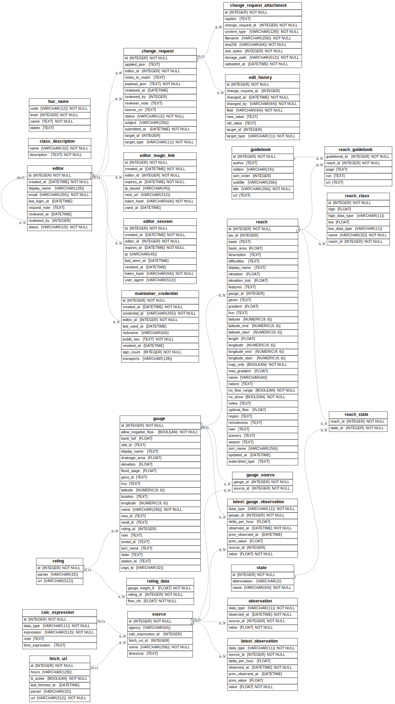

# Database Schema Reference

This document describes the SQLite database schema used by the Kayak river levels system. The schema is defined in `src/kayak/db/models.py` using SQLAlchemy 2.x ORM models. Tables are created via `levels init-db` using `Base.metadata.create_all()`.

## Entity-Relationship Overview

The schema has three main domains:

1. **Data acquisition** -- gauges, sources, fetch URLs, and observations
2. **River reaches** -- reaches, states, classes, levels, and guidebooks
3. **Cache tables** -- pre-computed latest values for fast display



## Tables

### Data Acquisition

#### gauge
Physical or virtual gauge stations that measure river conditions.

| Column | Type | Notes |
|--------|------|-------|
| id | INTEGER | PK, autoincrement |
| name | VARCHAR(256) | Unique, not null |
| bank_full | FLOAT | Bank-full stage level |
| flood_stage | FLOAT | Flood stage level |
| location | TEXT | Human-readable location |
| latitude | NUMERIC(9,6) | |
| longitude | NUMERIC(9,6) | |
| elevation | FLOAT | Gauge elevation (ft) |
| drainage_area | FLOAT | Upstream drainage area (sq mi) |
| station_id | TEXT | Generic station identifier |
| cbtt_id | TEXT | NWRFC CBTT identifier |
| geos_id | TEXT | GEOS identifier |
| nws_id | TEXT | National Weather Service ID |
| nwsli_id | TEXT | NWS Location Identifier |
| snotel_id | TEXT | SNOTEL station ID |
| usgs_id | VARCHAR(32) | USGS site number (indexed) |
| rating_id | INTEGER | FK -> rating.id |

**Indexes:** `ix_gauge_usgs_id` on usgs_id

#### source
Individual data feeds linked to gauges. A gauge may have multiple sources (e.g., NWRFC + USGS OGC for the same station). Sources are either fetched via URL or calculated from expressions.

| Column | Type | Notes |
|--------|------|-------|
| id | INTEGER | PK, autoincrement |
| name | VARCHAR(256) | Not null (indexed) |
| agency | VARCHAR(64) | Data provider (USGS, NOAA, etc.) |
| fetch_url_id | INTEGER | FK -> fetch_url.id (fetched sources) |
| calc_expression_id | INTEGER | FK -> calc_expression.id (calculated sources) |

**Indexes:** `ix_source_name` on name

#### gauge_source
Many-to-many junction linking gauges to their data sources.

| Column | Type | Notes |
|--------|------|-------|
| gauge_id | INTEGER | PK, FK -> gauge.id (CASCADE) |
| source_id | INTEGER | PK, FK -> source.id (CASCADE) |

#### fetch_url
URLs and parser configurations for fetching data from external agencies.

| Column | Type | Notes |
|--------|------|-------|
| id | INTEGER | PK, autoincrement |
| url | VARCHAR(512) | Unique, not null |
| parser | VARCHAR(32) | Parser name (usgs, nwps, usbr, etc.) |
| hours | VARCHAR(128) | Hour restrictions for scheduling |
| is_active | BOOLEAN | Whether to fetch this URL |
| last_fetched_at | DATETIME | Timestamp of last fetch |

**Indexes:** `ix_fetch_url_is_active` on is_active

#### calc_expression
Regression formulas for calculating synthetic gauge values from other gauges.

| Column | Type | Notes |
|--------|------|-------|
| id | INTEGER | PK, autoincrement |
| data_type | VARCHAR(11) | Not null (flow, gauge, etc.) |
| expression | VARCHAR(512) | Math expression with gauge references |
| time_expression | TEXT | Space-separated list of `key::gauge_name::type` references |
| note | TEXT | |

**Expression format:** References use `key::gauge_name::data_type` (e.g., `g8::Mohawk_Springfield_merge::flow`). The calculator resolves gauge names via `latest_gauge_observation` and evaluates the expression with substituted values.

#### rating / rating_data
Gage height to flow conversion tables for interpolating between measurement types.

**rating:**

| Column | Type | Notes |
|--------|------|-------|
| id | INTEGER | PK, autoincrement |
| url | VARCHAR(512) | Source URL for rating table |
| parser | VARCHAR(32) | Parser used to load data |

**rating_data:**

| Column | Type | Notes |
|--------|------|-------|
| rating_id | INTEGER | PK, FK -> rating.id (CASCADE) |
| gauge_height_ft | FLOAT | PK, gage height in feet |
| flow_cfs | FLOAT | Not null, corresponding flow in CFS |

### Observation Data

#### observation
Time-series measurements from data sources. The largest table (~5.4M rows).

| Column | Type | Notes |
|--------|------|-------|
| source_id | INTEGER | PK, FK -> source.id (RESTRICT) |
| observed_at | DATETIME | PK |
| data_type | VARCHAR(11) | PK (flow, gauge, inflow, temperature) |
| value | FLOAT | Not null |

**Indexes:** `ix_observation_source_type_time` on (source_id, data_type, observed_at)

#### latest_observation
Cached most-recent reading per source and data type. Updated by each fetch step. Used for source-level debugging and inspection.

| Column | Type | Notes |
|--------|------|-------|
| source_id | INTEGER | PK, FK -> source.id (RESTRICT) |
| data_type | VARCHAR(11) | PK |
| observed_at | DATETIME | Not null |
| value | FLOAT | Not null |
| prev_observed_at | DATETIME | Previous reading >6h before latest |
| prev_value | FLOAT | |
| delta_per_hour | FLOAT | Hourly rate of change |

#### latest_gauge_observation
Cached most-recent reading per gauge and data type, aggregated across all sources for that gauge. This is the primary table used by the build step, calculator, and PHP display layer.

| Column | Type | Notes |
|--------|------|-------|
| gauge_id | INTEGER | PK, FK -> gauge.id (CASCADE) |
| data_type | VARCHAR(11) | PK |
| observed_at | DATETIME | Not null |
| value | FLOAT | Not null |
| prev_observed_at | DATETIME | Previous reading >6h before latest |
| prev_value | FLOAT | |
| delta_per_hour | FLOAT | Hourly rate of change |
| source_id | INTEGER | FK -> source.id, which source contributed this value |

### River Reaches

#### reach
A paddleable section of river with put-in/take-out coordinates, metadata, and a link to a gauge.

| Column | Type | Notes |
|--------|------|-------|
| id | INTEGER | PK, autoincrement |
| updated_at | DATETIME | |
| gauge_id | INTEGER | FK -> gauge.id |
| name | VARCHAR(64) | Unique internal name |
| display_name | TEXT | Shown on website |
| sort_name | VARCHAR(256) | Controls display order (indexed) |
| river | TEXT | River name (groups reaches) |
| description | TEXT | Section description (put-in to take-out) |
| difficulties | TEXT | Whitewater class/difficulty notes |
| nature | TEXT | Character (pool-drop, continuous, etc.) |
| basin | TEXT | Watershed (e.g., Willamette) |
| basin_area | FLOAT | |
| elevation | FLOAT | |
| elevation_lost | FLOAT | Total drop in feet |
| length | FLOAT | River miles |
| gradient | FLOAT | Feet per mile |
| max_gradient | FLOAT | Maximum gradient |
| features | TEXT | |
| latitude | NUMERIC(9,6) | Midpoint latitude |
| longitude | NUMERIC(9,6) | Midpoint longitude |
| latitude_start | NUMERIC(9,6) | Put-in latitude |
| longitude_start | NUMERIC(9,6) | Put-in longitude |
| latitude_end | NUMERIC(9,6) | Take-out latitude |
| longitude_end | NUMERIC(9,6) | Take-out longitude |
| geom | TEXT | LineString trace as "lon lat,lon lat,..." |
| map_name | TEXT | |
| no_show | BOOLEAN | Hidden from public display |
| notes | TEXT | Internal notes |
| optimal_flow | FLOAT | Ideal flow in CFS |
| region | TEXT | Geographic region |
| remoteness | TEXT | |
| scenery | TEXT | |
| season | TEXT | Typical runnable season |
| watershed_type | TEXT | |
| aw_id | INTEGER | American Whitewater reach ID |

**Indexes:** `ix_reach_sort_name` on sort_name

#### state
US states for reach geographic tagging.

| Column | Type | Notes |
|--------|------|-------|
| id | INTEGER | PK, autoincrement |
| name | VARCHAR(64) | Unique, not null |
| abbreviation | VARCHAR(2) | |

#### reach_state
Many-to-many junction linking reaches to states. A border river may belong to multiple states.

| Column | Type | Notes |
|--------|------|-------|
| reach_id | INTEGER | PK, FK -> reach.id (CASCADE) |
| state_id | INTEGER | PK, FK -> state.id (CASCADE) |

**Indexes:** `ix_reach_state_state_id` on state_id

#### reach_class
Whitewater classification ranges for a reach, with optional flow/gage thresholds.

| Column | Type | Notes |
|--------|------|-------|
| id | INTEGER | PK, autoincrement |
| reach_id | INTEGER | FK -> reach.id (CASCADE), not null |
| name | VARCHAR(32) | Class name (e.g., "III(IV)"), not null |
| low | FLOAT | Low threshold value |
| low_data_type | VARCHAR(11) | Threshold type (flow or gauge) |
| high | FLOAT | High threshold value |
| high_data_type | VARCHAR(11) | Threshold type (flow or gauge) |

#### reach_level
Flow level classifications (low/okay/high) for color-coding on the website.

| Column | Type | Notes |
|--------|------|-------|
| id | INTEGER | PK, autoincrement |
| reach_id | INTEGER | FK -> reach.id (CASCADE), not null |
| level | VARCHAR(4) | Not null (low, okay, high) |
| low | FLOAT | Lower bound |
| low_data_type | VARCHAR(11) | |
| high | FLOAT | Upper bound |
| high_data_type | VARCHAR(11) | |

#### guidebook
Reference guidebook publications.

| Column | Type | Notes |
|--------|------|-------|
| id | INTEGER | PK, autoincrement |
| title | VARCHAR(256) | Not null |
| subtitle | VARCHAR(256) | |
| edition | VARCHAR(24) | |
| author | TEXT | |
| url | TEXT | |

#### reach_guidebook
Many-to-many junction with page/run references per guidebook entry.

| Column | Type | Notes |
|--------|------|-------|
| reach_id | INTEGER | PK, FK -> reach.id (CASCADE) |
| guidebook_id | INTEGER | PK, FK -> guidebook.id (CASCADE) |
| page | TEXT | Page number |
| run | TEXT | Run number |
| url | TEXT | Direct URL (for web-based guidebooks) |

#### class_description
Lookup table mapping whitewater class names to descriptions.

| Column | Type | Notes |
|--------|------|-------|
| name | VARCHAR(32) | PK |
| description | TEXT | Not null |

### Legacy / Cache

#### pages
Pre-rendered page cache (currently unused).

| Column | Type | Notes |
|--------|------|-------|
| name | VARCHAR(128) | PK |
| action | VARCHAR(4) | Not null (page, file, plot, etc.) |
| expires | INTEGER | |
| modified | DATETIME | |
| mimetype | TEXT | |
| body | TEXT | |

## Data Flow

```
External APIs (USGS, NOAA/NWRFC, USACE, USBR)
    |
    v
fetch / fetch-usgs-ogc
    |
    v
observation (raw time-series per source)
    |
    v
latest_observation (per-source cache)
    |
    +---> calc-rating (gage height <-> flow via rating tables)
    |
    v
update-gauge-cache
    |
    v
latest_gauge_observation (per-gauge cache, best across all sources)
    |
    v
calculator (evaluates calc_expression formulas)
    |
    v
build (generates HTML/CSV/JSON)  +  PHP layer (dynamic pages)
```
