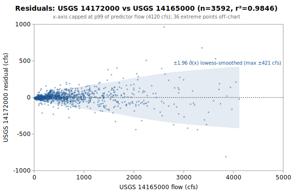

# Multi-Linear regression: USGS 14172000 from 14165000, 14187000, 14188800

**Goal**: estimate USGS `14172000` from `14165000`, `14187000`, `14188800` so a downstream `calc_expression` can replace the target gauge.



Generated by:

```bash
python3 scripts/regression/gauge_pair_linear.py \
    --predictor 14165000 \
    --predictor 14187000 \
    --predictor 14188800 \
    --target 14172000 \
    --start 1962-10-01 \
    --end 1990-09-30 \
    --name calapooia_14172000_from_mohawk_wiley_thomas
```

## Data

All series are USGS daily-mean flow (`parameterCd=00060`, `statCd=00003`).

| Gauge | Period of record | Daily means |
|---|---|---|
| `14172000` (target) | 1935-10-01 → **1990-09-30** | 20089 |
| `14165000` (predictor) | 1935-09-01 → 2026-05-16 | 28746 |
| `14187000` (predictor) | 1947-10-01 → 2026-05-16 | 23178 |
| `14188800` (predictor) | 1962-10-01 → 2026-05-16 | 17759 |
| **Overlap (full)** | 1963-10-01 → 1973-07-31 | **3592** |

Note: USGS records can be **non-contiguous** (instrumentation outages).
The chosen window is selected for *data points*, not calendar span.

## Chosen fit

Window: **1962-10-01 → 1990-09-30**, n = **3592** daily means (~9.8 years of data).

### Coefficients (1-sigma uncertainty)

| Term | Estimate | SE | 95% CI |
|---|---|---|---|
| intercept | +19.2629 | 1.642 | [+16.04, +22.48] |
| g8::Mohawk_Springfield_merge (predictor 1: 14165000) | +0.189876 | 0.00394 | [+0.1822, +0.1976] |
| uP::Wiley_Foster_merge (predictor 2: 14187000) | +1.11498 | 0.01566 | [+1.084, +1.146] |
| rq::14188800 (predictor 3: 14188800) | +0.152599 | 0.006619 | [+0.1396, +0.1656] |

r² = **0.9846**, RMSE = **80.92 cfs** (sigma_hat = 80.97 cfs unbiased).

Predictor / target summary:

| Series | Mean | Range |
|---|---|---|
| target `14172000` | 440.02 | [19, 11000] |
| predictor `14165000` | 557.26 | [10, 11500] |
| predictor `14187000` | 212.27 | [7, 6410] |
| predictor `14188800` | 512.92 | [9, 11400] |

### Parameter covariance

Full variance-covariance matrix (rows/cols in `coef_names` order):

```
                intercept            x1            x2            x3
   intercept  +2.6957e+00  -3.0379e-04  +2.2751e-03  -2.3088e-03
          x1  -3.0379e-04  +1.5524e-05  -2.4675e-05  -6.0628e-06
          x2  +2.2751e-03  -2.4675e-05  +2.4515e-04  -7.9081e-05
          x3  -2.3088e-03  -6.0628e-06  -7.9081e-05  +4.3815e-05
```

Correlation matrix:

```
              intercept          x1          x2          x3
   intercept  +1.0000      -0.0470      +0.0885      -0.2124    
          x1  -0.0470      +1.0000      -0.4000      -0.2325    
          x2  +0.0885      -0.4000      +1.0000      -0.7630    
          x3  -0.2124      -0.2325      -0.7630      +1.0000    
```

**Caveat**: these uncertainties capture *parameter* precision only. For a single-day prediction at new `x`, the prediction interval is dominated by the residual scatter `sigma_hat` (about 117 cfs at 1-sigma here), not by parameter SEs.

## Window stability

Re-fit at multiple start dates (endpoint fixed at `1990-09-30`):

| Window start | n | data yr | r² | RMSE |
|---|---|---|---|---|
| 1957-10-02 | 3592 | 9.8 | 0.9846 | 80.9 |
| 1962-10-01 | 3592 | 9.8 | 0.9846 | 80.9 |
| 1963-10-01 | 3592 | 9.8 | 0.9846 | 80.9 |
| 1967-09-30 | 2132 | 5.8 | 0.9836 | 75.9 |
| 1972-09-28 | 307 | 0.8 | 0.9937 | 27.0 |
| 1977-09-27 | — | — | — | — |
| 1990-01-01 | — | — | — | — |

(Multi-predictor coefficients in the stability table would be wide; per-window coefficient drift can be inspected by re-running the script with a different `--start`.)

## Residual diagnostics

**Percentile distribution** (residual = y - y_hat, cfs):

| p01 | p05 | p25 | p50 | p75 | p95 | p99 |
|---|---|---|---|---|---|---|
| -231.3 | -90.3 | -16.2 | -6.5 | +14.7 | +105.8 | +242.1 |

**By predictor-1 quintile** (Q1 = lowest values of `14165000`):

| Quintile | x median | mean residual | std residual | n |
|---|---|---|---|---|
| Q1 | 31 | -10.4 | 4.9 | 718 |
| Q2 | 86 | -6.7 | 16.8 | 718 |
| Q3 | 247 | +4.5 | 37.8 | 718 |
| Q4 | 566 | +10.7 | 59.1 | 718 |
| Q5 | 1420 | +1.8 | 165.0 | 720 |

## Predictions at example x values

For each row, `y_hat` is the fitted value and the two CIs are 95% two-sided bands. The **mean-response CI** is the uncertainty in `E[y | x]` (use for plotting the fit line's confidence band). The **prediction CI** is for a *single new observation* — bounded below by `sigma_hat` regardless of how precisely the parameters are estimated.

| pred-1 position | x (14165000) | x (14187000) | x (14188800) | y_hat | 95% CI (mean resp.) | 95% CI (single obs.) |
|---|---|---|---|---|---|---|
| p05 (low) | 22 | 212 | 513 | 338.4 | [333.5, 343.3] (±4.9) | [179.6, 497.2] (±158.8) |
| p25 | 64 | 212 | 513 | 346.4 | [341.7, 351.0] (±4.6) | [187.6, 505.1] (±158.8) |
| p50 (median) | 247 | 212 | 513 | 381.1 | [377.5, 384.7] (±3.6) | [222.4, 539.8] (±158.7) |
| p75 | 668 | 212 | 513 | 461.0 | [458.3, 463.8] (±2.8) | [302.3, 619.8] (±158.7) |
| p95 (high) | 2040 | 212 | 513 | 721.6 | [709.8, 733.3] (±11.8) | [562.4, 880.7] (±159.1) |

### Computing a CI at any other x*

All the information needed to compute prediction CIs at any new predictor value is in this document. With the design row `X* = [1, x1*, x2*, ..., x1*^2, x2*^2, ...]` matching the column order in the covariance matrix above:

```
y_hat = X* . coefs
Var(mean response) = X* . Cov(beta) . X*'
Var(single observation) = Var(mean response) + sigma_hat^2
SE = sqrt(Var)
95% CI = y_hat +/- 1.96 * SE     (n >> 30, large-sample z; use t_{n-p} for small n)
```

## SQL stub for `calc_expression`

Paste this into a `data/db/migrations/00NN_*.sql` file. The handles (`g8::Mohawk_Springfield_merge`, `uP::Wiley_Foster_merge`, `rq::14188800`) follow the `prefix::gauge_name` convention enforced by `kayak.cli.calculator._resolve_refs`:

```sql
INSERT INTO calc_expression (data_type, expression, time_expression, note) SELECT
    'flow',
    'round(greatest(0, 0.189876 * g8::Mohawk_Springfield_merge::flow + 1.11498 * uP::Wiley_Foster_merge::flow + 0.152599 * rq::14188800::flow +19.26))',
    'g8::Mohawk_Springfield_merge::flow uP::Wiley_Foster_merge::flow rq::14188800::flow',
    'multi-linear regression fit. n=3592 daily means, window 1962-10-01..1990-09-30, r2=0.9846, RMSE=80.9 cfs.'
WHERE NOT EXISTS (
    SELECT 1 FROM calc_expression WHERE time_expression = 'g8::Mohawk_Springfield_merge::flow uP::Wiley_Foster_merge::flow rq::14188800::flow'
);
```

**Note**: the migration runner (`cli/migrate.py::_split_statements`) splits SQL on `;` without understanding string literals, so make sure no `;` appears inside the `note` text.

## Future

- **Piecewise-linear fit by predictor-1 quintile.** If the residual table above shows systematic mean drift across quintiles (e.g., consistently under-estimating at low flow and over-estimating at high flow), splitting the predictor range into 2-3 regimes and fitting one linear model per regime can halve RMSE without adding free parameters beyond what `calc_expression` already supports via `greatest(low_estimate, high_estimate)` or `if(x < threshold, ..., ...)`-style composition. Worth trying when RMSE > ~10% of the mean target value.
- **Re-running** when the active predictor's rating curve drifts. USGS occasionally updates stage-discharge ratings; the `Reproduce` snippet above re-pulls the full period of record on demand.
