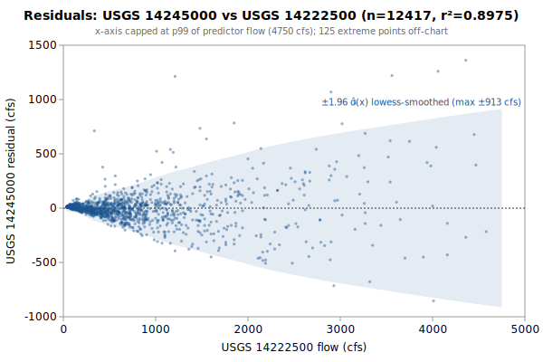

# Linear+Quadratic regression: USGS 14245000 from 14222500

**Goal**: estimate USGS `14245000` from `14222500` so a downstream `calc_expression` can replace the target gauge.



Generated by:

```bash
python3 scripts/regression/gauge_pair_linear.py \
    --predictor 14222500 \
    --target 14245000 \
    --start 1950-10-01 \
    --end 1984-09-30 \
    --name coweeman_14245000_from_eflewis \
    --calc-handle ef::EF_Lewis_Washington_merge \
    --quadratic
```

## Data

All series are USGS daily-mean flow (`parameterCd=00060`, `statCd=00003`).

| Gauge | Period of record | Daily means |
|---|---|---|
| `14245000` (target) | 1950-10-01 → **1984-09-30** | 12417 |
| `14222500` (predictor) | 1929-10-01 → 2026-06-03 | 35310 |
| **Overlap (full)** | 1950-10-01 → 1984-09-30 | **12417** |

Note: USGS records can be **non-contiguous** (instrumentation outages).
The chosen window is selected for *data points*, not calendar span.

## Chosen fit

Window: **1950-10-01 → 1984-09-30**, n = **12417** daily means (~34.0 years of data).

### Coefficients (with honest, autocorrelation-aware uncertainty)

Daily streamflow residuals are strongly autocorrelated (lag-1 **0.71** here), which violates the IID assumption behind the OLS standard errors — so **SE (OLS)** is optimistic. **SE (block-boot)** resamples whole monthly blocks (408 months, B=1000), preserving the serial correlation; it is the realistic figure and runs about **4.4x** the OLS SE. The **95% CI** below is the block-bootstrap percentile interval. **VIF** is the variance-inflation factor (collinearity with the other predictors); VIF > 10 means the individual coefficient is poorly determined and should not be read as a physical sensitivity.

| Term | Estimate | SE (OLS) | SE (block-boot) | 95% CI (block-boot) | VIF |
|---|---|---|---|---|---|
| intercept | -4.63966 | 2.299 | 4.601 | [-12.65, +5.307] | — |
| ef::EF_Lewis_Washington_merge (predictor 1: 14222500) | +0.574501 | 0.002954 | 0.01301 | [+0.5455, +0.5962] | 1.0 |
| (14222500)² | -9.5595e-06 | 5.088e-07 | 3.022e-06 | [-1.479e-05, -2.383e-06] | — |

r² = **0.8975**, RMSE = **173.66 cfs** (sigma_hat = 173.68 cfs unbiased).

Predictor / target summary:

| Series | Mean | Range |
|---|---|---|
| target `14245000` | 427.35 | [22, 7110] |
| predictor `14222500` | 777.72 | [30, 15600] |

### Parameter covariance

Full variance-covariance matrix (rows/cols in `coef_names` order):

```
                intercept            x1          x1^2
   intercept  +5.2875e+00  -4.8312e-03  +5.8052e-07
          x1  -4.8312e-03  +8.7259e-06  -1.2621e-09
        x1^2  +5.8052e-07  -1.2621e-09  +2.5888e-13
```

Correlation matrix:

```
              intercept          x1        x1^2
   intercept  +1.0000      -0.7113      +0.4962
          x1  -0.7113      +1.0000      -0.8397
        x1^2  +0.4962      -0.8397      +1.0000
```

**Caveat 1 (autocorrelation)**: this is the **OLS** covariance, which assumes IID residuals; with lag-1 residual autocorrelation **0.71** it understates the parameter SE by roughly **4.4x**. Use the block-bootstrap SEs/CIs in the coefficients table for inference, not these (monthly blocks; longer blocks would only widen the intervals, so they are conservative for the most autocorrelated fits).

**Caveat 2 (prediction vs parameter)**: even with correct parameter SEs, a single-day prediction at new `x` is dominated by the residual scatter `sigma_hat` (about 174 cfs at 1-sigma here), not by parameter uncertainty. `sigma_hat` is a valid *marginal* description of single-day error (autocorrelation barely biases it); what autocorrelation breaks is treating the n days as n independent observations.

## Window stability

Re-fit at multiple start dates (endpoint fixed at `1984-09-30`):

| Window start | n | data yr | r² | RMSE |
|---|---|---|---|---|
| 1945-10-02 | 12417 | 34.0 | 0.8975 | 173.7 |
| 1950-10-01 | 12417 | 34.0 | 0.8975 | 173.7 |
| 1955-09-30 | 10592 | 29.0 | 0.8991 | 174.4 |
| 1960-09-28 | 8767 | 24.0 | 0.8998 | 175.6 |
| 1965-09-27 | 6942 | 19.0 | 0.8939 | 179.8 |

(Multi-predictor coefficients in the stability table would be wide; per-window coefficient drift can be inspected by re-running the script with a different `--start`.)

## Residual diagnostics

**Percentile distribution** (residual = y - y_hat, cfs):

| p01 | p05 | p25 | p50 | p75 | p95 | p99 |
|---|---|---|---|---|---|---|
| -509.3 | -221.7 | -40.8 | +6.3 | +28.2 | +225.6 | +605.6 |

**By predictor-1 quintile** (Q1 = lowest values of `14222500`):

| Quintile | x median | mean residual | std residual | n |
|---|---|---|---|---|
| Q1 | 72 | +12.0 | 9.2 | 2483 |
| Q2 | 197 | +3.0 | 31.3 | 2483 |
| Q3 | 486 | -3.5 | 80.9 | 2483 |
| Q4 | 865 | -15.2 | 128.7 | 2483 |
| Q5 | 1810 | +3.6 | 355.2 | 2485 |

### By hydrologic season

Residuals bucketed by monsoonal season (most kayak gauges sit in a PNW monsoonal regime). **Mean / median flow** give each season's target-flow magnitude. **Bias** is the mean residual (y - y_hat); a non-zero bias means the pooled fit systematically over- (negative) or under-predicts (positive) in that season. **% of flow** normalizes the bias by the season's mean flow so it's comparable across gauges. The remaining columns (median residual, std, RMSE) are residual statistics in cfs.

| Season | n | mean flow | median flow | bias (cfs) | % of flow | median resid | std | RMSE |
|---|---|---|---|---|---|---|---|---|
| Heavy rain (Nov-Dec) | 2074 | 732 | 516 | +0.7 | +0.1% | -9.3 | 243.7 | 243.6 |
| Light rain (Jan-Feb) | 2014 | 844 | 608 | +41.9 | +5.0% | +36.5 | 264.3 | 267.5 |
| Rain-on-snow (Mar-Apr) | 2074 | 573 | 460 | +6.9 | +1.2% | -1.3 | 182.3 | 182.4 |
| Dry season (May-Oct) | 6255 | 144 | 91 | -16.0 | -11.1% | +5.9 | 76.6 | 78.2 |

A season whose bias is large relative to `sigma_hat` (the pooled 1-sigma residual scatter) is a candidate for a season-specific intercept or a separate seasonal fit; a season with elevated `std`/`RMSE` but near-zero bias is just noisier (e.g., flashy storm response), not mis-calibrated.

## Predictions at example x values

For each row, `y_hat` is the fitted value and the two CIs are 95% two-sided bands. The **mean-response CI** is the uncertainty in `E[y | x]` (use for plotting the fit line's confidence band). The **prediction CI** is for a *single new observation* — bounded below by `sigma_hat` regardless of how precisely the parameters are estimated.

| pred-1 position | x (14222500) | y_hat | 95% CI (mean resp.) | 95% CI (single obs.) |
|---|---|---|---|---|
| p05 (low) | 58 | 28.6 | [24.4, 32.9] (±4.3) | [-311.8, 369.1] (±340.4) |
| p25 | 148 | 80.2 | [76.2, 84.1] (±4.0) | [-260.3, 420.6] (±340.4) |
| p50 (median) | 486 | 272.3 | [269.1, 275.5] (±3.2) | [-68.1, 612.7] (±340.4) |
| p75 | 1000 | 560.3 | [556.8, 563.8] (±3.5) | [219.9, 900.7] (±340.4) |
| p95 (high) | 2600 | 1424.4 | [1417.0, 1431.9] (±7.5) | [1083.9, 1764.9] (±340.5) |

### Computing a CI at any other x*

All the information needed to compute prediction CIs at any new predictor value is in this document. With the design row `X* = [1, x1*, x2*, ...]` — plus a squared column for each predictor fitted quadratically, in predictor order — matching the column order in the covariance matrix above:

```
y_hat = X* . coefs
Var(mean response) = X* . Cov(beta) . X*'
Var(single observation) = Var(mean response) + sigma_hat^2
SE = sqrt(Var)
95% CI = y_hat +/- 1.96 * SE     (n >> 30, large-sample z; use t_{n-p} for small n)
```

## `calc_expression` row

`calc_expression` rows are **metadata**: add a row to `calc_expression.csv` in the `kayak_data` repo (stable `id` from `id_counters.csv`, `provenance_slug` = this report's slug) and let `levels sync-metadata` apply it on deploy. Do **not** put this in a migration — a new migration may not write a metadata table (`tests/test_scripts/test_migrations_schema_only.py`). The handles (`ef::EF_Lewis_Washington_merge`) follow the `prefix::gauge_name` convention enforced by `kayak.cli.calculator._resolve_refs`. Column values:

```
data_type:       flow
expression:      round(greatest(0, 0.574501 * ef::EF_Lewis_Washington_merge::flow + -9.5595e-06 * ef::EF_Lewis_Washington_merge::flow * ef::EF_Lewis_Washington_merge::flow -4.64))
time_expression: ef::EF_Lewis_Washington_merge::flow
note:            linear+quadratic regression fit. n=12417 daily means, window 1950-10-01..1984-09-30, r2=0.8975, RMSE=173.7 cfs. See docs/regression/coweeman_14245000_from_eflewis.md.
provenance_slug: coweeman_14245000_from_eflewis
```

Flesh out `note` before committing — the strongest existing rows also record window stability, rejected predictors, and any drainage-area scaling (see `calc_expression.csv` for examples).

## Future

- **Piecewise-linear fit by predictor-1 quintile.** If the residual table above shows systematic mean drift across quintiles (e.g., consistently under-estimating at low flow and over-estimating at high flow), splitting the predictor range into 2-3 regimes and fitting one linear model per regime can halve RMSE without adding free parameters beyond what `calc_expression` already supports via `greatest(low_estimate, high_estimate)` or `if(x < threshold, ..., ...)`-style composition. Worth trying when RMSE > ~10% of the mean target value.
- **Re-running** when the active predictor's rating curve drifts. USGS occasionally updates stage-discharge ratings; the `Reproduce` snippet above re-pulls the full period of record on demand.
- **Sub-daily lead/lag.** This fit is on daily means, but the `calc_expression` applies its coefficients to the *latest instantaneous* predictor readings — so inter-gauge travel time (1-12 h) becomes a timing error the daily fit never sees. `gauge_lead_lag.py` (same directory) quantifies that error from USGS unit values; worth a look when predictors are many river-miles from the target. (Run it to embed a summary here via `--leadlag`.)
