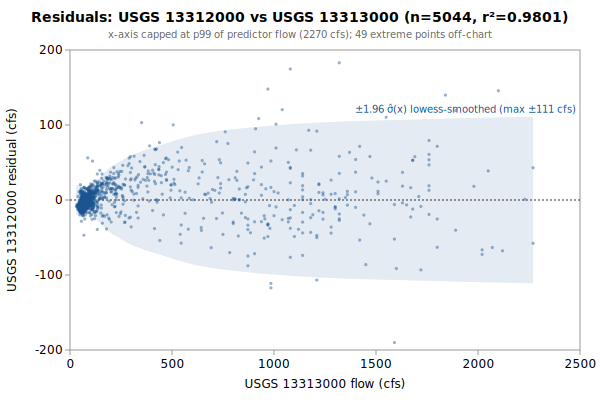

# Multi-Linear regression: USGS 13312000 from 13313000, 13311000

**Goal**: estimate USGS `13312000` from `13313000`, `13311000` so a downstream `calc_expression` can replace the target gauge.



Generated by:

```bash
python3 scripts/regression/gauge_pair_linear.py \
    --predictor 13313000 \
    --predictor 13311000 \
    --target 13312000 \
    --start 1928-08-13 \
    --end 1943-07-14 \
    --name efsf_13312000_from_johnson_stibnite \
    --calc-handle jo::Johnson_Yellopine_merge \
    --calc-handle st::EFSF_Stibnite \
    --deploy-note 'The deployed row (kayak_data calc_expression 12, gauge EFSF_Salmon_calc) represents the EFSF *below* the Johnson Cr confluence: it adds live Johnson Cr to this fit, so the deployed Johnson coefficient is 1.177027 (= 0.177027 fitted + 1.0 live) with the same Stibnite term and intercept. Scored against measured 13312000 + Johnson over 1928-43: bias 0 / RMSE 26.5 cfs vs the old uncalibrated Johnson+Stibnite sum at bias -113 / RMSE 191 (reproduce: docs/one-offs/efsf_calc_comparison.py).'
```

## Data

All series are USGS daily-mean flow (`parameterCd=00060`, `statCd=00003`).

| Gauge | Period of record | Daily means |
|---|---|---|
| `13312000` (target) | 1928-08-13 → **1943-07-14** | 5325 |
| `13313000` (predictor) | 1928-09-01 → 2026-06-03 | 35705 |
| `13311000` (predictor) | 1928-06-15 → 2026-06-03 | 16324 |
| **Overlap (full)** | 1928-09-01 → 1943-07-14 | **5044** |

Note: USGS records can be **non-contiguous** (instrumentation outages).
The chosen window is selected for *data points*, not calendar span.

## Chosen fit

Window: **1928-08-13 → 1943-07-14**, n = **5044** daily means (~13.8 years of data).

### Coefficients (with honest, autocorrelation-aware uncertainty)

Daily streamflow residuals are strongly autocorrelated (lag-1 **0.83** here), which violates the IID assumption behind the OLS standard errors — so **SE (OLS)** is optimistic. **SE (block-boot)** resamples whole monthly blocks (177 months, B=1000), preserving the serial correlation; it is the realistic figure and runs about **8.3x** the OLS SE. The **95% CI** below is the block-bootstrap percentile interval. **VIF** is the variance-inflation factor (collinearity with the other predictors); VIF > 10 means the individual coefficient is poorly determined and should not be read as a physical sensitivity.

| Term | Estimate | SE (OLS) | SE (block-boot) | 95% CI (block-boot) | VIF |
|---|---|---|---|---|---|
| intercept | +14.2552 | 0.4546 | 1.514 | [+11.34, +17.28] | — |
| jo::Johnson_Yellopine_merge (predictor 1: 13313000) | +0.177027 | 0.002426 | 0.01991 | [+0.1414, +0.2156] | 9.5 |
| st::EFSF_Stibnite (predictor 2: 13311000) | +3.02123 | 0.03311 | 0.2753 | [+2.502, +3.525] | 9.5 |

r² = **0.9801**, RMSE = **26.50 cfs** (sigma_hat = 26.51 cfs unbiased).

Predictor / target summary:

| Series | Mean | Range |
|---|---|---|
| target `13312000` | 137.01 | [27, 1660] |
| predictor `13313000` | 288.01 | [30, 4540] |
| predictor `13311000` | 23.75 | [4, 343] |

### Parameter covariance

Full variance-covariance matrix (rows/cols in `coef_names` order):

```
                intercept            x1            x2
   intercept  +2.0663e-01  +1.0957e-04  -4.1627e-03
          x1  +1.0957e-04  +5.8845e-06  -7.5958e-05
          x2  -4.1627e-03  -7.5958e-05  +1.0962e-03
```

Correlation matrix:

```
              intercept          x1          x2
   intercept  +1.0000      +0.0994      -0.2766    
          x1  +0.0994      +1.0000      -0.9458    
          x2  -0.2766      -0.9458      +1.0000    
```

**Caveat 1 (autocorrelation)**: this is the **OLS** covariance, which assumes IID residuals; with lag-1 residual autocorrelation **0.83** it understates the parameter SE by roughly **8.3x**. Use the block-bootstrap SEs/CIs in the coefficients table for inference, not these (monthly blocks; longer blocks would only widen the intervals, so they are conservative for the most autocorrelated fits).

**Caveat 2 (prediction vs parameter)**: even with correct parameter SEs, a single-day prediction at new `x` is dominated by the residual scatter `sigma_hat` (about 27 cfs at 1-sigma here), not by parameter uncertainty. `sigma_hat` is a valid *marginal* description of single-day error (autocorrelation barely biases it); what autocorrelation breaks is treating the n days as n independent observations.

## Window stability

Re-fit at multiple start dates (endpoint fixed at `1943-07-14`):

| Window start | n | data yr | r² | RMSE |
|---|---|---|---|---|
| 1923-08-15 | 5044 | 13.8 | 0.9801 | 26.5 |
| 1928-08-13 | 5044 | 13.8 | 0.9801 | 26.5 |
| 1928-09-01 | 5044 | 13.8 | 0.9801 | 26.5 |
| 1933-08-12 | 3238 | 8.9 | 0.9819 | 23.7 |
| 1938-08-11 | 1413 | 3.9 | 0.9788 | 22.6 |

(Multi-predictor coefficients in the stability table would be wide; per-window coefficient drift can be inspected by re-running the script with a different `--start`.)

## Residual diagnostics

**Percentile distribution** (residual = y - y_hat, cfs):

| p01 | p05 | p25 | p50 | p75 | p95 | p99 |
|---|---|---|---|---|---|---|
| -78.1 | -31.8 | -10.1 | -3.2 | +7.7 | +44.1 | +91.0 |

**By predictor-1 quintile** (Q1 = lowest values of `13313000`):

| Quintile | x median | mean residual | std residual | n |
|---|---|---|---|---|
| Q1 | 55 | -7.2 | 7.0 | 1008 |
| Q2 | 66 | -5.8 | 7.1 | 1008 |
| Q3 | 85 | -0.2 | 9.1 | 1008 |
| Q4 | 142 | +8.4 | 18.7 | 1008 |
| Q5 | 938 | +4.9 | 52.9 | 1012 |

### By hydrologic season

Residuals bucketed by monsoonal season (most kayak gauges sit in a PNW monsoonal regime). **Mean / median flow** give each season's target-flow magnitude. **Bias** is the mean residual (y - y_hat); a non-zero bias means the pooled fit systematically over- (negative) or under-predicts (positive) in that season. **% of flow** normalizes the bias by the season's mean flow so it's comparable across gauges. The remaining columns (median residual, std, RMSE) are residual statistics in cfs.

| Season | n | mean flow | median flow | bias (cfs) | % of flow | median resid | std | RMSE |
|---|---|---|---|---|---|---|---|---|
| Heavy rain (Nov-Dec) | 833 | 47 | 45 | -6.7 | -14.1% | -7.2 | 10.6 | 12.5 |
| Light rain (Jan-Feb) | 773 | 39 | 40 | -7.3 | -18.5% | -8.1 | 6.3 | 9.7 |
| Rain-on-snow (Mar-Apr) | 817 | 105 | 55 | -2.5 | -2.4% | -7.8 | 25.0 | 25.1 |
| Dry season (May-Oct) | 2621 | 204 | 88 | +5.0 | +2.5% | +3.4 | 32.4 | 32.8 |

A season whose bias is large relative to `sigma_hat` (the pooled 1-sigma residual scatter) is a candidate for a season-specific intercept or a separate seasonal fit; a season with elevated `std`/`RMSE` but near-zero bias is just noisier (e.g., flashy storm response), not mis-calibrated.

## Predictions at example x values

For each row, `y_hat` is the fitted value and the two CIs are 95% two-sided bands. The **mean-response CI** is the uncertainty in `E[y | x]` (use for plotting the fit line's confidence band). The **prediction CI** is for a *single new observation* — bounded below by `sigma_hat` regardless of how precisely the parameters are estimated.

| pred-1 position | x (13313000) | x (13311000) | y_hat | 95% CI (mean resp.) | 95% CI (single obs.) |
|---|---|---|---|---|---|
| p05 (low) | 50 | 24 | 94.9 | [93.5, 96.2] (±1.3) | [42.9, 146.8] (±52.0) |
| p25 | 63 | 24 | 97.2 | [95.9, 98.5] (±1.3) | [45.2, 149.1] (±52.0) |
| p50 (median) | 85 | 24 | 101.1 | [99.9, 102.3] (±1.2) | [49.1, 153.0] (±52.0) |
| p75 | 216 | 24 | 124.3 | [123.5, 125.1] (±0.8) | [72.3, 176.2] (±52.0) |
| p95 (high) | 1360 | 24 | 326.8 | [321.6, 331.9] (±5.1) | [274.6, 379.0] (±52.2) |

### Computing a CI at any other x*

All the information needed to compute prediction CIs at any new predictor value is in this document. With the design row `X* = [1, x1*, x2*, ...]` — plus a squared column for each predictor fitted quadratically, in predictor order — matching the column order in the covariance matrix above:

```
y_hat = X* . coefs
Var(mean response) = X* . Cov(beta) . X*'
Var(single observation) = Var(mean response) + sigma_hat^2
SE = sqrt(Var)
95% CI = y_hat +/- 1.96 * SE     (n >> 30, large-sample z; use t_{n-p} for small n)
```

## `calc_expression` row

`calc_expression` rows are **metadata**: add a row to `calc_expression.csv` in the `kayak_data` repo (stable `id` from `id_counters.csv`, `provenance_slug` = this report's slug) and let `levels sync-metadata` apply it on deploy. Do **not** put this in a migration — a new migration may not write a metadata table (`tests/test_scripts/test_migrations_schema_only.py`). The handles (`jo::Johnson_Yellopine_merge`, `st::EFSF_Stibnite`) follow the `prefix::gauge_name` convention enforced by `kayak.cli.calculator._resolve_refs`. Column values:

```
data_type:       flow
expression:      round(greatest(0, 0.177027 * jo::Johnson_Yellopine_merge::flow + 3.02123 * st::EFSF_Stibnite::flow +14.26))
time_expression: jo::Johnson_Yellopine_merge::flow st::EFSF_Stibnite::flow
note:            multi-linear regression fit. n=5044 daily means, window 1928-08-13..1943-07-14, r2=0.9801, RMSE=26.5 cfs. See docs/regression/efsf_13312000_from_johnson_stibnite.md.
provenance_slug: efsf_13312000_from_johnson_stibnite
```

⚠️ **Deployment note — the deployed expression differs from this fit**: The deployed row (kayak_data calc_expression 12, gauge EFSF_Salmon_calc) represents the EFSF *below* the Johnson Cr confluence: it adds live Johnson Cr to this fit, so the deployed Johnson coefficient is 1.177027 (= 0.177027 fitted + 1.0 live) with the same Stibnite term and intercept. Scored against measured 13312000 + Johnson over 1928-43: bias 0 / RMSE 26.5 cfs vs the old uncalibrated Johnson+Stibnite sum at bias -113 / RMSE 191 (reproduce: docs/one-offs/efsf_calc_comparison.py). Do not copy the expression above verbatim; apply the stated composition first.

Flesh out `note` before committing — the strongest existing rows also record window stability, rejected predictors, and any drainage-area scaling (see `calc_expression.csv` for examples).

## Future

- **Piecewise-linear fit by predictor-1 quintile.** If the residual table above shows systematic mean drift across quintiles (e.g., consistently under-estimating at low flow and over-estimating at high flow), splitting the predictor range into 2-3 regimes and fitting one linear model per regime can halve RMSE without adding free parameters beyond what `calc_expression` already supports via `greatest(low_estimate, high_estimate)` or `if(x < threshold, ..., ...)`-style composition. Worth trying when RMSE > ~10% of the mean target value.
- **Re-running** when the active predictor's rating curve drifts. USGS occasionally updates stage-discharge ratings; the `Reproduce` snippet above re-pulls the full period of record on demand.
- **Sub-daily lead/lag.** This fit is on daily means, but the `calc_expression` applies its coefficients to the *latest instantaneous* predictor readings — so inter-gauge travel time (1-12 h) becomes a timing error the daily fit never sees. `gauge_lead_lag.py` (same directory) quantifies that error from USGS unit values; worth a look when predictors are many river-miles from the target. (Run it to embed a summary here via `--leadlag`.)
