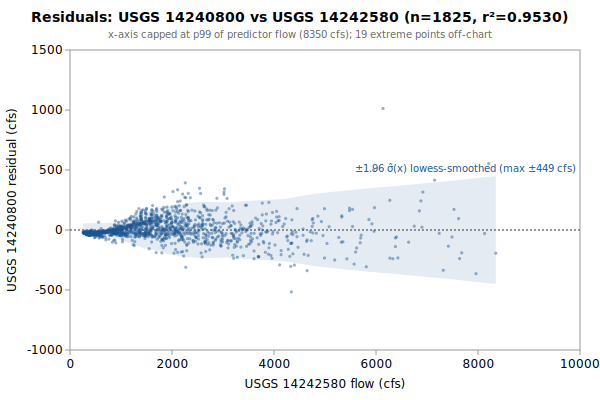

# Multi-Linear regression: USGS 14240800 from 14242580, 14236200

**Goal**: estimate USGS `14240800` from `14242580`, `14236200` so a downstream `calc_expression` can replace the target gauge.



Generated by:

```bash
python3 scripts/regression/gauge_pair_linear.py \
    --predictor 14242580 \
    --predictor 14236200 \
    --target 14240800 \
    --start 1989-10-01 \
    --end 1994-09-29 \
    --name green_14240800_from_tower_tilton \
    --calc-handle tw::14242580 \
    --calc-handle ti::14236200
```

## Data

All series are USGS daily-mean flow (`parameterCd=00060`, `statCd=00003`).

| Gauge | Period of record | Daily means |
|---|---|---|
| `14240800` (target) | 1980-09-08 → **1994-09-29** | 5135 |
| `14242580` (predictor) | 1981-03-24 → 2026-06-03 | 16508 |
| `14236200` (predictor) | 1956-10-01 → 2026-06-03 | 25448 |
| **Overlap (full)** | 1981-03-24 → 1994-09-29 | **4938** |

Note: USGS records can be **non-contiguous** (instrumentation outages).
The chosen window is selected for *data points*, not calendar span.

## Chosen fit

Window: **1989-10-01 → 1994-09-29**, n = **1825** daily means (~5.0 years of data).

### Coefficients (with honest, autocorrelation-aware uncertainty)

Daily streamflow residuals are strongly autocorrelated (lag-1 **0.70** here), which violates the IID assumption behind the OLS standard errors — so **SE (OLS)** is optimistic. **SE (block-boot)** resamples whole monthly blocks (60 months, B=1000), preserving the serial correlation; it is the realistic figure and runs about **6.1x** the OLS SE. The **95% CI** below is the block-bootstrap percentile interval. **VIF** is the variance-inflation factor (collinearity with the other predictors); VIF > 10 means the individual coefficient is poorly determined and should not be read as a physical sensitivity.

| Term | Estimate | SE (OLS) | SE (block-boot) | 95% CI (block-boot) | VIF |
|---|---|---|---|---|---|
| intercept | +0.684262 | 3.463 | 9.513 | [-17.56, +19.4] | — |
| tw::14242580 (predictor 1: 14242580) | +0.204922 | 0.002745 | 0.01558 | [+0.1751, +0.2338] | 4.1 |
| ti::14236200 (predictor 2: 14236200) | +0.108959 | 0.004808 | 0.03105 | [+0.05543, +0.1698] | 4.1 |

r² = **0.9530**, RMSE = **101.36 cfs** (sigma_hat = 101.45 cfs unbiased).

Predictor / target summary:

| Series | Mean | Range |
|---|---|---|
| target `14240800` | 447.33 | [37, 5220] |
| predictor `14242580` | 1785.28 | [255, 20800] |
| predictor `14236200` | 741.62 | [55, 13400] |

### Parameter covariance

Full variance-covariance matrix (rows/cols in `coef_names` order):

```
                intercept            x1            x2
   intercept  +1.1991e+01  -4.9425e-03  +3.3334e-03
          x1  -4.9425e-03  +7.5337e-06  -1.1471e-05
          x2  +3.3334e-03  -1.1471e-05  +2.3120e-05
```

Correlation matrix:

```
              intercept          x1          x2
   intercept  +1.0000      -0.5200      +0.2002
          x1  -0.5200      +1.0000      -0.8692
          x2  +0.2002      -0.8692      +1.0000
```

**Caveat 1 (autocorrelation)**: this is the **OLS** covariance, which assumes IID residuals; with lag-1 residual autocorrelation **0.70** it understates the parameter SE by roughly **6.1x**. Use the block-bootstrap SEs/CIs in the coefficients table for inference, not these (monthly blocks; longer blocks would only widen the intervals, so they are conservative for the most autocorrelated fits).

**Caveat 2 (prediction vs parameter)**: even with correct parameter SEs, a single-day prediction at new `x` is dominated by the residual scatter `sigma_hat` (about 101 cfs at 1-sigma here), not by parameter uncertainty. `sigma_hat` is a valid *marginal* description of single-day error (autocorrelation barely biases it); what autocorrelation breaks is treating the n days as n independent observations.

## Window stability

Re-fit at multiple start dates (endpoint fixed at `1994-09-29`):

| Window start | n | data yr | r² | RMSE |
|---|---|---|---|---|
| 1981-03-24 | 4938 | 13.5 | 0.9275 | 131.4 |
| 1984-10-02 | 3650 | 10.0 | 0.9339 | 118.1 |
| 1989-10-01 | 1825 | 5.0 | 0.9530 | 101.4 |
| 1990-01-01 | 1733 | 4.7 | 0.9527 | 101.9 |

(Multi-predictor coefficients in the stability table would be wide; per-window coefficient drift can be inspected by re-running the script with a different `--start`.)

## Residual diagnostics

**Percentile distribution** (residual = y - y_hat, cfs):

| p01 | p05 | p25 | p50 | p75 | p95 | p99 |
|---|---|---|---|---|---|---|
| -290.5 | -128.6 | -32.5 | -20.8 | +36.8 | +163.2 | +299.3 |

**By predictor-1 quintile** (Q1 = lowest values of `14242580`):

| Quintile | x median | mean residual | std residual | n |
|---|---|---|---|---|
| Q1 | 361 | -27.0 | 6.9 | 365 |
| Q2 | 663 | -19.1 | 23.8 | 365 |
| Q3 | 1380 | +31.6 | 65.5 | 365 |
| Q4 | 2110 | +33.5 | 105.8 | 365 |
| Q5 | 3650 | -19.0 | 178.4 | 365 |

### By hydrologic season

Residuals bucketed by monsoonal season (most kayak gauges sit in a PNW monsoonal regime). **Mean / median flow** give each season's target-flow magnitude. **Bias** is the mean residual (y - y_hat); a non-zero bias means the pooled fit systematically over- (negative) or under-predicts (positive) in that season. **% of flow** normalizes the bias by the season's mean flow so it's comparable across gauges. The remaining columns (median residual, std, RMSE) are residual statistics in cfs.

| Season | n | mean flow | median flow | bias (cfs) | % of flow | median resid | std | RMSE |
|---|---|---|---|---|---|---|---|---|
| Heavy rain (Nov-Dec) | 305 | 614 | 501 | +20.7 | +3.4% | -0.8 | 134.7 | 136.0 |
| Light rain (Jan-Feb) | 296 | 705 | 498 | -36.0 | -5.1% | -31.4 | 128.9 | 133.6 |
| Rain-on-snow (Mar-Apr) | 305 | 668 | 607 | -16.3 | -2.4% | -22.4 | 109.8 | 110.9 |
| Dry season (May-Oct) | 919 | 236 | 106 | +10.1 | +4.3% | -21.0 | 65.8 | 66.6 |

A season whose bias is large relative to `sigma_hat` (the pooled 1-sigma residual scatter) is a candidate for a season-specific intercept or a separate seasonal fit; a season with elevated `std`/`RMSE` but near-zero bias is just noisier (e.g., flashy storm response), not mis-calibrated.

## Predictions at example x values

For each row, `y_hat` is the fitted value and the two CIs are 95% two-sided bands. The **mean-response CI** is the uncertainty in `E[y | x]` (use for plotting the fit line's confidence band). The **prediction CI** is for a *single new observation* — bounded below by `sigma_hat` regardless of how precisely the parameters are estimated.

| pred-1 position | x (14242580) | x (14236200) | y_hat | 95% CI (mean resp.) | 95% CI (single obs.) |
|---|---|---|---|---|---|
| p05 (low) | 319 | 742 | 146.9 | [137.7, 156.0] (±9.2) | [-52.2, 345.9] (±199.0) |
| p25 | 529 | 742 | 189.9 | [181.7, 198.1] (±8.2) | [-9.1, 388.9] (±199.0) |
| p50 (median) | 1380 | 742 | 364.3 | [359.1, 369.4] (±5.1) | [165.4, 563.2] (±198.9) |
| p75 | 2320 | 742 | 556.9 | [551.4, 562.4] (±5.5) | [358.0, 755.8] (±198.9) |
| p95 (high) | 4710 | 742 | 1046.7 | [1030.3, 1063.1] (±16.4) | [847.2, 1246.2] (±199.5) |

### Computing a CI at any other x*

All the information needed to compute prediction CIs at any new predictor value is in this document. With the design row `X* = [1, x1*, x2*, ...]` — plus a squared column for each predictor fitted quadratically, in predictor order — matching the column order in the covariance matrix above:

```
y_hat = X* . coefs
Var(mean response) = X* . Cov(beta) . X*'
Var(single observation) = Var(mean response) + sigma_hat^2
SE = sqrt(Var)
95% CI = y_hat +/- 1.96 * SE     (n >> 30, large-sample z; use t_{n-p} for small n)
```

## `calc_expression` row

`calc_expression` rows are **metadata**: add a row to `calc_expression.csv` in the `kayak_data` repo (stable `id` from `id_counters.csv`, `provenance_slug` = this report's slug) and let `levels sync-metadata` apply it on deploy. Do **not** put this in a migration — a new migration may not write a metadata table (`tests/test_scripts/test_migrations_schema_only.py`). The handles (`tw::14242580`, `ti::14236200`) follow the `prefix::gauge_name` convention enforced by `kayak.cli.calculator._resolve_refs`. Column values:

```
data_type:       flow
expression:      round(greatest(0, 0.204922 * tw::14242580::flow + 0.108959 * ti::14236200::flow +0.6843))
time_expression: tw::14242580::flow ti::14236200::flow
note:            multi-linear regression fit. n=1825 daily means, window 1989-10-01..1994-09-29, r2=0.9530, RMSE=101.4 cfs. See docs/regression/green_14240800_from_tower_tilton.md.
provenance_slug: green_14240800_from_tower_tilton
```

Flesh out `note` before committing — the strongest existing rows also record window stability, rejected predictors, and any drainage-area scaling (see `calc_expression.csv` for examples).

## Future

- **Piecewise-linear fit by predictor-1 quintile.** If the residual table above shows systematic mean drift across quintiles (e.g., consistently under-estimating at low flow and over-estimating at high flow), splitting the predictor range into 2-3 regimes and fitting one linear model per regime can halve RMSE without adding free parameters beyond what `calc_expression` already supports via `greatest(low_estimate, high_estimate)` or `if(x < threshold, ..., ...)`-style composition. Worth trying when RMSE > ~10% of the mean target value.
- **Re-running** when the active predictor's rating curve drifts. USGS occasionally updates stage-discharge ratings; the `Reproduce` snippet above re-pulls the full period of record on demand.
- **Sub-daily lead/lag.** This fit is on daily means, but the `calc_expression` applies its coefficients to the *latest instantaneous* predictor readings — so inter-gauge travel time (1-12 h) becomes a timing error the daily fit never sees. `gauge_lead_lag.py` (same directory) quantifies that error from USGS unit values; worth a look when predictors are many river-miles from the target. (Run it to embed a summary here via `--leadlag`.)
