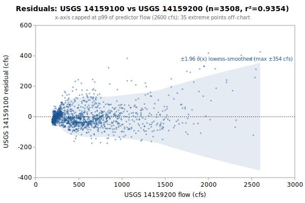

# Multi-Linear regression: USGS 14159100 from 14159200, 14158850

**Goal**: estimate USGS `14159100` from `14159200`, `14158850` so a downstream `calc_expression` can replace the target gauge.



Generated by:

```bash
python3 scripts/regression/gauge_pair_linear.py \
    --predictor 14159200 \
    --predictor 14158850 \
    --target 14159100 \
    --start 1962-10-01 \
    --end 2026-04-01 \
    --name horse_14159100_from_sfcougar_trailbridge
```

## Data

All series are USGS daily-mean flow (`parameterCd=00060`, `statCd=00003`).

| Gauge | Period of record | Daily means |
|---|---|---|
| `14159100` (target) | 1962-10-01 → **2026-04-01** | 3508 |
| `14159200` (predictor) | 1957-10-01 → 2026-05-21 | 20320 |
| `14158850` (predictor) | 1959-10-01 → 2026-05-21 | 24340 |
| **Overlap (full)** | 1962-10-01 → 2026-04-01 | **3508** |

Note: USGS records can be **non-contiguous** (instrumentation outages).
The chosen window is selected for *data points*, not calendar span.

## Chosen fit

Window: **1962-10-01 → 2026-04-01**, n = **3508** daily means (~9.6 years of data).

### Coefficients (1-sigma uncertainty)

| Term | Estimate | SE | 95% CI |
|---|---|---|---|
| intercept | +53.4289 | 5.524 | [+42.6, +64.26] |
| sc::SF_McKenzie_Cougar_merge (predictor 1: 14159200) | +0.403663 | 0.004915 | [+0.394, +0.4133] |
| tb::14158850 (predictor 2: 14158850) | +0.217772 | 0.007729 | [+0.2026, +0.2329] |

r² = **0.9354**, RMSE = **88.40 cfs** (sigma_hat = 88.44 cfs unbiased).

Predictor / target summary:

| Series | Mean | Range |
|---|---|---|
| target `14159100` | 518.24 | [220, 5680] |
| predictor `14159200` | 610.22 | [191, 14000] |
| predictor `14158850` | 1003.27 | [425, 7650] |

### Parameter covariance

Full variance-covariance matrix (rows/cols in `coef_names` order):

```
                intercept            x1            x2
   intercept  +3.0510e+01  +1.8731e-02  -3.9581e-02
          x1  +1.8731e-02  +2.4152e-05  -3.3360e-05
          x2  -3.9581e-02  -3.3360e-05  +5.9742e-05
```

Correlation matrix:

```
              intercept          x1          x2
   intercept  +1.0000      +0.6900      -0.9271    
          x1  +0.6900      +1.0000      -0.8782    
          x2  -0.9271      -0.8782      +1.0000    
```

**Caveat**: these uncertainties capture *parameter* precision only. For a single-day prediction at new `x`, the prediction interval is dominated by the residual scatter `sigma_hat` (about 117 cfs at 1-sigma here), not by parameter SEs.

## Window stability

Re-fit at multiple start dates (endpoint fixed at `2026-04-01`):

| Window start | n | data yr | r² | RMSE |
|---|---|---|---|---|
| 1957-10-02 | 3508 | 9.6 | 0.9354 | 88.4 |
| 1962-10-01 | 3508 | 9.6 | 0.9354 | 88.4 |
| 1967-09-30 | 1683 | 4.6 | 0.9458 | 79.6 |
| 1972-09-28 | 951 | 2.6 | 0.9645 | 74.8 |
| 1977-09-27 | 951 | 2.6 | 0.9645 | 74.8 |
| 1990-01-01 | 951 | 2.6 | 0.9645 | 74.8 |

(Multi-predictor coefficients in the stability table would be wide; per-window coefficient drift can be inspected by re-running the script with a different `--start`.)

## Residual diagnostics

**Percentile distribution** (residual = y - y_hat, cfs):

| p01 | p05 | p25 | p50 | p75 | p95 | p99 |
|---|---|---|---|---|---|---|
| -150.2 | -87.4 | -36.4 | -9.8 | +21.3 | +121.9 | +304.9 |

**By predictor-1 quintile** (Q1 = lowest values of `14159200`):

| Quintile | x median | mean residual | std residual | n |
|---|---|---|---|---|
| Q1 | 215 | -14.9 | 23.3 | 701 |
| Q2 | 274 | +10.1 | 35.9 | 701 |
| Q3 | 452 | -8.5 | 61.7 | 701 |
| Q4 | 678 | -7.3 | 66.8 | 701 |
| Q5 | 1170 | +20.4 | 167.6 | 704 |

## Predictions at example x values

For each row, `y_hat` is the fitted value and the two CIs are 95% two-sided bands. The **mean-response CI** is the uncertainty in `E[y | x]` (use for plotting the fit line's confidence band). The **prediction CI** is for a *single new observation* — bounded below by `sigma_hat` regardless of how precisely the parameters are estimated.

| pred-1 position | x (14159200) | x (14158850) | y_hat | 95% CI (mean resp.) | 95% CI (single obs.) |
|---|---|---|---|---|---|
| p05 (low) | 205 | 1003 | 354.7 | [349.8, 359.5] (±4.9) | [181.3, 528.1] (±173.4) |
| p25 | 253 | 1003 | 374.0 | [369.5, 378.6] (±4.5) | [200.6, 547.4] (±173.4) |
| p50 (median) | 452 | 1003 | 454.4 | [451.1, 457.7] (±3.3) | [281.0, 627.7] (±173.4) |
| p75 | 746 | 1003 | 573.0 | [569.8, 576.3] (±3.2) | [399.7, 746.4] (±173.4) |
| p95 (high) | 1480 | 1003 | 869.3 | [860.5, 878.2] (±8.9) | [695.8, 1042.9] (±173.6) |

### Computing a CI at any other x*

All the information needed to compute prediction CIs at any new predictor value is in this document. With the design row `X* = [1, x1*, x2*, ..., x1*^2, x2*^2, ...]` matching the column order in the covariance matrix above:

```
y_hat = X* . coefs
Var(mean response) = X* . Cov(beta) . X*'
Var(single observation) = Var(mean response) + sigma_hat^2
SE = sqrt(Var)
95% CI = y_hat +/- 1.96 * SE     (n >> 30, large-sample z; use t_{n-p} for small n)
```

## SQL stub for `calc_expression`

Paste this into a `data/db/migrations/00NN_*.sql` file. The handles (`sc::SF_McKenzie_Cougar_merge`, `tb::14158850`) follow the `prefix::gauge_name` convention enforced by `kayak.cli.calculator._resolve_refs`:

```sql
INSERT INTO calc_expression (data_type, expression, time_expression, note) SELECT
    'flow',
    'round(greatest(0, 0.403663 * sc::SF_McKenzie_Cougar_merge::flow + 0.217772 * tb::14158850::flow +53.43))',
    'sc::SF_McKenzie_Cougar_merge::flow tb::14158850::flow',
    'multi-linear regression fit. n=3508 daily means, window 1962-10-01..2026-04-01, r2=0.9354, RMSE=88.4 cfs.'
WHERE NOT EXISTS (
    SELECT 1 FROM calc_expression WHERE time_expression = 'sc::SF_McKenzie_Cougar_merge::flow tb::14158850::flow'
);
```

**Note**: the migration runner (`cli/migrate.py::_split_statements`) splits SQL on `;` without understanding string literals, so make sure no `;` appears inside the `note` text.

## Future

- **Piecewise-linear fit by predictor-1 quintile.** If the residual table above shows systematic mean drift across quintiles (e.g., consistently under-estimating at low flow and over-estimating at high flow), splitting the predictor range into 2-3 regimes and fitting one linear model per regime can halve RMSE without adding free parameters beyond what `calc_expression` already supports via `greatest(low_estimate, high_estimate)` or `if(x < threshold, ..., ...)`-style composition. Worth trying when RMSE > ~10% of the mean target value.
- **Re-running** when the active predictor's rating curve drifts. USGS occasionally updates stage-discharge ratings; the `Reproduce` snippet above re-pulls the full period of record on demand.
