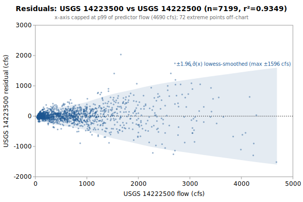

# Multi-Linear+Quadratic(14222500) regression: USGS 14223500 from 14222500, 14236200

**Goal**: estimate USGS `14223500` from `14222500`, `14236200` so a downstream `calc_expression` can replace the target gauge.



Generated by:

```bash
python3 scripts/regression/gauge_pair_linear.py \
    --predictor 14222500 \
    --predictor 14236200 \
    --target 14223500 \
    --start 1956-10-01 \
    --end 1982-09-12 \
    --name kalama_14223500_from_eflewis_tilton \
    --calc-handle ef::EF_Lewis_Washington_merge \
    --calc-handle ti::14236200 \
    --deploy-note 'The deployed expression caps the EF Lewis input at its fitted maximum: every ef reference becomes least(ef, 15600). The fitted parabola'"'"'s vertex sits at EF=14955 cfs, just inside the observed range [30, 15600] - uncapped, a major EF Lewis flood (>20000 cfs has occurred, e.g. Feb 1996) would drive the formula toward zero. With the cap the estimate plateaus at the calibrated edge instead. In-range behavior is identical to this fit.' \
    --quadratic-for 14222500
```

## Data

All series are USGS daily-mean flow (`parameterCd=00060`, `statCd=00003`).

| Gauge | Period of record | Daily means |
|---|---|---|
| `14223500` (target) | 1946-10-01 → **1982-09-12** | 10852 |
| `14222500` (predictor) | 1929-10-01 → 2026-06-03 | 35310 |
| `14236200` (predictor) | 1956-10-01 → 2026-06-03 | 25448 |
| **Overlap (full)** | 1956-10-01 → 1982-09-12 | **7199** |

Note: USGS records can be **non-contiguous** (instrumentation outages).
The chosen window is selected for *data points*, not calendar span.

## Chosen fit

Window: **1956-10-01 → 1982-09-12**, n = **7199** daily means (~19.7 years of data).

### Coefficients (with honest, autocorrelation-aware uncertainty)

Daily streamflow residuals are strongly autocorrelated (lag-1 **0.66** here), which violates the IID assumption behind the OLS standard errors — so **SE (OLS)** is optimistic. **SE (block-boot)** resamples whole monthly blocks (239 months, B=1000), preserving the serial correlation; it is the realistic figure and runs about **3.7x** the OLS SE. The **95% CI** below is the block-bootstrap percentile interval. **VIF** is the variance-inflation factor (collinearity with the other predictors); VIF > 10 means the individual coefficient is poorly determined and should not be read as a physical sensitivity.

| Term | Estimate | SE (OLS) | SE (block-boot) | 95% CI (block-boot) | VIF |
|---|---|---|---|---|---|
| intercept | +187.188 | 5.392 | 13.02 | [+156.2, +207.6] | — |
| ef::EF_Lewis_Washington_merge (predictor 1: 14222500) | +1.14988 | 0.01103 | 0.04282 | [+1.074, +1.239] | 5.9 |
| ti::14236200 (predictor 2: 14236200) | +0.24075 | 0.008484 | 0.03001 | [+0.1869, +0.3031] | 5.9 |
| (14222500)² | -3.84488e-05 | 1.097e-06 | 7.146e-06 | [-5.714e-05, -3.025e-05] | — |

r² = **0.9349**, RMSE = **312.64 cfs** (sigma_hat = 312.73 cfs unbiased).

Predictor / target summary:

| Series | Mean | Range |
|---|---|---|
| target `14223500` | 1225.27 | [93, 13800] |
| predictor `14222500` | 776.46 | [30, 15600] |
| predictor `14236200` | 854.26 | [52, 13400] |

### Parameter covariance

Full variance-covariance matrix (rows/cols in `coef_names` order):

```
                intercept            x1            x2          x1^2
   intercept  +2.9070e+01  -2.0155e-02  -4.9123e-03  +2.7748e-06
          x1  -2.0155e-02  +1.2173e-04  -7.4436e-05  -6.8598e-09
          x2  -4.9123e-03  -7.4436e-05  +7.1983e-05  +7.7414e-10
        x1^2  +2.7748e-06  -6.8598e-09  +7.7414e-10  +1.2029e-12
```

Correlation matrix:

```
              intercept          x1          x2        x1^2
   intercept  +1.0000      -0.3388      -0.1074      +0.4693
          x1  -0.3388      +1.0000      -0.7952      -0.5669
          x2  -0.1074      -0.7952      +1.0000      +0.0832
        x1^2  +0.4693      -0.5669      +0.0832      +1.0000
```

**Caveat 1 (autocorrelation)**: this is the **OLS** covariance, which assumes IID residuals; with lag-1 residual autocorrelation **0.66** it understates the parameter SE by roughly **3.7x**. Use the block-bootstrap SEs/CIs in the coefficients table for inference, not these (monthly blocks; longer blocks would only widen the intervals, so they are conservative for the most autocorrelated fits).

**Caveat 2 (prediction vs parameter)**: even with correct parameter SEs, a single-day prediction at new `x` is dominated by the residual scatter `sigma_hat` (about 313 cfs at 1-sigma here), not by parameter uncertainty. `sigma_hat` is a valid *marginal* description of single-day error (autocorrelation barely biases it); what autocorrelation breaks is treating the n days as n independent observations.

## Window stability

Re-fit at multiple start dates (endpoint fixed at `1982-09-12`):

| Window start | n | data yr | r² | RMSE |
|---|---|---|---|---|
| 1951-10-03 | 7199 | 19.7 | 0.9349 | 312.6 |
| 1956-10-01 | 7199 | 19.7 | 0.9349 | 312.6 |
| 1961-09-30 | 5374 | 14.7 | 0.9373 | 313.0 |
| 1966-09-29 | 3549 | 9.7 | 0.9336 | 338.1 |
| 1971-09-28 | 1724 | 4.7 | 0.9466 | 329.3 |

(Multi-predictor coefficients in the stability table would be wide; per-window coefficient drift can be inspected by re-running the script with a different `--start`.)

## Residual diagnostics

**Percentile distribution** (residual = y - y_hat, cfs):

| p01 | p05 | p25 | p50 | p75 | p95 | p99 |
|---|---|---|---|---|---|---|
| -933.2 | -402.2 | -81.1 | -15.2 | +84.4 | +404.0 | +1010.3 |

**By predictor-1 quintile** (Q1 = lowest values of `14222500`):

| Quintile | x median | mean residual | std residual | n |
|---|---|---|---|---|
| Q1 | 68 | -23.3 | 47.3 | 1439 |
| Q2 | 185 | +5.6 | 101.2 | 1439 |
| Q3 | 480 | +13.6 | 156.7 | 1439 |
| Q4 | 867 | -12.8 | 218.4 | 1439 |
| Q5 | 1820 | +16.8 | 634.3 | 1443 |

### By hydrologic season

Residuals bucketed by monsoonal season (most kayak gauges sit in a PNW monsoonal regime). **Mean / median flow** give each season's target-flow magnitude. **Bias** is the mean residual (y - y_hat); a non-zero bias means the pooled fit systematically over- (negative) or under-predicts (positive) in that season. **% of flow** normalizes the bias by the season's mean flow so it's comparable across gauges. The remaining columns (median residual, std, RMSE) are residual statistics in cfs.

| Season | n | mean flow | median flow | bias (cfs) | % of flow | median resid | std | RMSE |
|---|---|---|---|---|---|---|---|---|
| Heavy rain (Nov-Dec) | 1220 | 1871 | 1410 | -55.7 | -3.0% | -65.2 | 427.8 | 431.2 |
| Light rain (Jan-Feb) | 1146 | 2203 | 1700 | +43.7 | +2.0% | +44.3 | 478.9 | 480.6 |
| Rain-on-snow (Mar-Apr) | 1159 | 1659 | 1390 | +60.2 | +3.6% | +29.0 | 325.8 | 331.2 |
| Dry season (May-Oct) | 3674 | 569 | 400 | -14.1 | -2.5% | -22.8 | 151.4 | 152.1 |

A season whose bias is large relative to `sigma_hat` (the pooled 1-sigma residual scatter) is a candidate for a season-specific intercept or a separate seasonal fit; a season with elevated `std`/`RMSE` but near-zero bias is just noisier (e.g., flashy storm response), not mis-calibrated.

## Predictions at example x values

For each row, `y_hat` is the fitted value and the two CIs are 95% two-sided bands. The **mean-response CI** is the uncertainty in `E[y | x]` (use for plotting the fit line's confidence band). The **prediction CI** is for a *single new observation* — bounded below by `sigma_hat` regardless of how precisely the parameters are estimated.

| pred-1 position | x (14222500) | x (14236200) | y_hat | 95% CI (mean resp.) | 95% CI (single obs.) |
|---|---|---|---|---|---|
| p05 (low) | 55 | 854 | 456.0 | [440.3, 471.7] (±15.7) | [-157.2, 1069.1] (±613.1) |
| p25 | 140 | 854 | 553.1 | [538.9, 567.2] (±14.2) | [-60.0, 1166.2] (±613.1) |
| p50 (median) | 480 | 854 | 935.9 | [927.0, 944.9] (±9.0) | [322.9, 1548.9] (±613.0) |
| p75 | 1000 | 854 | 1504.3 | [1495.1, 1513.4] (±9.2) | [891.3, 2117.3] (±613.0) |
| p95 (high) | 2590 | 854 | 3113.1 | [3078.2, 3148.1] (±34.9) | [2499.2, 3727.1] (±613.9) |

### Computing a CI at any other x*

All the information needed to compute prediction CIs at any new predictor value is in this document. With the design row `X* = [1, x1*, x2*, ...]` — plus a squared column for each predictor fitted quadratically, in predictor order — matching the column order in the covariance matrix above:

```
y_hat = X* . coefs
Var(mean response) = X* . Cov(beta) . X*'
Var(single observation) = Var(mean response) + sigma_hat^2
SE = sqrt(Var)
95% CI = y_hat +/- 1.96 * SE     (n >> 30, large-sample z; use t_{n-p} for small n)
```

## `calc_expression` row

`calc_expression` rows are **metadata**: add a row to `calc_expression.csv` in the `kayak_data` repo (stable `id` from `id_counters.csv`, `provenance_slug` = this report's slug) and let `levels sync-metadata` apply it on deploy. Do **not** put this in a migration — a new migration may not write a metadata table (`tests/test_scripts/test_migrations_schema_only.py`). The handles (`ef::EF_Lewis_Washington_merge`, `ti::14236200`) follow the `prefix::gauge_name` convention enforced by `kayak.cli.calculator._resolve_refs`. Column values:

```
data_type:       flow
expression:      round(greatest(0, 1.14988 * ef::EF_Lewis_Washington_merge::flow + 0.24075 * ti::14236200::flow + -3.84488e-05 * ef::EF_Lewis_Washington_merge::flow * ef::EF_Lewis_Washington_merge::flow +187.2))
time_expression: ef::EF_Lewis_Washington_merge::flow ti::14236200::flow
note:            multi-linear+quadratic(14222500) regression fit. n=7199 daily means, window 1956-10-01..1982-09-12, r2=0.9349, RMSE=312.6 cfs. See docs/regression/kalama_14223500_from_eflewis_tilton.md.
provenance_slug: kalama_14223500_from_eflewis_tilton
```

⚠️ **Deployment note — the deployed expression differs from this fit**: The deployed expression caps the EF Lewis input at its fitted maximum: every ef reference becomes least(ef, 15600). The fitted parabola's vertex sits at EF=14955 cfs, just inside the observed range [30, 15600] - uncapped, a major EF Lewis flood (>20000 cfs has occurred, e.g. Feb 1996) would drive the formula toward zero. With the cap the estimate plateaus at the calibrated edge instead. In-range behavior is identical to this fit. Do not copy the expression above verbatim; apply the stated composition first.

Flesh out `note` before committing — the strongest existing rows also record window stability, rejected predictors, and any drainage-area scaling (see `calc_expression.csv` for examples).

## Future

- **Piecewise-linear fit by predictor-1 quintile.** If the residual table above shows systematic mean drift across quintiles (e.g., consistently under-estimating at low flow and over-estimating at high flow), splitting the predictor range into 2-3 regimes and fitting one linear model per regime can halve RMSE without adding free parameters beyond what `calc_expression` already supports via `greatest(low_estimate, high_estimate)` or `if(x < threshold, ..., ...)`-style composition. Worth trying when RMSE > ~10% of the mean target value.
- **Re-running** when the active predictor's rating curve drifts. USGS occasionally updates stage-discharge ratings; the `Reproduce` snippet above re-pulls the full period of record on demand.
- **Sub-daily lead/lag.** This fit is on daily means, but the `calc_expression` applies its coefficients to the *latest instantaneous* predictor readings — so inter-gauge travel time (1-12 h) becomes a timing error the daily fit never sees. `gauge_lead_lag.py` (same directory) quantifies that error from USGS unit values; worth a look when predictors are many river-miles from the target. (Run it to embed a summary here via `--leadlag`.)
