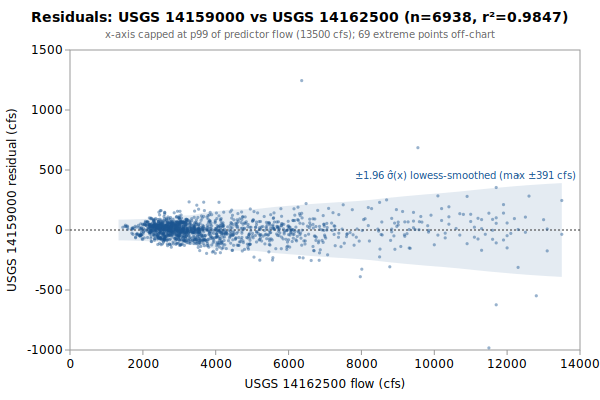

# Multi-Linear regression: USGS 14159000 from 14162500, 14158850, 14159500, 14159200, 14161500

**Goal**: estimate USGS `14159000` from `14162500`, `14158850`, `14159500`, `14159200`, `14161500` so a downstream `calc_expression` can replace the target gauge.



Generated by:

```bash
python3 scripts/regression/gauge_pair_linear.py \
    --predictor 14162500 \
    --predictor 14158850 \
    --predictor 14159500 \
    --predictor 14159200 \
    --predictor 14161500 \
    --target 14159000 \
    --start 1968-10-01 \
    --end 1994-09-29 \
    --name mckenzie_14159000_from_vida_trailbridge_sfrainbow_sfcougar_lookout
```

## Data

All series are USGS daily-mean flow (`parameterCd=00060`, `statCd=00003`).

| Gauge | Period of record | Daily means |
|---|---|---|
| `14159000` (target) | 1910-08-01 → **1994-09-29** | 30741 |
| `14162500` (predictor) | 1910-07-01 → 2026-06-01 | 37438 |
| `14158850` (predictor) | 1959-10-01 → 2026-06-01 | 24351 |
| `14159500` (predictor) | 1947-10-01 → 2026-06-01 | 28734 |
| `14159200` (predictor) | 1957-10-01 → 2026-06-01 | 20331 |
| `14161500` (predictor) | 1949-10-01 → 2026-06-01 | 25110 |
| **Overlap (full)** | 1963-09-01 → 1987-09-29 | **8795** |

Note: USGS records can be **non-contiguous** (instrumentation outages).
The chosen window is selected for *data points*, not calendar span.

## Chosen fit

Window: **1968-10-01 → 1994-09-29**, n = **6938** daily means (~19.0 years of data).

### Coefficients (with honest, autocorrelation-aware uncertainty)

Daily streamflow residuals are strongly autocorrelated (lag-1 **0.71** here), which violates the IID assumption behind the OLS standard errors — so **SE (OLS)** is optimistic. **SE (block-boot)** resamples whole monthly blocks (228 months, B=1000), preserving the serial correlation; it is the realistic figure and runs about **3.5x** the OLS SE. The **95% CI** below is the block-bootstrap percentile interval. **VIF** is the variance-inflation factor (collinearity with the other predictors); VIF > 10 means the individual coefficient is poorly determined and should not be read as a physical sensitivity.

| Term | Estimate | SE (OLS) | SE (block-boot) | 95% CI (block-boot) | VIF |
|---|---|---|---|---|---|
| intercept | +162.095 | 4.134 | 13.63 | [+134, +186.7] | — |
| vd::MCKENZIE_VIDA_merge (predictor 1: 14162500) | +0.0691955 | 0.002215 | 0.007693 | [+0.05428, +0.08345] | 23.1 |
| tb::14158850 (predictor 2: 14158850) | +1.21419 | 0.007026 | 0.02418 | [+1.169, +1.263] | 6.3 |
| sr::SF_McKenzie_near_Rainbow (predictor 3: 14159500) | -0.0930529 | 0.003786 | 0.01407 | [-0.1199, -0.06622] | 5.5 |
| sc::SF_McKenzie_Cougar_merge (predictor 4: 14159200) | +0.116552 | 0.007893 | 0.02655 | [+0.06618, +0.1714] | 16.3 |
| lk::Lookout_Blue_merge (predictor 5: 14161500) | +0.561507 | 0.02399 | 0.08793 | [+0.3914, +0.7211] | 12.6 |

r² = **0.9847**, RMSE = **94.91 cfs** (sigma_hat = 94.95 cfs unbiased).

Predictor / target summary:

| Series | Mean | Range |
|---|---|---|
| target `14159000` | 1775.62 | [903, 10900] |
| predictor `14162500` | 4220.67 | [1330, 23600] |
| predictor `14158850` | 1032.95 | [495, 4660] |
| predictor `14159500` | 839.42 | [85, 6050] |
| predictor `14159200` | 653.35 | [175, 8260] |
| predictor `14161500` | 123.31 | [5, 2230] |

### Parameter covariance

Full variance-covariance matrix (rows/cols in `coef_names` order):

```
                intercept            x1            x2            x3            x4            x5
   intercept  +1.7092e+01  -1.9220e-03  -1.8928e-02  +3.0732e-03  +1.2399e-02  +9.6564e-03
          x1  -1.9220e-03  +4.9082e-06  -6.7155e-06  -7.3770e-06  -3.2024e-06  -2.8970e-05
          x2  -1.8928e-02  -6.7155e-06  +4.9371e-05  +6.9230e-06  -2.8941e-05  +7.5995e-05
          x3  +3.0732e-03  -7.3770e-06  +6.9230e-06  +1.4332e-05  +5.1708e-06  +4.4626e-05
          x4  +1.2399e-02  -3.2024e-06  -2.8941e-05  +5.1708e-06  +6.2294e-05  -1.1376e-04
          x5  +9.6564e-03  -2.8970e-05  +7.5995e-05  +4.4626e-05  -1.1376e-04  +5.7566e-04
```

Correlation matrix:

```
              intercept          x1          x2          x3          x4          x5
   intercept  +1.0000      -0.2098      -0.6516      +0.1964      +0.3800      +0.0974    
          x1  -0.2098      +1.0000      -0.4314      -0.8796      -0.1831      -0.5450    
          x2  -0.6516      -0.4314      +1.0000      +0.2603      -0.5219      +0.4508    
          x3  +0.1964      -0.8796      +0.2603      +1.0000      +0.1731      +0.4913    
          x4  +0.3800      -0.1831      -0.5219      +0.1731      +1.0000      -0.6007    
          x5  +0.0974      -0.5450      +0.4508      +0.4913      -0.6007      +1.0000    
```

**Caveat 1 (autocorrelation)**: this is the **OLS** covariance, which assumes IID residuals; with lag-1 residual autocorrelation **0.71** it understates the true parameter variance by roughly **3.5x** (in SE terms). Use the block-bootstrap SEs/CIs in the coefficients table for inference, not these.

**Caveat 2 (prediction vs parameter)**: even with correct parameter SEs, a single-day prediction at new `x` is dominated by the residual scatter `sigma_hat` (about 95 cfs at 1-sigma here), not by parameter uncertainty. `sigma_hat` is a valid *marginal* description of single-day error (autocorrelation barely biases it); what autocorrelation breaks is treating the n days as n independent observations.

## Window stability

Re-fit at multiple start dates (endpoint fixed at `1994-09-29`):

| Window start | n | data yr | r² | RMSE |
|---|---|---|---|---|
| 1963-09-01 | 8795 | 24.1 | 0.9821 | 104.4 |
| 1963-10-03 | 8763 | 24.0 | 0.9821 | 104.5 |
| 1968-10-01 | 6938 | 19.0 | 0.9847 | 94.9 |
| 1973-09-30 | 5113 | 14.0 | 0.9821 | 98.7 |
| 1978-09-29 | 3288 | 9.0 | 0.9806 | 97.4 |
| 1983-09-28 | 1463 | 4.0 | 0.9767 | 100.8 |
| 1990-01-01 | — | — | — | — |

(Multi-predictor coefficients in the stability table would be wide; per-window coefficient drift can be inspected by re-running the script with a different `--start`.)

## Residual diagnostics

**Percentile distribution** (residual = y - y_hat, cfs):

| p01 | p05 | p25 | p50 | p75 | p95 | p99 |
|---|---|---|---|---|---|---|
| -225.2 | -123.2 | -43.8 | +5.4 | +42.8 | +123.5 | +227.4 |

**By predictor-1 quintile** (Q1 = lowest values of `14162500`):

| Quintile | x median | mean residual | std residual | n |
|---|---|---|---|---|
| Q1 | 2340 | +11.3 | 46.1 | 1387 |
| Q2 | 2790 | +5.3 | 55.8 | 1387 |
| Q3 | 3280 | -1.2 | 62.4 | 1387 |
| Q4 | 4380 | -11.5 | 87.1 | 1387 |
| Q5 | 7430 | -3.9 | 167.3 | 1390 |

### By hydrologic season

Residuals bucketed by monsoonal season (most kayak gauges sit in a PNW monsoonal regime). **Mean / median flow** give each season's target-flow magnitude. **Bias** is the mean residual (y - y_hat); a non-zero bias means the pooled fit systematically over- (negative) or under-predicts (positive) in that season. **% of flow** normalizes the bias by the season's mean flow so it's comparable across gauges. The remaining columns (median residual, std, RMSE) are residual statistics in cfs.

| Season | n | mean flow | median flow | bias (cfs) | % of flow | median resid | std | RMSE |
|---|---|---|---|---|---|---|---|---|
| Heavy rain (Nov-Dec) | 1159 | 1987 | 1710 | -22.8 | -1.1% | -21.3 | 115.3 | 117.5 |
| Light rain (Jan-Feb) | 1125 | 2222 | 2000 | +15.7 | +0.7% | +12.3 | 146.6 | 147.4 |
| Rain-on-snow (Mar-Apr) | 1159 | 1994 | 1870 | -5.3 | -0.3% | -0.0 | 72.4 | 72.6 |
| Dry season (May-Oct) | 3495 | 1490 | 1330 | +4.3 | +0.3% | +11.4 | 67.4 | 67.6 |

A season whose bias is large relative to `sigma_hat` (the pooled 1-sigma residual scatter) is a candidate for a season-specific intercept or a separate seasonal fit; a season with elevated `std`/`RMSE` but near-zero bias is just noisier (e.g., flashy storm response), not mis-calibrated.

## Predictions at example x values

For each row, `y_hat` is the fitted value and the two CIs are 95% two-sided bands. The **mean-response CI** is the uncertainty in `E[y | x]` (use for plotting the fit line's confidence band). The **prediction CI** is for a *single new observation* — bounded below by `sigma_hat` regardless of how precisely the parameters are estimated.

| pred-1 position | x (14162500) | x (14158850) | x (14159500) | x (14159200) | x (14161500) | y_hat | 95% CI (mean resp.) | 95% CI (single obs.) |
|---|---|---|---|---|---|---|---|---|
| p05 (low) | 2180 | 1033 | 839 | 653 | 123 | 1634.4 | [1625.3, 1643.6] (±9.1) | [1448.1, 1820.7] (±186.3) |
| p25 | 2690 | 1033 | 839 | 653 | 123 | 1669.7 | [1662.7, 1676.7] (±7.0) | [1483.5, 1855.9] (±186.2) |
| p50 (median) | 3280 | 1033 | 839 | 653 | 123 | 1710.5 | [1705.9, 1715.2] (±4.7) | [1524.4, 1896.7] (±186.2) |
| p75 | 4870 | 1033 | 839 | 653 | 123 | 1820.6 | [1817.0, 1824.2] (±3.6) | [1634.4, 2006.7] (±186.1) |
| p95 (high) | 9760 | 1033 | 839 | 653 | 123 | 2158.9 | [2134.8, 2183.1] (±24.2) | [1971.3, 2346.6] (±187.7) |

### Computing a CI at any other x*

All the information needed to compute prediction CIs at any new predictor value is in this document. With the design row `X* = [1, x1*, x2*, ..., x1*^2, x2*^2, ...]` matching the column order in the covariance matrix above:

```
y_hat = X* . coefs
Var(mean response) = X* . Cov(beta) . X*'
Var(single observation) = Var(mean response) + sigma_hat^2
SE = sqrt(Var)
95% CI = y_hat +/- 1.96 * SE     (n >> 30, large-sample z; use t_{n-p} for small n)
```

## SQL stub for `calc_expression`

Paste this into a `data/db/migrations/00NN_*.sql` file. The handles (`vd::MCKENZIE_VIDA_merge`, `tb::14158850`, `sr::SF_McKenzie_near_Rainbow`, `sc::SF_McKenzie_Cougar_merge`, `lk::Lookout_Blue_merge`) follow the `prefix::gauge_name` convention enforced by `kayak.cli.calculator._resolve_refs`:

```sql
INSERT INTO calc_expression (data_type, expression, time_expression, note) SELECT
    'flow',
    'round(greatest(0, 0.0691955 * vd::MCKENZIE_VIDA_merge::flow + 1.21419 * tb::14158850::flow + -0.0930529 * sr::SF_McKenzie_near_Rainbow::flow + 0.116552 * sc::SF_McKenzie_Cougar_merge::flow + 0.561507 * lk::Lookout_Blue_merge::flow +162.1))',
    'vd::MCKENZIE_VIDA_merge::flow tb::14158850::flow sr::SF_McKenzie_near_Rainbow::flow sc::SF_McKenzie_Cougar_merge::flow lk::Lookout_Blue_merge::flow',
    'multi-linear regression fit. n=6938 daily means, window 1968-10-01..1994-09-29, r2=0.9847, RMSE=94.9 cfs.'
WHERE NOT EXISTS (
    SELECT 1 FROM calc_expression WHERE time_expression = 'vd::MCKENZIE_VIDA_merge::flow tb::14158850::flow sr::SF_McKenzie_near_Rainbow::flow sc::SF_McKenzie_Cougar_merge::flow lk::Lookout_Blue_merge::flow'
);
```

**Note**: the migration runner (`cli/migrate.py::_split_statements`) splits SQL on `;` without understanding string literals, so make sure no `;` appears inside the `note` text.

## Future

- **Piecewise-linear fit by predictor-1 quintile.** If the residual table above shows systematic mean drift across quintiles (e.g., consistently under-estimating at low flow and over-estimating at high flow), splitting the predictor range into 2-3 regimes and fitting one linear model per regime can halve RMSE without adding free parameters beyond what `calc_expression` already supports via `greatest(low_estimate, high_estimate)` or `if(x < threshold, ..., ...)`-style composition. Worth trying when RMSE > ~10% of the mean target value.
- **Re-running** when the active predictor's rating curve drifts. USGS occasionally updates stage-discharge ratings; the `Reproduce` snippet above re-pulls the full period of record on demand.
- **Sub-daily lead/lag.** This fit is on daily means, but the `calc_expression` applies its coefficients to the *latest instantaneous* predictor readings — so inter-gauge travel time (1-12 h) becomes a timing error the daily fit never sees. `gauge_lead_lag.py` (same directory) quantifies that error from USGS unit values; worth a look when predictors are many river-miles from the target.
