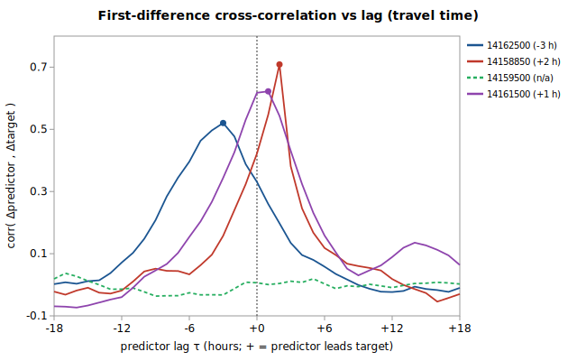

# Sub-daily lead/lag: USGS 14159000 regression

Companion to [`gauge_pair_linear.py`](../../scripts/regression/gauge_pair_linear.py) and the daily-mean fit in [`mckenzie_14159000_from_vida_trailbridge_sfrainbow_sfcougar_lookout.md`](./mckenzie_14159000_from_vida_trailbridge_sfrainbow_sfcougar_lookout.md). **Question:** the daily-mean coefficients are applied in production to the *latest instantaneous* predictor readings — does correcting for the 1-12 h travel time between gauges measurably improve accuracy?



Generated by:

```bash
python3 scripts/regression/gauge_lead_lag.py \
    --predictor 14162500 \
    --predictor 14158850 \
    --predictor 14159500 \
    --predictor 14161500 \
    --target 14159000 \
    --start 1987-10-01 \
    --end 1994-09-30 \
    --name mckenzie_14159000_leadlag
```

## Data

USGS **unit values** (sub-hourly discharge), resampled to hourly means on a common UTC grid over **1987-10-01 → 1994-09-30** (the target's UV window). Overlap where the target and all 4 predictors have an hourly value: **23,155 hours** (~2.6 years).

| Role | Gauge | Label |
|---|---|---|
| target | `14159000` | McKenzie at McKenzie Bridge (target, retired) |
| predictor | `14162500` | McKenzie nr Springfield / Vida (downstream) |
| predictor | `14158850` | McKenzie at Trail Bridge Dam (upstream, dominant) |
| predictor | `14159500` | SF McKenzie nr Rainbow |
| predictor | `14161500` | Lookout Cr nr Blue River |

> Note: the deployed daily fit uses **5** predictors; SF Cougar `14159200` is dropped here because its unit-value record starts in 2000, after the target retired (1994). The daily reference below is therefore refit on the same 4 predictors for an apples-to-apples comparison.

## Estimated travel-time lags

Per predictor, the lag τ maximizing the correlation of hourly *first differences* (flow changes) with the target — i.e. how long a storm rise/fall takes to propagate between the two gauges. **+τ** = the predictor leads the target (upstream); **-τ** = it lags (downstream). A predictor whose CCF peak stays below **0.15** has no resolvable travel time and is **held contemporaneous** (applied τ = 0) so its noise can't pollute the alignment.

| Predictor | peak τ (h) | peak Δ-corr | applied τ (h) | interpretation |
|---|---|---|---|---|
| McKenzie nr Springfield / Vida (downstream) `14162500` | -3 | 0.520 | **-3** | downstream — target leads it by ~3 h |
| McKenzie at Trail Bridge Dam (upstream, dominant) `14158850` | +2 | 0.709 | **+2** | upstream — rise reaches target ~2 h later |
| SF McKenzie nr Rainbow `14159500` | -17 | 0.037 | **+0** | not identifiable (peak Δ-corr 0.04); held contemporaneous |
| Lookout Cr nr Blue River `14161500` | +1 | 0.622 | **+1** | upstream — rise reaches target ~1 h later |

## Accuracy: contemporaneous vs travel-time-aligned

Both alignments are evaluated on the **same** hourly hold-out grid (the only difference is whether each predictor is read at the current hour or shifted by its τ above), under two coefficient sources:

* **daily-trained** — coefficients refit on daily means, the deployed style; this is the production-relevant row.
* **hourly-refit** — coefficients refit on the hourly grid itself; the ceiling on what alignment can buy.

| Coefficients | Alignment | n (hours) | r² | RMSE (cfs) |
|---|---|---|---|---|
| daily-trained | contemporaneous (lag 0) | 23,155 | 0.9835 | 79.4 |
| daily-trained | travel-time-aligned | 23,155 | 0.9839 | 78.5 |
| hourly-refit | contemporaneous (lag 0) | 23,155 | 0.9851 | 75.6 |
| hourly-refit | travel-time-aligned | 23,155 | 0.9853 | 75.1 |

### What the numbers say

- **Production-relevant (daily-trained coefficients):** travel-time alignment moves hourly RMSE from **79.4** → **78.5 cfs** (**+1.1%**) and r² 0.9835 → 0.9839.
- **Ceiling (hourly-refit coefficients):** **75.6** → **75.1 cfs** (+0.6%). Refitting on hourly data and aligning together is the most accuracy available from this predictor set.
- **Daily-mean reference (same 4 predictors, 1968-10-01→1994-09-29, n=9,495):** RMSE **90.5 cfs**, r² 0.9846. Daily means are intrinsically smoother than instantaneous values, so this sits below the hourly RMSEs — it is *not* directly comparable to them, only a reference for the deployed product's daily accuracy.

### During rapid flow changes (storm rises/falls)

Travel-time misalignment should hurt most when flow is *changing* fast — most hours are slowly-varying regulated baseflow where a 1-3 h shift barely moves the value. Restricting to the **top decile of hourly |Δtarget|** (|Δ| ≥ 10 cfs/h, n = 4,645 hours), with the daily-trained coefficients:

| Subset | Alignment | n | r² | RMSE (cfs) |
|---|---|---|---|---|
| fastest-changing 10% | contemporaneous | 4,645 | 0.9822 | 120.7 |
| fastest-changing 10% | travel-time-aligned | 4,645 | 0.9826 | 119.5 |

Alignment changes storm-subset RMSE by **+1.0%** (120.7 → 119.5 cfs). So even where misalignment should bite hardest the lags buy little: at this reach's short travel times and heavily regulated, slowly-varying flow, sub-daily alignment carries essentially no usable signal.

## Verdict & recommendation

Travel-time alignment yields a **negligible** gain here: +1.1% RMSE overall and +1.0% even on the fastest-changing 10% of hours (production-style coefficients), both well inside the residual scatter. **Recommendation: do not wire lead/lag into this reach's estimate** — the complexity (below) buys nothing measurable. Keep using contemporaneous latest readings.

**Why the effect is bounded for this reach:** the dominant term is Trail Bridge (coefficient ≈ 1.21), only ~7 river miles upstream, so its lead is just a few hours; the smaller-coefficient tributaries contribute little even when mis-aligned. The downstream term (Vida) would need *future* readings to align perfectly, which a real-time estimate cannot have — so its share of the gain is **not deployable** (see below).

### Deployability (what it *would* take — not recommended for this reach)

Recorded for completeness and for reaches where the gain is larger. Applying lags in production is **not** a coefficient change; it requires the calculator to read each predictor's value *from τ hours ago* rather than its latest:

1. **Upstream predictors (+τ):** deployable — the needed value is in the past, already in the `observation` table. The calculator would select the reading closest to `now - τ` instead of `LatestObservation`.
2. **Downstream predictors (-τ):** **not** deployable for a *nowcast* — the best-aligned value is in the future. Leave them contemporaneous (forfeiting their share) or treat the estimate as a short forecast.
3. **Plumbing:** `calc_expression` currently references only `LatestObservation`; a lag-aware estimate needs a new time-offset reference form (e.g. `tb::…::flow@-2h`) and a windowed lookup in `kayak.cli.calculator`. A real feature — justified only when the **upstream-only, deployable** share of the gain is large enough to matter, which it is not for this reach.

## Method

- **Unit values** pulled unfiltered from `nwis.waterservices.usgs.gov` (the only host serving pre-2007 UV) and resampled to hourly means; 15-min (Trail Bridge) and 30-min sites land on the same grid.
- **Lag estimation** maximizes the correlation of hourly first differences (flow *changes* propagate; baseline levels are near-identical across neighbours and would pin the peak at τ≈0).
- **Fair comparison:** contemporaneous and aligned RMSE use one shared hold-out grid — the hours where every contemporaneous *and* every shifted predictor value exists — so only alignment varies.
- **Caveat:** the hourly window (~7 yr, 1987-1994) is shorter than the daily fit's record and excludes SF Cougar; the daily-reference row controls for the predictor-set change but not the window.

