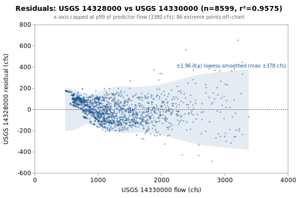

# Linear regression: USGS 14328000 from 14330000

**Goal**: estimate USGS `14328000` from `14330000` so a downstream `calc_expression` can replace the target gauge.



Generated by:

```bash
python3 scripts/regression/gauge_pair_linear.py \
    --predictor 14330000 \
    --target 14328000 \
    --start 1985-01-01 \
    --end 2024-06-09 \
    --name rogue_14328000_from_14330000
```

## Data

All series are USGS daily-mean flow (`parameterCd=00060`, `statCd=00003`).

| Gauge | Period of record | Daily means |
|---|---|---|
| `14328000` (target) | 1908-01-01 → **2024-06-09** | 32465 |
| `14330000` (predictor) | 1913-10-01 → 2026-06-01 | 27270 |
| **Overlap (full)** | 1923-10-01 → 2024-06-09 | **17091** |

Note: USGS records can be **non-contiguous** (instrumentation outages).
The chosen window is selected for *data points*, not calendar span.

## Chosen fit

Window: **1985-01-01 → 2024-06-09**, n = **8599** daily means (~23.5 years of data).

### Coefficients (with honest, autocorrelation-aware uncertainty)

Daily streamflow residuals are strongly autocorrelated (lag-1 **0.90** here), which violates the IID assumption behind the OLS standard errors — so **SE (OLS)** is optimistic. **SE (block-boot)** resamples whole monthly blocks (284 months, B=1000), preserving the serial correlation; it is the realistic figure and runs about **6.7x** the OLS SE. The **95% CI** below is the block-bootstrap percentile interval. **VIF** is the variance-inflation factor (collinearity with the other predictors); VIF > 10 means the individual coefficient is poorly determined and should not be read as a physical sensitivity.

| Term | Estimate | SE (OLS) | SE (block-boot) | 95% CI (block-boot) | VIF |
|---|---|---|---|---|---|
| intercept | -292.717 | 2.762 | 16.28 | [-321.5, -259] | — |
| rp::14330000 (predictor 1: 14330000) | +0.828462 | 0.001883 | 0.01256 | [+0.8019, +0.8504] | 1.0 |

r² = **0.9575**, RMSE = **117.13 cfs** (sigma_hat = 117.15 cfs unbiased).

Predictor / target summary:

| Series | Mean | Range |
|---|---|---|
| target `14328000` | 787.97 | [222, 9600] |
| predictor `14330000` | 1304.45 | [482, 10500] |

### Parameter covariance

Full variance-covariance matrix (rows/cols in `coef_names` order):

```
                intercept            x1
   intercept  +7.6292e+00  -4.6252e-03
          x1  -4.6252e-03  +3.5457e-06
```

Correlation matrix:

```
              intercept          x1
   intercept  +1.0000      -0.8893    
          x1  -0.8893      +1.0000    
```

**Caveat 1 (autocorrelation)**: this is the **OLS** covariance, which assumes IID residuals; with lag-1 residual autocorrelation **0.90** it understates the parameter SE by roughly **6.7x**. Use the block-bootstrap SEs/CIs in the coefficients table for inference, not these (monthly blocks; longer blocks would only widen the intervals, so they are conservative for the most autocorrelated fits).

**Caveat 2 (prediction vs parameter)**: even with correct parameter SEs, a single-day prediction at new `x` is dominated by the residual scatter `sigma_hat` (about 117 cfs at 1-sigma here), not by parameter uncertainty. `sigma_hat` is a valid *marginal* description of single-day error (autocorrelation barely biases it); what autocorrelation breaks is treating the n days as n independent observations.

## Window stability

Re-fit at multiple start dates (endpoint fixed at `2024-06-09`):

| Window start | n | data yr | slope | intercept | r² | RMSE | SE(slope) | SE(int) |
|---|---|---|---|---|---|---|---|---|
| 1923-10-01 | 17091 | 46.8 | 0.7956 | -240.30 | 0.9267 | 159.2 | 0.0017 | 2.57 |
| 1980-01-03 | 10424 | 28.5 | 0.8288 | -307.66 | 0.9577 | 119.2 | 0.0017 | 2.59 |
| 1985-01-01 | 8599 | 23.5 | 0.8285 | -292.72 | 0.9575 | 117.1 | 0.0019 | 2.76 |
| 1989-12-31 | 6774 | 18.5 | 0.8318 | -271.82 | 0.9655 | 110.1 | 0.0019 | 2.80 |
| 1990-01-01 | 6773 | 18.5 | 0.8318 | -271.78 | 0.9655 | 110.1 | 0.0019 | 2.80 |
| 1994-12-30 | 4949 | 13.5 | 0.8276 | -241.75 | 0.9700 | 108.3 | 0.0021 | 3.16 |
| 1999-12-29 | 3579 | 9.8 | 0.7917 | -185.07 | 0.9659 | 97.1 | 0.0025 | 3.38 |

## Residual diagnostics

**Percentile distribution** (residual = y - y_hat, cfs):

| p01 | p05 | p25 | p50 | p75 | p95 | p99 |
|---|---|---|---|---|---|---|
| -237.6 | -171.0 | -83.2 | +2.2 | +79.8 | +152.9 | +327.7 |

**By predictor-1 quintile** (Q1 = lowest values of `14330000`):

| Quintile | x median | mean residual | std residual | n |
|---|---|---|---|---|
| Q1 | 692 | +80.6 | 55.6 | 1719 |
| Q2 | 913 | -0.7 | 72.5 | 1719 |
| Q3 | 1120 | -31.0 | 94.6 | 1719 |
| Q4 | 1460 | -49.7 | 100.0 | 1719 |
| Q5 | 2100 | +0.8 | 177.1 | 1723 |

### By hydrologic season

Residuals bucketed by monsoonal season (most kayak gauges sit in a PNW monsoonal regime). **Mean / median flow** give each season's target-flow magnitude. **Bias** is the mean residual (y - y_hat); a non-zero bias means the pooled fit systematically over- (negative) or under-predicts (positive) in that season. **% of flow** normalizes the bias by the season's mean flow so it's comparable across gauges. The remaining columns (median residual, std, RMSE) are residual statistics in cfs.

| Season | n | mean flow | median flow | bias (cfs) | % of flow | median resid | std | RMSE |
|---|---|---|---|---|---|---|---|---|
| Heavy rain (Nov-Dec) | 1402 | 710 | 527 | +26.1 | +3.7% | +36.2 | 117.3 | 120.2 |
| Light rain (Jan-Feb) | 1414 | 970 | 783 | +9.6 | +1.0% | +10.3 | 123.6 | 123.9 |
| Rain-on-snow (Mar-Apr) | 1464 | 1172 | 1030 | -26.8 | -2.3% | -40.5 | 130.5 | 133.2 |
| Dry season (May-Oct) | 4319 | 623 | 473 | -2.5 | -0.4% | +5.6 | 107.6 | 107.7 |

A season whose bias is large relative to `sigma_hat` (the pooled 1-sigma residual scatter) is a candidate for a season-specific intercept or a separate seasonal fit; a season with elevated `std`/`RMSE` but near-zero bias is just noisier (e.g., flashy storm response), not mis-calibrated.

## Sub-daily lead/lag

Inter-gauge travel-time structure from USGS unit values (30-min grid, 167,823 points); full analysis in [`rogue_14328000_leadlag.md`](./rogue_14328000_leadlag.md). The daily coefficients above are applied in production to *instantaneous* readings, so these lags are the timing error a correction would address. **+τ** = upstream (a past read, deployable in real time); **-τ** = downstream (a future read — non-causal look-ahead).

| Predictor | applied τ (h) | Δ-corr | direction |
|---|---|---|---|
| 14330000 `14330000` | -0.5 | 0.218 | downstream — look-ahead |

**Full** alignment (incl. downstream → future): +0.3% RMSE, 95% CI [+0.24, +0.56] cfs (resolved). **Deployable** (causal, upstream-only): +0.0%, [+0.00, +0.00] cfs (CI through 0). **Verdict: real signal, but downstream look-ahead only (deployable gain nil)** — keep using contemporaneous readings.

## Predictions at example x values

For each row, `y_hat` is the fitted value and the two CIs are 95% two-sided bands. The **mean-response CI** is the uncertainty in `E[y | x]` (use for plotting the fit line's confidence band). The **prediction CI** is for a *single new observation* — bounded below by `sigma_hat` regardless of how precisely the parameters are estimated.

| pred-1 position | x (14330000) | y_hat | 95% CI (mean resp.) | 95% CI (single obs.) |
|---|---|---|---|---|
| p05 (low) | 625 | 225.1 | [221.5, 228.6] (±3.5) | [-4.6, 454.7] (±229.6) |
| p25 | 855 | 415.6 | [412.6, 418.6] (±3.0) | [186.0, 645.2] (±229.6) |
| p50 (median) | 1120 | 635.2 | [632.6, 637.7] (±2.6) | [405.5, 864.8] (±229.6) |
| p75 | 1580 | 1016.3 | [1013.6, 1018.9] (±2.7) | [786.6, 1245.9] (±229.6) |
| p95 (high) | 2520 | 1795.0 | [1789.9, 1800.1] (±5.1) | [1565.3, 2024.7] (±229.7) |

### Computing a CI at any other x*

All the information needed to compute prediction CIs at any new predictor value is in this document. With the design row `X* = [1, x1*, x2*, ..., x1*^2, x2*^2, ...]` matching the column order in the covariance matrix above:

```
y_hat = X* . coefs
Var(mean response) = X* . Cov(beta) . X*'
Var(single observation) = Var(mean response) + sigma_hat^2
SE = sqrt(Var)
95% CI = y_hat +/- 1.96 * SE     (n >> 30, large-sample z; use t_{n-p} for small n)
```

For this single-predictor linear fit, the equivalent closed form is:

```
Var(mean response at x*) = sigma_hat^2 * (1/n + (x* - mean_x)^2 / Sxx)
                         where mean_x = 1304.4547, sigma_hat = 117.1463,
                         n = 8599, Sxx = sigma_hat^2 / SE(slope)^2 = 3.8704e+09
```

## SQL stub for `calc_expression`

Paste this into a `data/db/migrations/00NN_*.sql` file. The handles (`rp::14330000`) follow the `prefix::gauge_name` convention enforced by `kayak.cli.calculator._resolve_refs`:

```sql
INSERT INTO calc_expression (data_type, expression, time_expression, note) SELECT
    'flow',
    'round(greatest(0, 0.828462 * rp::14330000::flow -292.7))',
    'rp::14330000::flow',
    'linear regression fit. n=8599 daily means, window 1985-01-01..2024-06-09, r2=0.9575, RMSE=117.1 cfs.'
WHERE NOT EXISTS (
    SELECT 1 FROM calc_expression WHERE time_expression = 'rp::14330000::flow'
);
```

**Note**: the migration runner (`cli/migrate.py::_split_statements`) splits SQL on `;` without understanding string literals, so make sure no `;` appears inside the `note` text.

## Future

- **Piecewise-linear fit by predictor-1 quintile.** If the residual table above shows systematic mean drift across quintiles (e.g., consistently under-estimating at low flow and over-estimating at high flow), splitting the predictor range into 2-3 regimes and fitting one linear model per regime can halve RMSE without adding free parameters beyond what `calc_expression` already supports via `greatest(low_estimate, high_estimate)` or `if(x < threshold, ..., ...)`-style composition. Worth trying when RMSE > ~10% of the mean target value.
- **Re-running** when the active predictor's rating curve drifts. USGS occasionally updates stage-discharge ratings; the `Reproduce` snippet above re-pulls the full period of record on demand.
