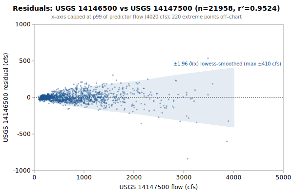

# Linear regression: USGS 14146500 from 14147500

**Goal**: estimate USGS `14146500` from `14147500` so a downstream `calc_expression` can replace the target gauge.



Generated by:

```bash
python3 scripts/regression/gauge_pair_linear.py \
    --predictor 14147500 \
    --target 14146500 \
    --start 1913-02-01 \
    --end 1994-06-13 \
    --name salmon_14146500_from_nfmf
```

## Data

All series are USGS daily-mean flow (`parameterCd=00060`, `statCd=00003`).

| Gauge | Period of record | Daily means |
|---|---|---|
| `14146500` (target) | 1913-02-01 → **1994-06-13** | 24055 |
| `14147500` (predictor) | 1909-10-01 → 1994-09-30 | 22980 |
| **Overlap (full)** | 1913-10-01 → 1994-06-13 | **21958** |

Note: USGS records can be **non-contiguous** (instrumentation outages).
The chosen window is selected for *data points*, not calendar span.

## Chosen fit

Window: **1913-02-01 → 1994-06-13**, n = **21958** daily means (~60.1 years of data).

### Coefficients (with honest, autocorrelation-aware uncertainty)

Daily streamflow residuals are strongly autocorrelated (lag-1 **0.76** here), which violates the IID assumption behind the OLS standard errors — so **SE (OLS)** is optimistic. **SE (block-boot)** resamples whole monthly blocks (722 months, B=1000), preserving the serial correlation; it is the realistic figure and runs about **8.1x** the OLS SE. The **95% CI** below is the block-bootstrap percentile interval. **VIF** is the variance-inflation factor (collinearity with the other predictors); VIF > 10 means the individual coefficient is poorly determined and should not be read as a physical sensitivity.

| Term | Estimate | SE (OLS) | SE (block-boot) | 95% CI (block-boot) | VIF |
|---|---|---|---|---|---|
| intercept | +78.7102 | 0.77 | 3.438 | [+72.02, +85.32] | — |
| fl::14147500 (predictor 1: 14147500) | +0.439612 | 0.0006636 | 0.0054 | [+0.4293, +0.4504] | 1.0 |

r² = **0.9524**, RMSE = **84.51 cfs** (sigma_hat = 84.52 cfs unbiased).

Predictor / target summary:

| Series | Mean | Range |
|---|---|---|
| target `14146500` | 421.37 | [78, 9000] |
| predictor `14147500` | 779.46 | [84, 19300] |

### Parameter covariance

Full variance-covariance matrix (rows/cols in `coef_names` order):

```
                intercept            x1
   intercept  +5.9283e-01  -3.4320e-04
          x1  -3.4320e-04  +4.4031e-07
```

Correlation matrix:

```
              intercept          x1
   intercept  +1.0000      -0.6717    
          x1  -0.6717      +1.0000    
```

**Caveat 1 (autocorrelation)**: this is the **OLS** covariance, which assumes IID residuals; with lag-1 residual autocorrelation **0.76** it understates the parameter SE by roughly **8.1x**. Use the block-bootstrap SEs/CIs in the coefficients table for inference, not these (monthly blocks; longer blocks would only widen the intervals, so they are conservative for the most autocorrelated fits).

**Caveat 2 (prediction vs parameter)**: even with correct parameter SEs, a single-day prediction at new `x` is dominated by the residual scatter `sigma_hat` (about 85 cfs at 1-sigma here), not by parameter uncertainty. `sigma_hat` is a valid *marginal* description of single-day error (autocorrelation barely biases it); what autocorrelation breaks is treating the n days as n independent observations.

## Window stability

Re-fit at multiple start dates (endpoint fixed at `1994-06-13`):

| Window start | n | data yr | slope | intercept | r² | RMSE | SE(slope) | SE(int) |
|---|---|---|---|---|---|---|---|---|
| 1908-02-03 | 21958 | 60.1 | 0.4396 | +78.71 | 0.9524 | 84.5 | 0.0007 | 0.77 |
| 1913-02-01 | 21958 | 60.1 | 0.4396 | +78.71 | 0.9524 | 84.5 | 0.0007 | 0.77 |
| 1913-10-01 | 21958 | 60.1 | 0.4396 | +78.71 | 0.9524 | 84.5 | 0.0007 | 0.77 |
| 1918-01-31 | 21076 | 57.7 | 0.4396 | +78.63 | 0.9534 | 84.4 | 0.0007 | 0.78 |
| 1923-01-30 | 21076 | 57.7 | 0.4396 | +78.63 | 0.9534 | 84.4 | 0.0007 | 0.78 |
| 1928-01-29 | 21076 | 57.7 | 0.4396 | +78.63 | 0.9534 | 84.4 | 0.0007 | 0.78 |
| 1990-01-01 | 1625 | 4.4 | 0.4709 | +55.89 | 0.9537 | 71.1 | 0.0026 | 2.49 |

## Residual diagnostics

**Percentile distribution** (residual = y - y_hat, cfs):

| p01 | p05 | p25 | p50 | p75 | p95 | p99 |
|---|---|---|---|---|---|---|
| -212.2 | -88.8 | -29.2 | -5.2 | +22.8 | +115.3 | +244.2 |

**By predictor-1 quintile** (Q1 = lowest values of `14147500`):

| Quintile | x median | mean residual | std residual | n |
|---|---|---|---|---|
| Q1 | 148 | -6.6 | 16.3 | 4391 |
| Q2 | 258 | +0.3 | 23.5 | 4391 |
| Q3 | 554 | -0.4 | 50.7 | 4391 |
| Q4 | 926 | +4.4 | 70.1 | 4391 |
| Q5 | 1620 | +2.3 | 165.3 | 4394 |

### By hydrologic season

Residuals bucketed by monsoonal season (most kayak gauges sit in a PNW monsoonal regime). **Mean / median flow** give each season's target-flow magnitude. **Bias** is the mean residual (y - y_hat); a non-zero bias means the pooled fit systematically over- (negative) or under-predicts (positive) in that season. **% of flow** normalizes the bias by the season's mean flow so it's comparable across gauges. The remaining columns (median residual, std, RMSE) are residual statistics in cfs.

| Season | n | mean flow | median flow | bias (cfs) | % of flow | median resid | std | RMSE |
|---|---|---|---|---|---|---|---|---|
| Heavy rain (Nov-Dec) | 3721 | 516 | 350 | -13.7 | -2.7% | -18.3 | 105.3 | 106.2 |
| Light rain (Jan-Feb) | 3584 | 577 | 450 | -35.8 | -6.2% | -34.9 | 111.7 | 117.3 |
| Rain-on-snow (Mar-Apr) | 3691 | 572 | 508 | -13.3 | -2.3% | -21.1 | 85.2 | 86.3 |
| Dry season (May-Oct) | 10962 | 288 | 191 | +20.8 | +7.2% | +6.9 | 55.2 | 59.0 |

A season whose bias is large relative to `sigma_hat` (the pooled 1-sigma residual scatter) is a candidate for a season-specific intercept or a separate seasonal fit; a season with elevated `std`/`RMSE` but near-zero bias is just noisier (e.g., flashy storm response), not mis-calibrated.

## Sub-daily lead/lag

Inter-gauge travel-time structure from USGS unit values (30-min grid, 90,987 points); full analysis in [`salmon_14146500_leadlag.md`](./salmon_14146500_leadlag.md). The daily coefficients above are applied in production to *instantaneous* readings, so these lags are the timing error a correction would address. **+τ** = upstream (a past read, deployable in real time); **-τ** = downstream (a future read — non-causal look-ahead).

| Predictor | applied τ (h) | Δ-corr | direction |
|---|---|---|---|
| 14147500 `14147500` | -0.5 | 0.570 | downstream — look-ahead |

**Full** alignment (incl. downstream → future): +0.5% RMSE, 95% CI [-0.01, +0.76] cfs (CI through 0). **Deployable** (causal, upstream-only): +0.0%, [+0.00, +0.00] cfs (CI through 0). **Verdict: negligible / statistically unresolved** — keep using contemporaneous readings.

## Predictions at example x values

For each row, `y_hat` is the fitted value and the two CIs are 95% two-sided bands. The **mean-response CI** is the uncertainty in `E[y | x]` (use for plotting the fit line's confidence band). The **prediction CI** is for a *single new observation* — bounded below by `sigma_hat` regardless of how precisely the parameters are estimated.

| pred-1 position | x (14147500) | y_hat | 95% CI (mean resp.) | 95% CI (single obs.) |
|---|---|---|---|---|
| p05 (low) | 130 | 135.9 | [134.5, 137.3] (±1.4) | [-29.8, 301.5] (±165.7) |
| p25 | 218 | 174.5 | [173.2, 175.9] (±1.3) | [8.9, 340.2] (±165.7) |
| p50 (median) | 554 | 322.3 | [321.1, 323.4] (±1.2) | [156.6, 487.9] (±165.7) |
| p75 | 1050 | 540.3 | [539.1, 541.5] (±1.2) | [374.6, 706.0] (±165.7) |
| p95 (high) | 2120 | 1010.7 | [1008.6, 1012.8] (±2.1) | [845.0, 1176.4] (±165.7) |

### Computing a CI at any other x*

All the information needed to compute prediction CIs at any new predictor value is in this document. With the design row `X* = [1, x1*, x2*, ..., x1*^2, x2*^2, ...]` matching the column order in the covariance matrix above:

```
y_hat = X* . coefs
Var(mean response) = X* . Cov(beta) . X*'
Var(single observation) = Var(mean response) + sigma_hat^2
SE = sqrt(Var)
95% CI = y_hat +/- 1.96 * SE     (n >> 30, large-sample z; use t_{n-p} for small n)
```

For this single-predictor linear fit, the equivalent closed form is:

```
Var(mean response at x*) = sigma_hat^2 * (1/n + (x* - mean_x)^2 / Sxx)
                         where mean_x = 779.4581, sigma_hat = 84.5183,
                         n = 21958, Sxx = sigma_hat^2 / SE(slope)^2 = 1.6224e+10
```

## SQL stub for `calc_expression`

Paste this into a `data/db/migrations/00NN_*.sql` file. The handles (`fl::14147500`) follow the `prefix::gauge_name` convention enforced by `kayak.cli.calculator._resolve_refs`:

```sql
INSERT INTO calc_expression (data_type, expression, time_expression, note) SELECT
    'flow',
    'round(greatest(0, 0.439612 * fl::14147500::flow +78.71))',
    'fl::14147500::flow',
    'linear regression fit. n=21958 daily means, window 1913-02-01..1994-06-13, r2=0.9524, RMSE=84.5 cfs.'
WHERE NOT EXISTS (
    SELECT 1 FROM calc_expression WHERE time_expression = 'fl::14147500::flow'
);
```

**Note**: the migration runner (`cli/migrate.py::_split_statements`) splits SQL on `;` without understanding string literals, so make sure no `;` appears inside the `note` text.

## Future

- **Piecewise-linear fit by predictor-1 quintile.** If the residual table above shows systematic mean drift across quintiles (e.g., consistently under-estimating at low flow and over-estimating at high flow), splitting the predictor range into 2-3 regimes and fitting one linear model per regime can halve RMSE without adding free parameters beyond what `calc_expression` already supports via `greatest(low_estimate, high_estimate)` or `if(x < threshold, ..., ...)`-style composition. Worth trying when RMSE > ~10% of the mean target value.
- **Re-running** when the active predictor's rating curve drifts. USGS occasionally updates stage-discharge ratings; the `Reproduce` snippet above re-pulls the full period of record on demand.
