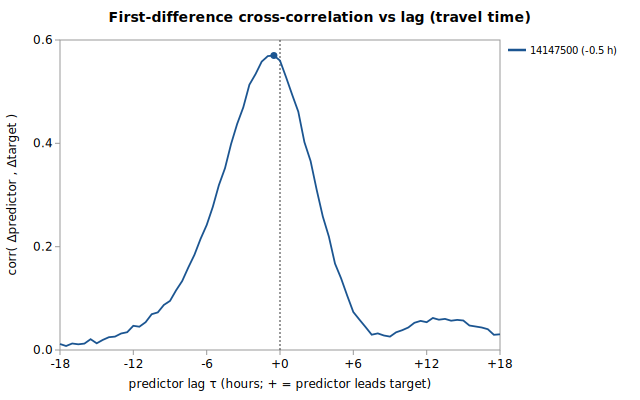

# Sub-daily lead/lag: USGS 14146500 regression

Companion to [`gauge_pair_linear.py`](../../scripts/regression/gauge_pair_linear.py) and the daily-mean fit in [`salmon_14146500_from_nfmf.md`](./salmon_14146500_from_nfmf.md). **Question (informational):** the daily-mean fit averages away the sub-daily travel time between gauges — how large is that timing structure, and how much of it is real-time-usable?



Generated by:

```bash
python3 scripts/regression/gauge_lead_lag.py \
    --predictor 14147500 \
    --target 14146500 \
    --start 1987-10-01 \
    --end 1994-06-13 \
    --grid-minutes 30 \
    --name salmon_14146500_leadlag
```

## Data

USGS **unit values** resampled to a common **30-min** UTC grid over **1987-10-01 → 1994-06-13**. Overlap where the target and all 1 predictors have a value: **90,987 points** (~5.2 years). Each gauge uses discharge where available, else gage height (timing is identical — USGS derives flow from stage instantaneously):

| Role | Gauge | Label | variable |
|---|---|---|---|
| target | `14146500` |  | flow |
| predictor | `14147500` |  | flow |

## Estimated travel-time lags

Per predictor, the lag τ maximizing the correlation of *first differences* (flow changes) with the target, searched in 30-min steps. **+τ** = upstream (predictor leads the target; its aligned reading is a *past* value, so it is **deployable** in real time); **-τ** = downstream (its aligned reading is a *future* value, **not** deployable). A peak below **0.15** has no resolvable travel time and is held contemporaneous.

| Predictor | peak τ (h) | peak Δ-corr | applied τ (h) | interpretation |
|---|---|---|---|---|
| 14147500 `14147500` | -0.5 | 0.570 | **-0.5** | downstream — target leads it by ~0.5 h (future read, not deployable) |

## Accuracy: contemporaneous vs travel-time-aligned

All alignments share one hold-out grid (only the alignment changes). **daily-trained** = the deployed-style daily coefficients applied to the grid values (production-relevant); **hourly-refit** = coefficients refit on the grid itself (an upper bound). **full** shifts every identifiable predictor (incl. downstream → future); **deployable** shifts only upstream predictors (causal).

| Coefficients | Alignment | n | r² | RMSE (cfs) |
|---|---|---|---|---|
| daily-trained | contemporaneous | 90,987 | 0.9556 | 62.6 |
| daily-trained | full (incl. downstream) | 90,987 | 0.9560 | 62.3 |
| daily-trained | deployable (upstream-only) | 90,987 | 0.9556 | 62.6 |
| hourly-refit | contemporaneous | 90,987 | 0.9569 | 61.6 |
| hourly-refit | full (incl. downstream) | 90,987 | 0.9573 | 61.3 |

Daily-mean reference (same 1 predictors, 1913-02-01→1994-06-13, n=21,958): RMSE **84.5 cfs**, r² 0.9524 — daily means are smoother than instantaneous values, so this sits below the grid RMSEs and isn't directly comparable to them.

### Is the gain statistically real, and is it usable?

Grid residuals are strongly autocorrelated (lag-1 **1.00**), so the 90,987 points carry far fewer independent observations than their count. A **block bootstrap** over 7-day blocks (279 of them, B=2000) on the RMSE reduction (contemporaneous minus aligned):

| Alignment | gain | mean Δ (cfs) | 95% CI (cfs) | better in | resolved? |
|---|---|---|---|---|---|
| **full** (incl. downstream future) | +0.5% | +0.32 | [-0.01, +0.76] | 97% | no (CI ∋ 0) |
| **deployable** (causal, upstream) | +0.0% | +0.00 | [+0.00, +0.00] | 0% | no (CI ∋ 0) |

During the **fastest-changing 11% of points** (|Δtarget| ≥ 7 cfs/30min, n=9,616), where misalignment should bite hardest, full alignment changes RMSE by **+0.8%** (130.7 → 129.7 cfs).

## Verdict

**Negligible and statistically unresolved.** The block-bootstrap CI includes zero (full +0.5% [-0.01, +0.76] cfs; deployable +0.0% [+0.00, +0.00] cfs) — once the residual autocorrelation is accounted for, the improvement isn't distinguishable from no effect. **Keep contemporaneous readings.**

### Deployability (what it *would* take)

Applying lags in production is **not** a coefficient change; it requires the calculator to read a predictor's value *from τ ago* rather than its latest:

1. **Upstream predictors (+τ):** deployable — the value is in the past, already in the `observation` table; select the reading closest to `now - τ`.
2. **Downstream predictors (-τ):** **not** deployable for a nowcast — the best-aligned value is in the future. Leave them contemporaneous, or treat the estimate as a short forecast.
3. **Plumbing:** `calc_expression` references only `LatestObservation`; a lag-aware estimate needs a time-offset reference form and a windowed lookup in `kayak.cli.calculator` — justified only when the deployable share is material.

## Method

- **Unit values** pulled unfiltered from `nwis.waterservices.usgs.gov` and resampled to a 30-min grid (discharge preferred, gage height as fallback — time-locked, so either works for timing).
- **Lag estimation** maximizes the correlation of first differences (flow *changes* propagate; baseline levels are near-identical across neighbours). Resolution is capped by the coarser series — a 30-min target can't resolve finer than 30 min, and finer grids add noise without information.
- **Causal split:** *deployable* shifts only upstream predictors (past reads); *full* also shifts downstream predictors to future reads (not real-time-usable, but it bounds the total timing signal).
- **Significance:** the RMSE difference is block-bootstrapped over 7-day blocks (B=2000) so the CI reflects the effective, not nominal, sample size (longer blocks would only widen it — a conservative bound).
- **Caveat:** the grid hold-out (1987-10-01..1994-06-13, ~5.2 yr) is far shorter than the daily fit's record; the daily-reference row controls for the predictor-set change, not the window.

