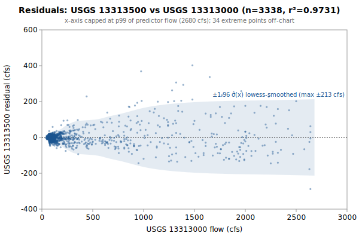

# Multi-Linear regression: USGS 13313500 from 13313000, 13317000

**Goal**: estimate USGS `13313500` from `13313000`, `13317000` so a downstream `calc_expression` can replace the target gauge.



Generated by:

```bash
python3 scripts/regression/gauge_pair_linear.py \
    --predictor 13313000 \
    --predictor 13317000 \
    --target 13313500 \
    --start 1943-04-12 \
    --end 1952-05-31 \
    --name secesh_13313500_from_johnson_whitebird \
    --calc-handle jo::Johnson_Yellopine_merge \
    --calc-handle wb::Salmon_Whitebird_merge
```

## Data

All series are USGS daily-mean flow (`parameterCd=00060`, `statCd=00003`).

| Gauge | Period of record | Daily means |
|---|---|---|
| `13313500` (target) | 1943-04-12 → **1952-05-31** | 3338 |
| `13313000` (predictor) | 1928-09-01 → 2026-06-03 | 35705 |
| `13317000` (predictor) | 1910-09-01 → 2026-06-03 | 41549 |
| **Overlap (full)** | 1943-04-12 → 1952-05-31 | **3338** |

Note: USGS records can be **non-contiguous** (instrumentation outages).
The chosen window is selected for *data points*, not calendar span.

## Chosen fit

Window: **1943-04-12 → 1952-05-31**, n = **3338** daily means (~9.1 years of data).

### Coefficients (with honest, autocorrelation-aware uncertainty)

Daily streamflow residuals are strongly autocorrelated (lag-1 **0.86** here), which violates the IID assumption behind the OLS standard errors — so **SE (OLS)** is optimistic. **SE (block-boot)** resamples whole monthly blocks (110 months, B=1000), preserving the serial correlation; it is the realistic figure and runs about **6.2x** the OLS SE. The **95% CI** below is the block-bootstrap percentile interval. **VIF** is the variance-inflation factor (collinearity with the other predictors); VIF > 10 means the individual coefficient is poorly determined and should not be read as a physical sensitivity.

| Term | Estimate | SE (OLS) | SE (block-boot) | 95% CI (block-boot) | VIF |
|---|---|---|---|---|---|
| intercept | -10.7604 | 1.308 | 5.108 | [-19.73, +0.1397] | — |
| jo::Johnson_Yellopine_merge (predictor 1: 13313000) | +0.254289 | 0.006517 | 0.04051 | [+0.1831, +0.344] | 23.2 |
| wb::Salmon_Whitebird_merge (predictor 2: 13317000) | +0.00910427 | 0.0002725 | 0.001702 | [+0.005252, +0.01204] | 23.2 |

r² = **0.9731**, RMSE = **48.25 cfs** (sigma_hat = 48.27 cfs unbiased).

Predictor / target summary:

| Series | Mean | Range |
|---|---|---|
| target `13313500` | 201.27 | [30, 2080] |
| predictor `13313000` | 392.61 | [37, 4070] |
| predictor `13317000` | 12322.87 | [2180, 99200] |

### Parameter covariance

Full variance-covariance matrix (rows/cols in `coef_names` order):

```
                intercept            x1            x2
   intercept  +1.7099e+00  +4.7290e-03  -2.3279e-04
          x1  +4.7290e-03  +4.2477e-05  -1.7371e-06
          x2  -2.3279e-04  -1.7371e-06  +7.4235e-08
```

Correlation matrix:

```
              intercept          x1          x2
   intercept  +1.0000      +0.5549      -0.6534    
          x1  +0.5549      +1.0000      -0.9782    
          x2  -0.6534      -0.9782      +1.0000    
```

**Caveat 1 (autocorrelation)**: this is the **OLS** covariance, which assumes IID residuals; with lag-1 residual autocorrelation **0.86** it understates the parameter SE by roughly **6.2x**. Use the block-bootstrap SEs/CIs in the coefficients table for inference, not these (monthly blocks; longer blocks would only widen the intervals, so they are conservative for the most autocorrelated fits).

**Caveat 2 (prediction vs parameter)**: even with correct parameter SEs, a single-day prediction at new `x` is dominated by the residual scatter `sigma_hat` (about 48 cfs at 1-sigma here), not by parameter uncertainty. `sigma_hat` is a valid *marginal* description of single-day error (autocorrelation barely biases it); what autocorrelation breaks is treating the n days as n independent observations.

## Window stability

Re-fit at multiple start dates (endpoint fixed at `1952-05-31`):

| Window start | n | data yr | r² | RMSE |
|---|---|---|---|---|
| 1938-04-13 | 3338 | 9.1 | 0.9731 | 48.2 |
| 1943-04-12 | 3338 | 9.1 | 0.9731 | 48.2 |
| 1948-04-10 | 1513 | 4.1 | 0.9741 | 54.6 |

(Multi-predictor coefficients in the stability table would be wide; per-window coefficient drift can be inspected by re-running the script with a different `--start`.)

## Residual diagnostics

**Percentile distribution** (residual = y - y_hat, cfs):

| p01 | p05 | p25 | p50 | p75 | p95 | p99 |
|---|---|---|---|---|---|---|
| -123.1 | -64.1 | -13.0 | -1.2 | +8.5 | +69.2 | +193.5 |

**By predictor-1 quintile** (Q1 = lowest values of `13313000`):

| Quintile | x median | mean residual | std residual | n |
|---|---|---|---|---|
| Q1 | 70 | -0.3 | 9.8 | 667 |
| Q2 | 87 | -1.0 | 10.9 | 667 |
| Q3 | 110 | -2.9 | 14.7 | 667 |
| Q4 | 193 | +0.1 | 36.7 | 667 |
| Q5 | 1330 | +4.0 | 99.1 | 670 |

### By hydrologic season

Residuals bucketed by monsoonal season (most kayak gauges sit in a PNW monsoonal regime). **Mean / median flow** give each season's target-flow magnitude. **Bias** is the mean residual (y - y_hat); a non-zero bias means the pooled fit systematically over- (negative) or under-predicts (positive) in that season. **% of flow** normalizes the bias by the season's mean flow so it's comparable across gauges. The remaining columns (median residual, std, RMSE) are residual statistics in cfs.

| Season | n | mean flow | median flow | bias (cfs) | % of flow | median resid | std | RMSE |
|---|---|---|---|---|---|---|---|---|
| Heavy rain (Nov-Dec) | 549 | 64 | 60 | +3.3 | +5.1% | +4.5 | 16.3 | 16.6 |
| Light rain (Jan-Feb) | 534 | 47 | 40 | -3.3 | -7.1% | -3.8 | 11.4 | 11.8 |
| Rain-on-snow (Mar-Apr) | 568 | 117 | 55 | -17.8 | -15.3% | -15.2 | 26.8 | 32.2 |
| Dry season (May-Oct) | 1687 | 323 | 113 | +6.0 | +1.9% | +1.4 | 64.0 | 64.2 |

A season whose bias is large relative to `sigma_hat` (the pooled 1-sigma residual scatter) is a candidate for a season-specific intercept or a separate seasonal fit; a season with elevated `std`/`RMSE` but near-zero bias is just noisier (e.g., flashy storm response), not mis-calibrated.

## Predictions at example x values

For each row, `y_hat` is the fitted value and the two CIs are 95% two-sided bands. The **mean-response CI** is the uncertainty in `E[y | x]` (use for plotting the fit line's confidence band). The **prediction CI** is for a *single new observation* — bounded below by `sigma_hat` regardless of how precisely the parameters are estimated.

| pred-1 position | x (13313000) | x (13317000) | y_hat | 95% CI (mean resp.) | 95% CI (single obs.) |
|---|---|---|---|---|---|
| p05 (low) | 64 | 12323 | 117.7 | [113.2, 122.2] (±4.5) | [23.0, 212.4] (±94.7) |
| p25 | 84 | 12323 | 122.8 | [118.5, 127.1] (±4.3) | [28.1, 217.5] (±94.7) |
| p50 (median) | 110 | 12323 | 129.4 | [125.4, 133.4] (±4.0) | [34.7, 224.1] (±94.7) |
| p75 | 304 | 12323 | 178.7 | [176.7, 180.7] (±2.0) | [84.1, 273.4] (±94.6) |
| p95 (high) | 1930 | 12323 | 592.2 | [572.5, 611.9] (±19.7) | [495.6, 688.8] (±96.6) |

### Computing a CI at any other x*

All the information needed to compute prediction CIs at any new predictor value is in this document. With the design row `X* = [1, x1*, x2*, ...]` — plus a squared column for each predictor fitted quadratically, in predictor order — matching the column order in the covariance matrix above:

```
y_hat = X* . coefs
Var(mean response) = X* . Cov(beta) . X*'
Var(single observation) = Var(mean response) + sigma_hat^2
SE = sqrt(Var)
95% CI = y_hat +/- 1.96 * SE     (n >> 30, large-sample z; use t_{n-p} for small n)
```

## `calc_expression` row

`calc_expression` rows are **metadata**: add a row to `calc_expression.csv` in the `kayak_data` repo (stable `id` from `id_counters.csv`, `provenance_slug` = this report's slug) and let `levels sync-metadata` apply it on deploy. Do **not** put this in a migration — a new migration may not write a metadata table (`tests/test_scripts/test_migrations_schema_only.py`). The handles (`jo::Johnson_Yellopine_merge`, `wb::Salmon_Whitebird_merge`) follow the `prefix::gauge_name` convention enforced by `kayak.cli.calculator._resolve_refs`. Column values:

```
data_type:       flow
expression:      round(greatest(0, 0.254289 * jo::Johnson_Yellopine_merge::flow + 0.00910427 * wb::Salmon_Whitebird_merge::flow -10.76))
time_expression: jo::Johnson_Yellopine_merge::flow wb::Salmon_Whitebird_merge::flow
note:            multi-linear regression fit. n=3338 daily means, window 1943-04-12..1952-05-31, r2=0.9731, RMSE=48.2 cfs. See docs/regression/secesh_13313500_from_johnson_whitebird.md.
provenance_slug: secesh_13313500_from_johnson_whitebird
```

Flesh out `note` before committing — the strongest existing rows also record window stability, rejected predictors, and any drainage-area scaling (see `calc_expression.csv` for examples).

## Future

- **Piecewise-linear fit by predictor-1 quintile.** If the residual table above shows systematic mean drift across quintiles (e.g., consistently under-estimating at low flow and over-estimating at high flow), splitting the predictor range into 2-3 regimes and fitting one linear model per regime can halve RMSE without adding free parameters beyond what `calc_expression` already supports via `greatest(low_estimate, high_estimate)` or `if(x < threshold, ..., ...)`-style composition. Worth trying when RMSE > ~10% of the mean target value.
- **Re-running** when the active predictor's rating curve drifts. USGS occasionally updates stage-discharge ratings; the `Reproduce` snippet above re-pulls the full period of record on demand.
- **Sub-daily lead/lag.** This fit is on daily means, but the `calc_expression` applies its coefficients to the *latest instantaneous* predictor readings — so inter-gauge travel time (1-12 h) becomes a timing error the daily fit never sees. `gauge_lead_lag.py` (same directory) quantifies that error from USGS unit values; worth a look when predictors are many river-miles from the target. (Run it to embed a summary here via `--leadlag`.)
