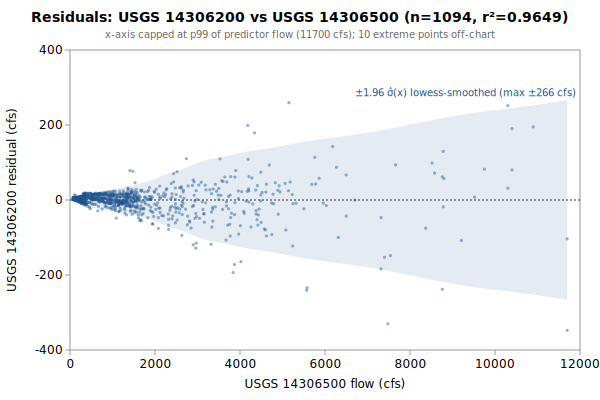

# Linear regression: USGS 14306200 from 14306500

**Goal**: estimate USGS `14306200` from `14306500` so a downstream `calc_expression` can replace the target gauge.



Generated by:

```bash
python3 scripts/regression/gauge_pair_linear.py \
    --predictor 14306500 \
    --target 14306200 \
    --start 1960-10-01 \
    --end 1963-09-29 \
    --name sf_alsea_14306200_from_14306500
```

## Data

All series are USGS daily-mean flow (`parameterCd=00060`, `statCd=00003`).

| Gauge | Period of record | Daily means |
|---|---|---|
| `14306200` (target) | 1960-10-01 → **1963-09-29** | 1094 |
| `14306500` (predictor) | 1939-10-01 → 2026-06-01 | 31656 |
| **Overlap (full)** | 1960-10-01 → 1963-09-29 | **1094** |

Note: USGS records can be **non-contiguous** (instrumentation outages).
The chosen window is selected for *data points*, not calendar span.

## Chosen fit

Window: **1960-10-01 → 1963-09-29**, n = **1094** daily means (~3.0 years of data).

### Coefficients (with honest, autocorrelation-aware uncertainty)

Daily streamflow residuals are strongly autocorrelated (lag-1 **0.47** here), which violates the IID assumption behind the OLS standard errors — so **SE (OLS)** is optimistic. **SE (block-boot)** resamples whole monthly blocks (36 months, B=1000), preserving the serial correlation; it is the realistic figure and runs about **5.1x** the OLS SE. The **95% CI** below is the block-bootstrap percentile interval. **VIF** is the variance-inflation factor (collinearity with the other predictors); VIF > 10 means the individual coefficient is poorly determined and should not be read as a physical sensitivity.

| Term | Estimate | SE (OLS) | SE (block-boot) | 95% CI (block-boot) | VIF |
|---|---|---|---|---|---|
| intercept | -1.40562 | 1.743 | 3.195 | [-7.096, +5.946] | — |
| q::14306500 (predictor 1: 14306500) | +0.110684 | 0.0006386 | 0.003258 | [+0.1029, +0.1158] | 1.0 |

r² = **0.9649**, RMSE = **47.91 cfs** (sigma_hat = 47.96 cfs unbiased).

Predictor / target summary:

| Series | Mean | Range |
|---|---|---|
| target `14306200` | 166.38 | [8, 3110] |
| predictor `14306500` | 1515.92 | [72, 22600] |

### Parameter covariance

Full variance-covariance matrix (rows/cols in `coef_names` order):

```
                intercept            x1
   intercept  +3.0392e+00  -6.1813e-04
          x1  -6.1813e-04  +4.0776e-07
```

Correlation matrix:

```
              intercept          x1
   intercept  +1.0000      -0.5553    
          x1  -0.5553      +1.0000    
```

**Caveat 1 (autocorrelation)**: this is the **OLS** covariance, which assumes IID residuals; with lag-1 residual autocorrelation **0.47** it understates the true parameter variance by roughly **5.1x** (in SE terms). Use the block-bootstrap SEs/CIs in the coefficients table for inference, not these.

**Caveat 2 (prediction vs parameter)**: even with correct parameter SEs, a single-day prediction at new `x` is dominated by the residual scatter `sigma_hat` (about 48 cfs at 1-sigma here), not by parameter uncertainty. `sigma_hat` is a valid *marginal* description of single-day error (autocorrelation barely biases it); what autocorrelation breaks is treating the n days as n independent observations.

## Window stability

Re-fit at multiple start dates (endpoint fixed at `1963-09-29`):

| Window start | n | data yr | slope | intercept | r² | RMSE | SE(slope) | SE(int) |
|---|---|---|---|---|---|---|---|---|
| 1955-10-03 | 1094 | 3.0 | 0.1107 | -1.41 | 0.9649 | 47.9 | 0.0006 | 1.74 |
| 1960-10-01 | 1094 | 3.0 | 0.1107 | -1.41 | 0.9649 | 47.9 | 0.0006 | 1.74 |

## Residual diagnostics

**Percentile distribution** (residual = y - y_hat, cfs):

| p01 | p05 | p25 | p50 | p75 | p95 | p99 |
|---|---|---|---|---|---|---|
| -171.9 | -52.6 | -5.4 | +3.3 | +9.4 | +41.9 | +142.4 |

**By predictor-1 quintile** (Q1 = lowest values of `14306500`):

| Quintile | x median | mean residual | std residual | n |
|---|---|---|---|---|
| Q1 | 115 | +3.2 | 1.9 | 218 |
| Q2 | 257 | +3.3 | 6.4 | 218 |
| Q3 | 765 | +3.8 | 12.0 | 218 |
| Q4 | 1490 | -3.0 | 22.3 | 218 |
| Q5 | 3870 | -7.2 | 102.9 | 222 |

### By hydrologic season

Residuals bucketed by monsoonal season (most kayak gauges sit in a PNW monsoonal regime). **Mean / median flow** give each season's target-flow magnitude. **Bias** is the mean residual (y - y_hat); a non-zero bias means the pooled fit systematically over- (negative) or under-predicts (positive) in that season. **% of flow** normalizes the bias by the season's mean flow so it's comparable across gauges. The remaining columns (median residual, std, RMSE) are residual statistics in cfs.

| Season | n | mean flow | median flow | bias (cfs) | % of flow | median resid | std | RMSE |
|---|---|---|---|---|---|---|---|---|
| Heavy rain (Nov-Dec) | 183 | 216 | 136 | -32.5 | -15.1% | -9.4 | 89.7 | 95.2 |
| Light rain (Jan-Feb) | 177 | 303 | 188 | -2.7 | -0.9% | -1.2 | 42.9 | 42.9 |
| Rain-on-snow (Mar-Apr) | 183 | 334 | 222 | +22.2 | +6.6% | +16.2 | 43.1 | 48.3 |
| Dry season (May-Oct) | 551 | 50 | 25 | +4.3 | +8.5% | +3.8 | 12.7 | 13.4 |

A season whose bias is large relative to `sigma_hat` (the pooled 1-sigma residual scatter) is a candidate for a season-specific intercept or a separate seasonal fit; a season with elevated `std`/`RMSE` but near-zero bias is just noisier (e.g., flashy storm response), not mis-calibrated.

## Predictions at example x values

For each row, `y_hat` is the fitted value and the two CIs are 95% two-sided bands. The **mean-response CI** is the uncertainty in `E[y | x]` (use for plotting the fit line's confidence band). The **prediction CI** is for a *single new observation* — bounded below by `sigma_hat` regardless of how precisely the parameters are estimated.

| pred-1 position | x (14306500) | y_hat | 95% CI (mean resp.) | 95% CI (single obs.) |
|---|---|---|---|---|
| p05 (low) | 96 | 9.2 | [5.9, 12.6] (±3.4) | [-84.8, 103.3] (±94.1) |
| p25 | 208 | 21.6 | [18.3, 24.9] (±3.3) | [-72.4, 115.7] (±94.1) |
| p50 (median) | 770 | 83.8 | [80.8, 86.8] (±3.0) | [-10.2, 177.9] (±94.0) |
| p75 | 1740 | 191.2 | [188.3, 194.0] (±2.9) | [97.1, 285.2] (±94.0) |
| p95 (high) | 5150 | 568.6 | [563.3, 574.0] (±5.4) | [474.5, 662.8] (±94.1) |

### Computing a CI at any other x*

All the information needed to compute prediction CIs at any new predictor value is in this document. With the design row `X* = [1, x1*, x2*, ..., x1*^2, x2*^2, ...]` matching the column order in the covariance matrix above:

```
y_hat = X* . coefs
Var(mean response) = X* . Cov(beta) . X*'
Var(single observation) = Var(mean response) + sigma_hat^2
SE = sqrt(Var)
95% CI = y_hat +/- 1.96 * SE     (n >> 30, large-sample z; use t_{n-p} for small n)
```

For this single-predictor linear fit, the equivalent closed form is:

```
Var(mean response at x*) = sigma_hat^2 * (1/n + (x* - mean_x)^2 / Sxx)
                         where mean_x = 1515.9159, sigma_hat = 47.9557,
                         n = 1094, Sxx = sigma_hat^2 / SE(slope)^2 = 5.6400e+09
```

## SQL stub for `calc_expression`

Paste this into a `data/db/migrations/00NN_*.sql` file. The handles (`q::14306500`) follow the `prefix::gauge_name` convention enforced by `kayak.cli.calculator._resolve_refs`:

```sql
INSERT INTO calc_expression (data_type, expression, time_expression, note) SELECT
    'flow',
    'round(greatest(0, 0.110684 * q::14306500::flow -1.406))',
    'q::14306500::flow',
    'linear regression fit. n=1094 daily means, window 1960-10-01..1963-09-29, r2=0.9649, RMSE=47.9 cfs.'
WHERE NOT EXISTS (
    SELECT 1 FROM calc_expression WHERE time_expression = 'q::14306500::flow'
);
```

**Note**: the migration runner (`cli/migrate.py::_split_statements`) splits SQL on `;` without understanding string literals, so make sure no `;` appears inside the `note` text.

## Future

- **Piecewise-linear fit by predictor-1 quintile.** If the residual table above shows systematic mean drift across quintiles (e.g., consistently under-estimating at low flow and over-estimating at high flow), splitting the predictor range into 2-3 regimes and fitting one linear model per regime can halve RMSE without adding free parameters beyond what `calc_expression` already supports via `greatest(low_estimate, high_estimate)` or `if(x < threshold, ..., ...)`-style composition. Worth trying when RMSE > ~10% of the mean target value.
- **Re-running** when the active predictor's rating curve drifts. USGS occasionally updates stage-discharge ratings; the `Reproduce` snippet above re-pulls the full period of record on demand.
- **Sub-daily lead/lag.** This fit is on daily means, but the `calc_expression` applies its coefficients to the *latest instantaneous* predictor readings — so inter-gauge travel time (1-12 h) becomes a timing error the daily fit never sees. `gauge_lead_lag.py` (same directory) quantifies that error from USGS unit values; worth a look when predictors are many river-miles from the target.
