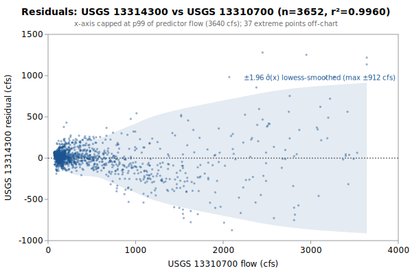

# Multi-Linear regression: USGS 13314300 from 13310700, 13313000, 13317000

**Goal**: estimate USGS `13314300` from `13310700`, `13313000`, `13317000` so a downstream `calc_expression` can replace the target gauge.



Generated by:

```bash
python3 scripts/regression/gauge_pair_linear.py \
    --predictor 13310700 \
    --predictor 13313000 \
    --predictor 13317000 \
    --target 13314300 \
    --start 1993-10-01 \
    --end 2003-09-30 \
    --name sfsalmon_13314300_from_krassel_johnson_whitebird \
    --calc-handle kr::SF_Salmon_Krassel_merge \
    --calc-handle jo::Johnson_Yellopine_merge \
    --calc-handle wb::Salmon_Whitebird_merge
```

## Data

All series are USGS daily-mean flow (`parameterCd=00060`, `statCd=00003`).

| Gauge | Period of record | Daily means |
|---|---|---|
| `13314300` (target) | 1993-10-01 → **2003-09-30** | 3652 |
| `13310700` (predictor) | 1966-10-01 → 2026-06-03 | 20028 |
| `13313000` (predictor) | 1928-09-01 → 2026-06-03 | 35705 |
| `13317000` (predictor) | 1910-09-01 → 2026-06-03 | 41549 |
| **Overlap (full)** | 1993-10-01 → 2003-09-30 | **3652** |

Note: USGS records can be **non-contiguous** (instrumentation outages).
The chosen window is selected for *data points*, not calendar span.

## Chosen fit

Window: **1993-10-01 → 2003-09-30**, n = **3652** daily means (~10.0 years of data).

### Coefficients (with honest, autocorrelation-aware uncertainty)

Daily streamflow residuals are strongly autocorrelated (lag-1 **0.84** here), which violates the IID assumption behind the OLS standard errors — so **SE (OLS)** is optimistic. **SE (block-boot)** resamples whole monthly blocks (120 months, B=1000), preserving the serial correlation; it is the realistic figure and runs about **5.2x** the OLS SE. The **95% CI** below is the block-bootstrap percentile interval. **VIF** is the variance-inflation factor (collinearity with the other predictors); VIF > 10 means the individual coefficient is poorly determined and should not be read as a physical sensitivity.

| Term | Estimate | SE (OLS) | SE (block-boot) | 95% CI (block-boot) | VIF |
|---|---|---|---|---|---|
| intercept | -41.034 | 4.905 | 21.22 | [-81.61, -2.554] | — |
| kr::SF_Salmon_Krassel_merge (predictor 1: 13310700) | +1.47919 | 0.0167 | 0.09839 | [+1.278, +1.66] | 17.3 |
| jo::Johnson_Yellopine_merge (predictor 2: 13313000) | +1.87198 | 0.03077 | 0.1588 | [+1.553, +2.165] | 34.3 |
| wb::Salmon_Whitebird_merge (predictor 3: 13317000) | +0.0509071 | 0.001278 | 0.006161 | [+0.04059, +0.06461] | 35.8 |

r² = **0.9960**, RMSE = **183.18 cfs** (sigma_hat = 183.28 cfs unbiased).

Predictor / target summary:

| Series | Mean | Range |
|---|---|---|
| target `13314300` | 1985.32 | [181, 20000] |
| predictor `13310700` | 540.17 | [69, 5740] |
| predictor `13313000` | 348.84 | [33, 3960] |
| predictor `13317000` | 11281.66 | [1000, 98900] |

### Parameter covariance

Full variance-covariance matrix (rows/cols in `coef_names` order):

```
                intercept            x1            x2            x3
   intercept  +2.4061e+01  -5.2162e-03  +9.0406e-02  -3.8632e-03
          x1  -5.2162e-03  +2.7891e-04  -1.6224e-04  -7.8754e-06
          x2  +9.0406e-02  -1.6224e-04  +9.4671e-04  -2.9519e-05
          x3  -3.8632e-03  -7.8754e-06  -2.9519e-05  +1.6323e-06
```

Correlation matrix:

```
              intercept          x1          x2          x3
   intercept  +1.0000      -0.0637      +0.5990      -0.6164    
          x1  -0.0637      +1.0000      -0.3157      -0.3691    
          x2  +0.5990      -0.3157      +1.0000      -0.7509    
          x3  -0.6164      -0.3691      -0.7509      +1.0000    
```

**Caveat 1 (autocorrelation)**: this is the **OLS** covariance, which assumes IID residuals; with lag-1 residual autocorrelation **0.84** it understates the parameter SE by roughly **5.2x**. Use the block-bootstrap SEs/CIs in the coefficients table for inference, not these (monthly blocks; longer blocks would only widen the intervals, so they are conservative for the most autocorrelated fits).

**Caveat 2 (prediction vs parameter)**: even with correct parameter SEs, a single-day prediction at new `x` is dominated by the residual scatter `sigma_hat` (about 183 cfs at 1-sigma here), not by parameter uncertainty. `sigma_hat` is a valid *marginal* description of single-day error (autocorrelation barely biases it); what autocorrelation breaks is treating the n days as n independent observations.

## Window stability

Re-fit at multiple start dates (endpoint fixed at `2003-09-30`):

| Window start | n | data yr | r² | RMSE |
|---|---|---|---|---|
| 1988-10-02 | 3652 | 10.0 | 0.9960 | 183.2 |
| 1990-01-01 | 3652 | 10.0 | 0.9960 | 183.2 |
| 1993-10-01 | 3652 | 10.0 | 0.9960 | 183.2 |
| 1998-09-30 | 1827 | 5.0 | 0.9971 | 140.2 |
| 2003-09-29 | — | — | — | — |

(Multi-predictor coefficients in the stability table would be wide; per-window coefficient drift can be inspected by re-running the script with a different `--start`.)

## Residual diagnostics

**Percentile distribution** (residual = y - y_hat, cfs):

| p01 | p05 | p25 | p50 | p75 | p95 | p99 |
|---|---|---|---|---|---|---|
| -618.3 | -278.4 | -44.6 | +1.5 | +51.8 | +229.2 | +609.5 |

**By predictor-1 quintile** (Q1 = lowest values of `13310700`):

| Quintile | x median | mean residual | std residual | n |
|---|---|---|---|---|
| Q1 | 110 | +9.6 | 50.3 | 730 |
| Q2 | 147 | +8.4 | 53.4 | 730 |
| Q3 | 197 | +22.3 | 79.6 | 730 |
| Q4 | 447 | +18.5 | 114.1 | 730 |
| Q5 | 1470 | -58.7 | 372.2 | 732 |

### By hydrologic season

Residuals bucketed by monsoonal season (most kayak gauges sit in a PNW monsoonal regime). **Mean / median flow** give each season's target-flow magnitude. **Bias** is the mean residual (y - y_hat); a non-zero bias means the pooled fit systematically over- (negative) or under-predicts (positive) in that season. **% of flow** normalizes the bias by the season's mean flow so it's comparable across gauges. The remaining columns (median residual, std, RMSE) are residual statistics in cfs.

| Season | n | mean flow | median flow | bias (cfs) | % of flow | median resid | std | RMSE |
|---|---|---|---|---|---|---|---|---|
| Heavy rain (Nov-Dec) | 610 | 711 | 545 | -9.0 | -1.3% | -7.2 | 100.4 | 100.7 |
| Light rain (Jan-Feb) | 592 | 766 | 578 | +13.6 | +1.8% | -0.2 | 97.8 | 98.7 |
| Rain-on-snow (Mar-Apr) | 610 | 1641 | 1340 | -37.5 | -2.3% | -14.4 | 137.8 | 142.7 |
| Dry season (May-Oct) | 1840 | 2914 | 974 | +11.0 | +0.4% | +15.6 | 230.8 | 231.0 |

A season whose bias is large relative to `sigma_hat` (the pooled 1-sigma residual scatter) is a candidate for a season-specific intercept or a separate seasonal fit; a season with elevated `std`/`RMSE` but near-zero bias is just noisier (e.g., flashy storm response), not mis-calibrated.

## Sub-daily lead/lag

Inter-gauge travel-time structure from USGS unit values (30-min grid, 114,559 points); full analysis in [`sfsalmon_13314300_leadlag.md`](./sfsalmon_13314300_leadlag.md). The daily coefficients above are applied in production to *instantaneous* readings, so these lags are the timing error a correction would address. **+τ** = upstream (a past read, deployable in real time); **-τ** = downstream (a future read — non-causal look-ahead).

| Predictor | applied τ (h) | Δ-corr | direction |
|---|---|---|---|
| 13310700 `13310700` | +3.0 | 0.384 | upstream — deployable |
| 13313000 `13313000` | +5.0 | 0.444 | upstream — deployable |
| 13317000 `13317000` | +1.0 | 0.197 | upstream — deployable |

**Full** alignment (incl. downstream → future): +21.1% RMSE, 95% CI [+41.73, +66.82] cfs (resolved). **Deployable** (causal, upstream-only): +21.1%, [+41.73, +66.82] cfs (resolved). **Verdict: deployable sub-daily gain exists** — a deployable gain worth considering.

## Predictions at example x values

For each row, `y_hat` is the fitted value and the two CIs are 95% two-sided bands. The **mean-response CI** is the uncertainty in `E[y | x]` (use for plotting the fit line's confidence band). The **prediction CI** is for a *single new observation* — bounded below by `sigma_hat` regardless of how precisely the parameters are estimated.

| pred-1 position | x (13310700) | x (13313000) | x (13317000) | y_hat | 95% CI (mean resp.) | 95% CI (single obs.) |
|---|---|---|---|---|---|---|
| p05 (low) | 95 | 349 | 11282 | 1326.8 | [1311.1, 1342.6] (±15.7) | [967.3, 1686.4] (±359.6) |
| p25 | 136 | 349 | 11282 | 1387.5 | [1373.0, 1402.0] (±14.5) | [1028.0, 1747.0] (±359.5) |
| p50 (median) | 197 | 349 | 11282 | 1477.7 | [1465.0, 1490.4] (±12.7) | [1118.3, 1837.2] (±359.4) |
| p75 | 582 | 349 | 11282 | 2047.2 | [2041.1, 2053.3] (±6.1) | [1687.9, 2406.5] (±359.3) |
| p95 (high) | 2210 | 349 | 11282 | 4455.3 | [4400.3, 4510.3] (±55.0) | [4091.9, 4818.7] (±363.4) |

### Computing a CI at any other x*

All the information needed to compute prediction CIs at any new predictor value is in this document. With the design row `X* = [1, x1*, x2*, ...]` — plus a squared column for each predictor fitted quadratically, in predictor order — matching the column order in the covariance matrix above:

```
y_hat = X* . coefs
Var(mean response) = X* . Cov(beta) . X*'
Var(single observation) = Var(mean response) + sigma_hat^2
SE = sqrt(Var)
95% CI = y_hat +/- 1.96 * SE     (n >> 30, large-sample z; use t_{n-p} for small n)
```

## `calc_expression` row

`calc_expression` rows are **metadata**: add a row to `calc_expression.csv` in the `kayak_data` repo (stable `id` from `id_counters.csv`, `provenance_slug` = this report's slug) and let `levels sync-metadata` apply it on deploy. Do **not** put this in a migration — a new migration may not write a metadata table (`tests/test_scripts/test_migrations_schema_only.py`). The handles (`kr::SF_Salmon_Krassel_merge`, `jo::Johnson_Yellopine_merge`, `wb::Salmon_Whitebird_merge`) follow the `prefix::gauge_name` convention enforced by `kayak.cli.calculator._resolve_refs`. Column values:

```
data_type:       flow
expression:      round(greatest(0, 1.47919 * kr::SF_Salmon_Krassel_merge::flow + 1.87198 * jo::Johnson_Yellopine_merge::flow + 0.0509071 * wb::Salmon_Whitebird_merge::flow -41.03))
time_expression: kr::SF_Salmon_Krassel_merge::flow jo::Johnson_Yellopine_merge::flow wb::Salmon_Whitebird_merge::flow
note:            multi-linear regression fit. n=3652 daily means, window 1993-10-01..2003-09-30, r2=0.9960, RMSE=183.2 cfs. See docs/regression/sfsalmon_13314300_from_krassel_johnson_whitebird.md.
provenance_slug: sfsalmon_13314300_from_krassel_johnson_whitebird
```

Flesh out `note` before committing — the strongest existing rows also record window stability, rejected predictors, and any drainage-area scaling (see `calc_expression.csv` for examples).

## Future

- **Piecewise-linear fit by predictor-1 quintile.** If the residual table above shows systematic mean drift across quintiles (e.g., consistently under-estimating at low flow and over-estimating at high flow), splitting the predictor range into 2-3 regimes and fitting one linear model per regime can halve RMSE without adding free parameters beyond what `calc_expression` already supports via `greatest(low_estimate, high_estimate)` or `if(x < threshold, ..., ...)`-style composition. Worth trying when RMSE > ~10% of the mean target value.
- **Re-running** when the active predictor's rating curve drifts. USGS occasionally updates stage-discharge ratings; the `Reproduce` snippet above re-pulls the full period of record on demand.
