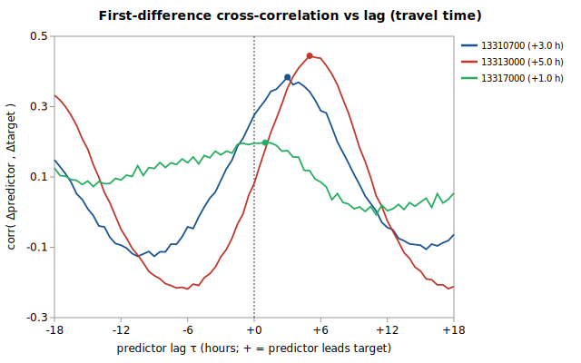

# Sub-daily lead/lag: USGS 13314300 regression

Companion to [`gauge_pair_linear.py`](../../scripts/regression/gauge_pair_linear.py) and the daily-mean fit in [`sfsalmon_13314300_from_krassel_johnson_whitebird.md`](./sfsalmon_13314300_from_krassel_johnson_whitebird.md). **Question (informational):** the daily-mean fit averages away the sub-daily travel time between gauges — how large is that timing structure, and how much of it is real-time-usable?



Generated by:

```bash
python3 scripts/regression/gauge_lead_lag.py \
    --predictor 13310700 \
    --predictor 13313000 \
    --predictor 13317000 \
    --target 13314300 \
    --start 1995-10-01 \
    --end 2003-09-29 \
    --grid-minutes 30 \
    --name sfsalmon_13314300_leadlag
```

## Data

USGS **unit values** resampled to a common **30-min** UTC grid over **1995-10-01 → 2003-09-29**. Overlap where the target and all 3 predictors have a value: **114,559 points** (~6.5 years). Each gauge uses discharge where available, else gage height (timing is identical — USGS derives flow from stage instantaneously):

| Role | Gauge | Label | variable |
|---|---|---|---|
| target | `13314300` |  | flow |
| predictor | `13310700` |  | flow |
| predictor | `13313000` |  | flow |
| predictor | `13317000` |  | flow |

## Estimated travel-time lags

Per predictor, the lag τ maximizing the correlation of *first differences* (flow changes) with the target, searched in 30-min steps. **+τ** = upstream (predictor leads the target; its aligned reading is a *past* value, so it is **deployable** in real time); **-τ** = downstream (its aligned reading is a *future* value, **not** deployable). A peak below **0.15** has no resolvable travel time and is held contemporaneous.

| Predictor | peak τ (h) | peak Δ-corr | applied τ (h) | interpretation |
|---|---|---|---|---|
| 13310700 `13310700` | +3.0 | 0.384 | **+3.0** | upstream — rise reaches target ~3.0 h later (deployable) |
| 13313000 `13313000` | +5.0 | 0.444 | **+5.0** | upstream — rise reaches target ~5.0 h later (deployable) |
| 13317000 `13317000` | +1.0 | 0.197 | **+1.0** | upstream — rise reaches target ~1.0 h later (deployable) |

## Accuracy: contemporaneous vs travel-time-aligned

All alignments share one hold-out grid (only the alignment changes). **daily-trained** = the deployed-style daily coefficients applied to the grid values (production-relevant); **hourly-refit** = coefficients refit on the grid itself (an upper bound). **full** shifts every identifiable predictor (incl. downstream → future); **deployable** shifts only upstream predictors (causal).

| Coefficients | Alignment | n | r² | RMSE (cfs) |
|---|---|---|---|---|
| daily-trained | contemporaneous | 114,559 | 0.9935 | 258.6 |
| daily-trained | full (incl. downstream) | 114,559 | 0.9959 | 204.1 |
| daily-trained | deployable (upstream-only) | 114,559 | 0.9959 | 204.1 |
| hourly-refit | contemporaneous | 114,559 | 0.9937 | 253.5 |
| hourly-refit | full (incl. downstream) | 114,559 | 0.9960 | 201.8 |

Daily-mean reference (same 3 predictors, 1968-10-01→2003-09-30, n=3,652): RMSE **183.2 cfs**, r² 0.9960 — daily means are smoother than instantaneous values, so this sits below the grid RMSEs and isn't directly comparable to them.

### Is the gain statistically real, and is it usable?

Grid residuals are strongly autocorrelated (lag-1 **0.99**), so the 114,559 points carry far fewer independent observations than their count. A **block bootstrap** over 7-day blocks (376 of them, B=2000) on the RMSE reduction (contemporaneous minus aligned):

| Alignment | gain | mean Δ (cfs) | 95% CI (cfs) | better in | resolved? |
|---|---|---|---|---|---|
| **full** (incl. downstream future) | +21.1% | +54.58 | [+41.73, +66.82] | 100% | yes |
| **deployable** (causal, upstream) | +21.1% | +54.58 | [+41.73, +66.82] | 100% | yes |

During the **fastest-changing 11% of points** (|Δtarget| ≥ 40 cfs/30min, n=12,147), where misalignment should bite hardest, full alignment changes RMSE by **+23.9%** (609.3 → 463.5 cfs).

## Verdict

**A usable sub-daily gain exists here.** The deployable (causal, upstream) alignment lowers RMSE by **+21.1%** with a 95% CI that excludes zero ([+41.73, +66.82] cfs) — worth considering for a real-time estimate (see deployability below).

### Deployability (what it *would* take)

Applying lags in production is **not** a coefficient change; it requires the calculator to read a predictor's value *from τ ago* rather than its latest:

1. **Upstream predictors (+τ):** deployable — the value is in the past, already in the `observation` table; select the reading closest to `now - τ`.
2. **Downstream predictors (-τ):** **not** deployable for a nowcast — the best-aligned value is in the future. Leave them contemporaneous, or treat the estimate as a short forecast.
3. **Plumbing:** `calc_expression` references only `LatestObservation`; a lag-aware estimate needs a time-offset reference form and a windowed lookup in `kayak.cli.calculator` — justified only when the deployable share is material.

## Method

- **Unit values** pulled unfiltered from `nwis.waterservices.usgs.gov` and resampled to a 30-min grid (discharge preferred, gage height as fallback — time-locked, so either works for timing).
- **Lag estimation** maximizes the correlation of first differences (flow *changes* propagate; baseline levels are near-identical across neighbours). Resolution is capped by the coarser series — a 30-min target can't resolve finer than 30 min, and finer grids add noise without information.
- **Causal split:** *deployable* shifts only upstream predictors (past reads); *full* also shifts downstream predictors to future reads (not real-time-usable, but it bounds the total timing signal).
- **Significance:** the RMSE difference is block-bootstrapped over 7-day blocks (B=2000) so the CI reflects the effective, not nominal, sample size (longer blocks would only widen it — a conservative bound).
- **Caveat:** the grid hold-out (1995-10-01..2003-09-29, ~6.5 yr) is far shorter than the daily fit's record; the daily-reference row controls for the predictor-set change, not the window.

