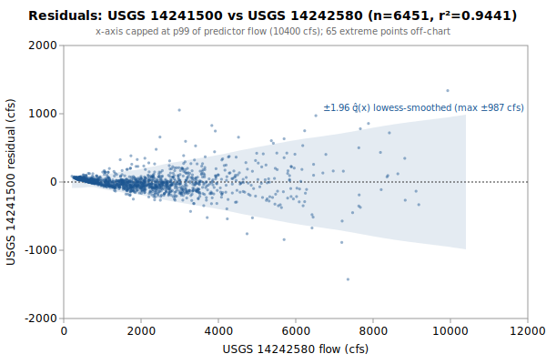

# Multi-Linear regression: USGS 14241500 from 14242580, 14222500

**Goal**: estimate USGS `14241500` from `14242580`, `14222500` so a downstream `calc_expression` can replace the target gauge.



Generated by:

```bash
python3 scripts/regression/gauge_pair_linear.py \
    --predictor 14242580 \
    --predictor 14222500 \
    --target 14241500 \
    --start 1996-02-01 \
    --end 2013-09-29 \
    --name sftoutle_14241500_from_tower_eflewis \
    --calc-handle tw::14242580 \
    --calc-handle ef::EF_Lewis_Washington_merge
```

## Data

All series are USGS daily-mean flow (`parameterCd=00060`, `statCd=00003`).

| Gauge | Period of record | Daily means |
|---|---|---|
| `14241500` (target) | 1939-10-01 → **2013-09-29** | 13025 |
| `14242580` (predictor) | 1981-03-24 → 2026-06-03 | 16508 |
| `14222500` (predictor) | 1929-10-01 → 2026-06-03 | 35310 |
| **Overlap (full)** | 1996-02-01 → 2013-09-29 | **6451** |

Note: USGS records can be **non-contiguous** (instrumentation outages).
The chosen window is selected for *data points*, not calendar span.

## Chosen fit

Window: **1996-02-01 → 2013-09-29**, n = **6451** daily means (~17.7 years of data).

### Coefficients (with honest, autocorrelation-aware uncertainty)

Daily streamflow residuals are strongly autocorrelated (lag-1 **0.56** here), which violates the IID assumption behind the OLS standard errors — so **SE (OLS)** is optimistic. **SE (block-boot)** resamples whole monthly blocks (212 months, B=1000), preserving the serial correlation; it is the realistic figure and runs about **4.0x** the OLS SE. The **95% CI** below is the block-bootstrap percentile interval. **VIF** is the variance-inflation factor (collinearity with the other predictors); VIF > 10 means the individual coefficient is poorly determined and should not be read as a physical sensitivity.

| Term | Estimate | SE (OLS) | SE (block-boot) | 95% CI (block-boot) | VIF |
|---|---|---|---|---|---|
| intercept | -75.9207 | 3.42 | 11.58 | [-100.5, -54.89] | — |
| tw::14242580 (predictor 1: 14242580) | +0.259162 | 0.002853 | 0.0121 | [+0.2361, +0.2831] | 7.5 |
| ef::EF_Lewis_Washington_merge (predictor 2: 14222500) | +0.210774 | 0.006794 | 0.02621 | [+0.162, +0.2633] | 7.5 |

r² = **0.9441**, RMSE = **188.81 cfs** (sigma_hat = 188.86 cfs unbiased).

Predictor / target summary:

| Series | Mean | Range |
|---|---|---|
| target `14241500` | 652.84 | [61, 17400] |
| predictor `14242580` | 2217.41 | [215, 48300] |
| predictor `14222500` | 731.06 | [34, 21000] |

### Parameter covariance

Full variance-covariance matrix (rows/cols in `coef_names` order):

```
                intercept            x1            x2
   intercept  +1.1695e+01  -4.8503e-03  +6.2770e-03
          x1  -4.8503e-03  +8.1384e-06  -1.8050e-05
          x2  +6.2770e-03  -1.8050e-05  +4.6163e-05
```

Correlation matrix:

```
              intercept          x1          x2
   intercept  +1.0000      -0.4972      +0.2701
          x1  -0.4972      +1.0000      -0.9313
          x2  +0.2701      -0.9313      +1.0000
```

**Caveat 1 (autocorrelation)**: this is the **OLS** covariance, which assumes IID residuals; with lag-1 residual autocorrelation **0.56** it understates the parameter SE by roughly **4.0x**. Use the block-bootstrap SEs/CIs in the coefficients table for inference, not these (monthly blocks; longer blocks would only widen the intervals, so they are conservative for the most autocorrelated fits).

**Caveat 2 (prediction vs parameter)**: even with correct parameter SEs, a single-day prediction at new `x` is dominated by the residual scatter `sigma_hat` (about 189 cfs at 1-sigma here), not by parameter uncertainty. `sigma_hat` is a valid *marginal* description of single-day error (autocorrelation barely biases it); what autocorrelation breaks is treating the n days as n independent observations.

## Window stability

Re-fit at multiple start dates (endpoint fixed at `2013-09-29`):

| Window start | n | data yr | r² | RMSE |
|---|---|---|---|---|
| 1990-01-01 | 6451 | 17.7 | 0.9441 | 188.8 |
| 1991-02-02 | 6451 | 17.7 | 0.9441 | 188.8 |
| 1996-02-01 | 6451 | 17.7 | 0.9441 | 188.8 |
| 2001-01-30 | 4626 | 12.7 | 0.9430 | 166.9 |
| 2006-01-29 | 2801 | 7.7 | 0.9462 | 161.9 |
| 2011-01-28 | 976 | 2.7 | 0.9588 | 141.1 |

(Multi-predictor coefficients in the stability table would be wide; per-window coefficient drift can be inspected by re-running the script with a different `--start`.)

## Residual diagnostics

**Percentile distribution** (residual = y - y_hat, cfs):

| p01 | p05 | p25 | p50 | p75 | p95 | p99 |
|---|---|---|---|---|---|---|
| -467.5 | -206.6 | -61.5 | +4.6 | +45.2 | +207.3 | +643.3 |

**By predictor-1 quintile** (Q1 = lowest values of `14242580`):

| Quintile | x median | mean residual | std residual | n |
|---|---|---|---|---|
| Q1 | 454 | +41.8 | 16.6 | 1290 |
| Q2 | 881 | +7.1 | 49.7 | 1290 |
| Q3 | 1730 | -22.3 | 81.2 | 1290 |
| Q4 | 2610 | -25.4 | 135.6 | 1290 |
| Q5 | 4360 | -1.2 | 384.2 | 1291 |

### By hydrologic season

Residuals bucketed by monsoonal season (most kayak gauges sit in a PNW monsoonal regime). **Mean / median flow** give each season's target-flow magnitude. **Bias** is the mean residual (y - y_hat); a non-zero bias means the pooled fit systematically over- (negative) or under-predicts (positive) in that season. **% of flow** normalizes the bias by the season's mean flow so it's comparable across gauges. The remaining columns (median residual, std, RMSE) are residual statistics in cfs.

| Season | n | mean flow | median flow | bias (cfs) | % of flow | median resid | std | RMSE |
|---|---|---|---|---|---|---|---|---|
| Heavy rain (Nov-Dec) | 1037 | 1041 | 704 | +19.2 | +1.8% | +7.8 | 321.2 | 321.7 |
| Light rain (Jan-Feb) | 1036 | 1115 | 822 | -12.5 | -1.1% | -13.4 | 268.8 | 268.9 |
| Rain-on-snow (Mar-Apr) | 1098 | 885 | 731 | -23.0 | -2.6% | -34.4 | 140.2 | 142.0 |
| Dry season (May-Oct) | 3280 | 306 | 158 | +5.6 | +1.8% | +15.8 | 88.2 | 88.3 |

A season whose bias is large relative to `sigma_hat` (the pooled 1-sigma residual scatter) is a candidate for a season-specific intercept or a separate seasonal fit; a season with elevated `std`/`RMSE` but near-zero bias is just noisier (e.g., flashy storm response), not mis-calibrated.

## Sub-daily lead/lag

Inter-gauge travel-time structure from USGS unit values (30-min grid, 218,477 points); full analysis in [`sftoutle_14241500_leadlag.md`](./sftoutle_14241500_leadlag.md). The daily coefficients above are applied in production to *instantaneous* readings, so these lags are the timing error a correction would address. **+τ** = the predictor leads (a past read, deployable in real time — upstream travel time or shared-forcing phase); **-τ** = it lags (a future read — non-causal look-ahead).

| Predictor | applied τ (h) | Δ-corr | direction |
|---|---|---|---|
| 14242580 `14242580` | -2.5 | 0.572 | -τ lag — look-ahead |
| 14222500 `14222500` | +0.0 | 0.441 | co-located |

**Full** alignment (incl. -τ → future): +8.8% RMSE, 95% CI [+8.94, +23.47] cfs (resolved). **Deployable** (causal, +τ-only): +0.0%, [+0.00, +0.00] cfs (CI through 0). **Verdict: real signal, but look-ahead (-τ) only (deployable gain nil)** — keep using contemporaneous readings.

## Predictions at example x values

For each row, `y_hat` is the fitted value and the two CIs are 95% two-sided bands. The **mean-response CI** is the uncertainty in `E[y | x]` (use for plotting the fit line's confidence band). The **prediction CI** is for a *single new observation* — bounded below by `sigma_hat` regardless of how precisely the parameters are estimated.

| pred-1 position | x (14242580) | x (14222500) | y_hat | 95% CI (mean resp.) | 95% CI (single obs.) |
|---|---|---|---|---|---|
| p05 (low) | 388 | 731 | 178.7 | [167.5, 189.9] (±11.2) | [-191.6, 549.0] (±370.3) |
| p25 | 718 | 731 | 264.2 | [254.7, 273.8] (±9.6) | [-106.0, 634.5] (±370.3) |
| p50 (median) | 1730 | 731 | 526.5 | [521.2, 531.9] (±5.4) | [156.3, 896.7] (±370.2) |
| p75 | 2870 | 731 | 822.0 | [816.1, 827.8] (±5.9) | [451.8, 1192.2] (±370.2) |
| p95 (high) | 5840 | 731 | 1591.7 | [1570.9, 1612.4] (±20.8) | [1220.9, 1962.4] (±370.7) |

### Computing a CI at any other x*

All the information needed to compute prediction CIs at any new predictor value is in this document. With the design row `X* = [1, x1*, x2*, ...]` — plus a squared column for each predictor fitted quadratically, in predictor order — matching the column order in the covariance matrix above:

```
y_hat = X* . coefs
Var(mean response) = X* . Cov(beta) . X*'
Var(single observation) = Var(mean response) + sigma_hat^2
SE = sqrt(Var)
95% CI = y_hat +/- 1.96 * SE     (n >> 30, large-sample z; use t_{n-p} for small n)
```

## `calc_expression` row

`calc_expression` rows are **metadata**: add a row to `calc_expression.csv` in the `kayak_data` repo (stable `id` from `id_counters.csv`, `provenance_slug` = this report's slug) and let `levels sync-metadata` apply it on deploy. Do **not** put this in a migration — a new migration may not write a metadata table (`tests/test_scripts/test_migrations_schema_only.py`). The handles (`tw::14242580`, `ef::EF_Lewis_Washington_merge`) follow the `prefix::gauge_name` convention enforced by `kayak.cli.calculator._resolve_refs`. Column values:

```
data_type:       flow
expression:      round(greatest(0, 0.259162 * tw::14242580::flow + 0.210774 * ef::EF_Lewis_Washington_merge::flow -75.92))
time_expression: tw::14242580::flow ef::EF_Lewis_Washington_merge::flow
note:            multi-linear regression fit. n=6451 daily means, window 1996-02-01..2013-09-29, r2=0.9441, RMSE=188.8 cfs. See docs/regression/sftoutle_14241500_from_tower_eflewis.md.
provenance_slug: sftoutle_14241500_from_tower_eflewis
```

Flesh out `note` before committing — the strongest existing rows also record window stability, rejected predictors, and any drainage-area scaling (see `calc_expression.csv` for examples).

## Future

- **Piecewise-linear fit by predictor-1 quintile.** If the residual table above shows systematic mean drift across quintiles (e.g., consistently under-estimating at low flow and over-estimating at high flow), splitting the predictor range into 2-3 regimes and fitting one linear model per regime can halve RMSE without adding free parameters beyond what `calc_expression` already supports via `greatest(low_estimate, high_estimate)` or `if(x < threshold, ..., ...)`-style composition. Worth trying when RMSE > ~10% of the mean target value.
- **Re-running** when the active predictor's rating curve drifts. USGS occasionally updates stage-discharge ratings; the `Reproduce` snippet above re-pulls the full period of record on demand.
