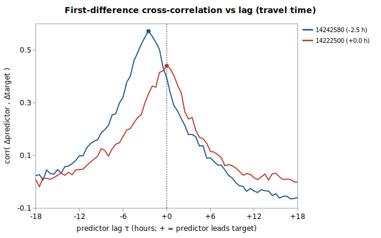

# Sub-daily lead/lag: USGS 14241500 regression

Companion to [`gauge_pair_linear.py`](../../scripts/regression/gauge_pair_linear.py) and the daily-mean fit in [`sftoutle_14241500_from_tower_eflewis.md`](./sftoutle_14241500_from_tower_eflewis.md). **Question (informational):** the daily-mean fit averages away the sub-daily travel time between gauges — how large is that timing structure, and how much of it is real-time-usable?



Generated by:

```bash
python3 scripts/regression/gauge_lead_lag.py \
    --predictor 14242580 \
    --predictor 14222500 \
    --target 14241500 \
    --start 1996-10-03 \
    --end 2013-09-29 \
    --grid-minutes 30 \
    --name sftoutle_14241500_leadlag
```

## Data

USGS **unit values** resampled to a common **30-min** UTC grid over **1996-10-03 → 2013-09-29**. Overlap where the target and all 2 predictors have a value: **218,477 points** (~12.5 years). Each gauge uses discharge where available, else gage height (timing is identical — USGS derives flow from stage instantaneously):

| Role | Gauge | Label | variable |
|---|---|---|---|
| target | `14241500` |  | flow |
| predictor | `14242580` |  | flow |
| predictor | `14222500` |  | flow |

## Estimated travel-time lags

Per predictor, the lag τ maximizing the correlation of *first differences* (flow changes) with the target, searched in 30-min steps. **+τ** = the predictor *leads* the target (its aligned reading is a *past* value, so it is **deployable** in real time — typically upstream travel time, though shared-forcing phase such as the diurnal melt cycle can also produce a +τ peak for a geographically downstream gauge); **-τ** = it *lags* (a *future* value, **not** deployable). A peak below **0.15** has no resolvable timing and is held contemporaneous.

| Predictor | peak τ (h) | peak Δ-corr | applied τ (h) | interpretation |
|---|---|---|---|---|
| 14242580 `14242580` | -2.5 | 0.572 | **-2.5** | lags target by ~2.5 h (-τ: future reading, not deployable) |
| 14222500 `14222500` | +0.0 | 0.441 | **+0.0** | co-located / sub-grid travel |

## Accuracy: contemporaneous vs travel-time-aligned

All alignments share one hold-out grid (only the alignment changes). **daily-trained** = the deployed-style daily coefficients applied to the grid values (production-relevant); **hourly-refit** = coefficients refit on the grid itself (an upper bound). **full** shifts every identifiable predictor (incl. -τ → future readings); **deployable** shifts only +τ (past-reading) predictors (causal).

| Coefficients | Alignment | n | r² | RMSE (cfs) |
|---|---|---|---|---|
| daily-trained | contemporaneous | 218,477 | 0.9351 | 179.6 |
| daily-trained | full (incl. -τ future reads) | 218,477 | 0.9460 | 163.8 |
| daily-trained | deployable (+τ-only) | 218,477 | 0.9351 | 179.6 |
| hourly-refit | contemporaneous | 218,477 | 0.9364 | 177.8 |
| hourly-refit | full (incl. -τ future reads) | 218,477 | 0.9467 | 162.9 |

Daily-mean reference (same 2 predictors, 1996-02-01→2013-09-29, n=6,451): RMSE **188.8 cfs**, r² 0.9441 — daily means are smoother than instantaneous values, so this sits below the grid RMSEs and isn't directly comparable to them.

### Is the gain statistically real, and is it usable?

Grid residuals are strongly autocorrelated (lag-1 **0.99**), so the 218,477 points carry far fewer independent observations than their count. A **block bootstrap** over 7-day blocks (674 of them, B=2000) on the RMSE reduction (contemporaneous minus aligned):

| Alignment | gain | mean Δ (cfs) | 95% CI (cfs) | better in | resolved? |
|---|---|---|---|---|---|
| **full** (incl. -τ future reads) | +8.8% | +15.70 | [+8.94, +23.47] | 100% | yes |
| **deployable** (causal, +τ only) | +0.0% | +0.00 | [+0.00, +0.00] | 0% | no (CI ∋ 0) |

During the **fastest-changing 10% of points** (|Δtarget| ≥ 18 cfs/30min, n=21,991), where misalignment should bite hardest, full alignment changes RMSE by **+11.7%** (470.0 → 415.1 cfs).

## Verdict

**The sub-daily signal is real but not real-time-usable.** Full alignment gives a statistically-resolved **+8.8%** (CI [+8.94, +23.47] cfs excludes zero), but that gain comes from **-τ** predictors aligned to *future* readings — typically a downstream gauge whose reading τ ahead is essentially a direct measurement of the target's current water arriving later, i.e. look-ahead. Here there are **no +τ (past-reading) predictors** at all, so the deployable alignment is simply contemporaneous — nothing is usable in real time. **Keep contemporaneous readings.**

### Deployability (what it *would* take)

Applying lags in production is **not** a coefficient change; it requires the calculator to read a predictor's value *from τ ago* rather than its latest:

1. **+τ predictors:** deployable — the value is in the past, already in the `observation` table; select the reading closest to `now - τ`.
2. **-τ predictors:** **not** deployable for a nowcast — the best-aligned value is in the future. Leave them contemporaneous, or treat the estimate as a short forecast.
3. **Plumbing:** `calc_expression` references only `LatestObservation`; a lag-aware estimate needs a time-offset reference form and a windowed lookup in `kayak.cli.calculator` — justified only when the deployable share is material.

## Method

- **Unit values** pulled unfiltered from `nwis.waterservices.usgs.gov` and resampled to a 30-min grid (discharge preferred, gage height as fallback — time-locked, so either works for timing).
- **Lag estimation** maximizes the correlation of first differences (flow *changes* propagate; baseline levels are near-identical across neighbours). Resolution is capped by the coarser series — a 30-min target can't resolve finer than 30 min, and finer grids add noise without information.
- **Causal split:** *deployable* shifts only +τ predictors (past reads); *full* also shifts -τ predictors to future reads (not real-time-usable, but it bounds the total timing signal).
- **Significance:** the RMSE difference is block-bootstrapped over 7-day blocks (B=2000) so the CI reflects the effective, not nominal, sample size (longer blocks would only widen it — a conservative bound).
- **Caveat:** the grid hold-out (1996-10-03..2013-09-29, ~12.5 yr) is far shorter than the daily fit's record; the daily-reference row controls for the predictor-set change, not the window.
