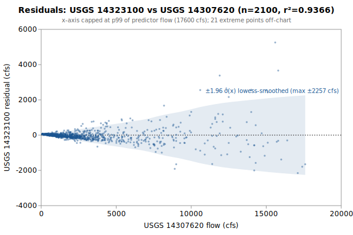

# Multi-Linear+Quadratic(14307620) regression: USGS 14323100 from 14307620, 14325000

**Goal**: estimate USGS `14323100` from `14307620`, `14325000` so a downstream `calc_expression` can replace the target gauge.



Generated by:

```bash
python3 scripts/regression/gauge_pair_linear.py \
    --predictor 14307620 \
    --predictor 14325000 \
    --target 14323100 \
    --start 1967-10-01 \
    --end 1973-06-30 \
    --name smith_14323100_from_siuslaw_sfcoquille \
    --quadratic-for 14307620
```

## Data

All series are USGS daily-mean flow (`parameterCd=00060`, `statCd=00003`).

| Gauge | Period of record | Daily means |
|---|---|---|
| `14323100` (target) | 1965-10-01 → **1973-06-30** | 2830 |
| `14307620` (predictor) | 1967-10-01 → 2026-06-03 | 18873 |
| `14325000` (predictor) | 1916-10-01 → 2026-06-03 | 39265 |
| **Overlap (full)** | 1967-10-01 → 1973-06-30 | **2100** |

Note: USGS records can be **non-contiguous** (instrumentation outages).
The chosen window is selected for *data points*, not calendar span.

## Chosen fit

Window: **1967-10-01 → 1973-06-30**, n = **2100** daily means (~5.7 years of data).

### Coefficients (with honest, autocorrelation-aware uncertainty)

Daily streamflow residuals are strongly autocorrelated (lag-1 **0.46** here), which violates the IID assumption behind the OLS standard errors — so **SE (OLS)** is optimistic. **SE (block-boot)** resamples whole monthly blocks (69 months, B=1000), preserving the serial correlation; it is the realistic figure and runs about **4.9x** the OLS SE. The **95% CI** below is the block-bootstrap percentile interval. **VIF** is the variance-inflation factor (collinearity with the other predictors); VIF > 10 means the individual coefficient is poorly determined and should not be read as a physical sensitivity.

| Term | Estimate | SE (OLS) | SE (block-boot) | 95% CI (block-boot) | VIF |
|---|---|---|---|---|---|
| intercept | -73.4463 | 10.51 | 20.6 | [-102.4, -21.21] | — |
| sm::Suislaw_Mapleton_merge (predictor 1: 14307620) | +0.288564 | 0.005613 | 0.02719 | [+0.2269, +0.3323] | 4.3 |
| cp::Coquille_Powers_merge (predictor 2: 14325000) | +0.130486 | 0.01006 | 0.05013 | [+0.03585, +0.225] | 4.3 |
| (14307620)² | +2.12545e-06 | 2.176e-07 | 1.63e-06 | [+9.515e-07, +7.435e-06] | — |

r² = **0.9366**, RMSE = **360.40 cfs** (sigma_hat = 360.74 cfs unbiased).

Predictor / target summary:

| Series | Mean | Range |
|---|---|---|
| target `14323100` | 764.27 | [6, 16000] |
| predictor `14307620` | 2364.08 | [72, 41900] |
| predictor `14325000` | 882.52 | [15, 20600] |

### Parameter covariance

Full variance-covariance matrix (rows/cols in `coef_names` order):

```
                intercept            x1            x2          x1^2
   intercept  +1.1044e+02  -2.8752e-02  -7.8772e-05  +1.0303e-06
          x1  -2.8752e-02  +3.1507e-05  -3.5983e-05  -7.3588e-10
          x2  -7.8772e-05  -3.5983e-05  +1.0111e-04  -2.1490e-10
        x1^2  +1.0303e-06  -7.3588e-10  -2.1490e-10  +4.7331e-14
```

Correlation matrix:

```
              intercept          x1          x2        x1^2
   intercept  +1.0000      -0.4874      -0.0007      +0.4506    
          x1  -0.4874      +1.0000      -0.6375      -0.6026    
          x2  -0.0007      -0.6375      +1.0000      -0.0982    
        x1^2  +0.4506      -0.6026      -0.0982      +1.0000    
```

**Caveat 1 (autocorrelation)**: this is the **OLS** covariance, which assumes IID residuals; with lag-1 residual autocorrelation **0.46** it understates the parameter SE by roughly **4.9x**. Use the block-bootstrap SEs/CIs in the coefficients table for inference, not these (monthly blocks; longer blocks would only widen the intervals, so they are conservative for the most autocorrelated fits).

**Caveat 2 (prediction vs parameter)**: even with correct parameter SEs, a single-day prediction at new `x` is dominated by the residual scatter `sigma_hat` (about 361 cfs at 1-sigma here), not by parameter uncertainty. `sigma_hat` is a valid *marginal* description of single-day error (autocorrelation barely biases it); what autocorrelation breaks is treating the n days as n independent observations.

## Window stability

Re-fit at multiple start dates (endpoint fixed at `1973-06-30`):

| Window start | n | data yr | r² | RMSE |
|---|---|---|---|---|
| 1962-10-02 | 2100 | 5.7 | 0.9366 | 360.4 |
| 1967-10-01 | 2100 | 5.7 | 0.9366 | 360.4 |
| 1972-09-29 | 275 | 0.8 | 0.9741 | 131.2 |

(Multi-predictor coefficients in the stability table would be wide; per-window coefficient drift can be inspected by re-running the script with a different `--start`.)

## Residual diagnostics

**Percentile distribution** (residual = y - y_hat, cfs):

| p01 | p05 | p25 | p50 | p75 | p95 | p99 |
|---|---|---|---|---|---|---|
| -1052.1 | -366.9 | -68.2 | +22.4 | +49.7 | +270.2 | +1172.7 |

**By predictor-1 quintile** (Q1 = lowest values of `14307620`):

| Quintile | x median | mean residual | std residual | n |
|---|---|---|---|---|
| Q1 | 153 | +48.6 | 6.3 | 420 |
| Q2 | 416 | +27.5 | 23.8 | 420 |
| Q3 | 969 | -8.3 | 61.0 | 420 |
| Q4 | 2240 | -54.1 | 155.4 | 420 |
| Q5 | 6460 | -13.7 | 785.0 | 420 |

### By hydrologic season

Residuals bucketed by monsoonal season (most kayak gauges sit in a PNW monsoonal regime). **Mean / median flow** give each season's target-flow magnitude. **Bias** is the mean residual (y - y_hat); a non-zero bias means the pooled fit systematically over- (negative) or under-predicts (positive) in that season. **% of flow** normalizes the bias by the season's mean flow so it's comparable across gauges. The remaining columns (median residual, std, RMSE) are residual statistics in cfs.

| Season | n | mean flow | median flow | bias (cfs) | % of flow | median resid | std | RMSE |
|---|---|---|---|---|---|---|---|---|
| Heavy rain (Nov-Dec) | 366 | 1417 | 770 | +96.7 | +6.8% | +13.9 | 603.7 | 610.6 |
| Light rain (Jan-Feb) | 356 | 1852 | 1080 | -121.3 | -6.6% | -110.9 | 531.0 | 544.0 |
| Rain-on-snow (Mar-Apr) | 366 | 875 | 533 | -65.1 | -7.4% | -68.6 | 267.9 | 275.4 |
| Dry season (May-Oct) | 1012 | 106 | 59 | +31.2 | +29.6% | +39.8 | 47.0 | 56.4 |

A season whose bias is large relative to `sigma_hat` (the pooled 1-sigma residual scatter) is a candidate for a season-specific intercept or a separate seasonal fit; a season with elevated `std`/`RMSE` but near-zero bias is just noisier (e.g., flashy storm response), not mis-calibrated.

## Predictions at example x values

For each row, `y_hat` is the fitted value and the two CIs are 95% two-sided bands. The **mean-response CI** is the uncertainty in `E[y | x]` (use for plotting the fit line's confidence band). The **prediction CI** is for a *single new observation* — bounded below by `sigma_hat` regardless of how precisely the parameters are estimated.

| pred-1 position | x (14307620) | x (14325000) | y_hat | 95% CI (mean resp.) | 95% CI (single obs.) |
|---|---|---|---|---|---|
| p05 (low) | 108 | 883 | 72.9 | [46.9, 98.9] (±26.0) | [-634.6, 780.4] (±707.5) |
| p25 | 311 | 883 | 131.7 | [107.3, 156.0] (±24.4) | [-575.8, 839.1] (±707.5) |
| p50 (median) | 969 | 883 | 323.3 | [303.6, 343.1] (±19.8) | [-384.0, 1030.7] (±707.3) |
| p75 | 2740 | 883 | 848.3 | [830.9, 865.8] (±17.4) | [141.1, 1555.6] (±707.3) |
| p95 (high) | 9540 | 883 | 2988.1 | [2921.0, 3055.1] (±67.0) | [2277.8, 3698.3] (±710.2) |

### Computing a CI at any other x*

All the information needed to compute prediction CIs at any new predictor value is in this document. With the design row `X* = [1, x1*, x2*, ...]` — plus a squared column for each predictor fitted quadratically, in predictor order — matching the column order in the covariance matrix above:

```
y_hat = X* . coefs
Var(mean response) = X* . Cov(beta) . X*'
Var(single observation) = Var(mean response) + sigma_hat^2
SE = sqrt(Var)
95% CI = y_hat +/- 1.96 * SE     (n >> 30, large-sample z; use t_{n-p} for small n)
```

## `calc_expression` row

`calc_expression` rows are **metadata**: add a row to `calc_expression.csv` in the `kayak_data` repo (stable `id` from `id_counters.csv`, `provenance_slug` = this report's slug) and let `levels sync-metadata` apply it on deploy. Do **not** put this in a migration — a new migration may not write a metadata table (`tests/test_scripts/test_migrations_schema_only.py`). The handles (`sm::Suislaw_Mapleton_merge`, `cp::Coquille_Powers_merge`) follow the `prefix::gauge_name` convention enforced by `kayak.cli.calculator._resolve_refs`. Column values:

```
data_type:       flow
expression:      round(greatest(0, 0.288564 * sm::Suislaw_Mapleton_merge::flow + 0.130486 * cp::Coquille_Powers_merge::flow + 2.12545e-06 * sm::Suislaw_Mapleton_merge::flow * sm::Suislaw_Mapleton_merge::flow -73.45))
time_expression: sm::Suislaw_Mapleton_merge::flow cp::Coquille_Powers_merge::flow
note:            multi-linear+quadratic(14307620) regression fit. n=2100 daily means, window 1967-10-01..1973-06-30, r2=0.9366, RMSE=360.4 cfs. See docs/regression/smith_14323100_from_siuslaw_sfcoquille.md.
provenance_slug: smith_14323100_from_siuslaw_sfcoquille
```

Flesh out `note` before committing — the strongest existing rows also record window stability, rejected predictors, and any drainage-area scaling (see `calc_expression.csv` for examples).

## Future

- **Piecewise-linear fit by predictor-1 quintile.** If the residual table above shows systematic mean drift across quintiles (e.g., consistently under-estimating at low flow and over-estimating at high flow), splitting the predictor range into 2-3 regimes and fitting one linear model per regime can halve RMSE without adding free parameters beyond what `calc_expression` already supports via `greatest(low_estimate, high_estimate)` or `if(x < threshold, ..., ...)`-style composition. Worth trying when RMSE > ~10% of the mean target value.
- **Re-running** when the active predictor's rating curve drifts. USGS occasionally updates stage-discharge ratings; the `Reproduce` snippet above re-pulls the full period of record on demand.
- **Sub-daily lead/lag.** This fit is on daily means, but the `calc_expression` applies its coefficients to the *latest instantaneous* predictor readings — so inter-gauge travel time (1-12 h) becomes a timing error the daily fit never sees. `gauge_lead_lag.py` (same directory) quantifies that error from USGS unit values; worth a look when predictors are many river-miles from the target. (Run it to embed a summary here via `--leadlag`.)
