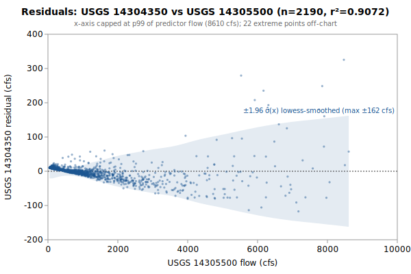

# Linear regression: USGS 14304350 from 14305500

**Goal**: estimate USGS `14304350` from `14305500` so a downstream `calc_expression` can replace the target gauge.



Generated by:

```bash
python3 scripts/regression/gauge_pair_linear.py \
    --predictor 14305500 \
    --target 14304350 \
    --start 1985-10-01 \
    --end 1991-09-29 \
    --name sunshine_14304350_from_14305500
```

## Data

All series are USGS daily-mean flow (`parameterCd=00060`, `statCd=00003`).

| Gauge | Period of record | Daily means |
|---|---|---|
| `14304350` (target) | 1985-10-01 → **1991-09-29** | 2190 |
| `14305500` (predictor) | 1905-10-01 → 2026-06-01 | 39597 |
| **Overlap (full)** | 1985-10-01 → 1991-09-29 | **2190** |

Note: USGS records can be **non-contiguous** (instrumentation outages).
The chosen window is selected for *data points*, not calendar span.

## Chosen fit

Window: **1985-10-01 → 1991-09-29**, n = **2190** daily means (~6.0 years of data).

### Coefficients (with honest, autocorrelation-aware uncertainty)

Daily streamflow residuals are strongly autocorrelated (lag-1 **0.56** here), which violates the IID assumption behind the OLS standard errors — so **SE (OLS)** is optimistic. **SE (block-boot)** resamples whole monthly blocks (72 months, B=1000), preserving the serial correlation; it is the realistic figure and runs about **5.4x** the OLS SE. The **95% CI** below is the block-bootstrap percentile interval. **VIF** is the variance-inflation factor (collinearity with the other predictors); VIF > 10 means the individual coefficient is poorly determined and should not be read as a physical sensitivity.

| Term | Estimate | SE (OLS) | SE (block-boot) | 95% CI (block-boot) | VIF |
|---|---|---|---|---|---|
| intercept | -12.0539 | 0.7496 | 2.087 | [-16.1, -7.996] | — |
| oN::14305500 (predictor 1: 14305500) | +0.0503754 | 0.0003444 | 0.001852 | [+0.04638, +0.05346] | 1.0 |

r² = **0.9072**, RMSE = **28.67 cfs** (sigma_hat = 28.68 cfs unbiased).

Predictor / target summary:

| Series | Mean | Range |
|---|---|---|
| target `14304350` | 51.08 | [0, 1160] |
| predictor `14305500` | 1253.27 | [47, 17000] |

### Parameter covariance

Full variance-covariance matrix (rows/cols in `coef_names` order):

```
                intercept            x1
   intercept  +5.6184e-01  -1.4865e-04
          x1  -1.4865e-04  +1.1861e-07
```

Correlation matrix:

```
              intercept          x1
   intercept  +1.0000      -0.5758    
          x1  -0.5758      +1.0000    
```

**Caveat 1 (autocorrelation)**: this is the **OLS** covariance, which assumes IID residuals; with lag-1 residual autocorrelation **0.56** it understates the parameter SE by roughly **5.4x**. Use the block-bootstrap SEs/CIs in the coefficients table for inference, not these (monthly blocks; longer blocks would only widen the intervals, so they are conservative for the most autocorrelated fits).

**Caveat 2 (prediction vs parameter)**: even with correct parameter SEs, a single-day prediction at new `x` is dominated by the residual scatter `sigma_hat` (about 29 cfs at 1-sigma here), not by parameter uncertainty. `sigma_hat` is a valid *marginal* description of single-day error (autocorrelation barely biases it); what autocorrelation breaks is treating the n days as n independent observations.

## Window stability

Re-fit at multiple start dates (endpoint fixed at `1991-09-29`):

| Window start | n | data yr | slope | intercept | r² | RMSE | SE(slope) | SE(int) |
|---|---|---|---|---|---|---|---|---|
| 1980-10-02 | 2190 | 6.0 | 0.0504 | -12.05 | 0.9072 | 28.7 | 0.0003 | 0.75 |
| 1985-10-01 | 2190 | 6.0 | 0.0504 | -12.05 | 0.9072 | 28.7 | 0.0003 | 0.75 |
| 1990-01-01 | 637 | 1.7 | 0.0568 | -15.37 | 0.9291 | 30.1 | 0.0006 | 1.47 |
| 1990-09-30 | 365 | 1.0 | 0.0569 | -14.93 | 0.9134 | 30.8 | 0.0009 | 2.04 |

## Residual diagnostics

**Percentile distribution** (residual = y - y_hat, cfs):

| p01 | p05 | p25 | p50 | p75 | p95 | p99 |
|---|---|---|---|---|---|---|
| -76.3 | -40.3 | -7.9 | +3.4 | +9.6 | +16.4 | +96.6 |

**By predictor-1 quintile** (Q1 = lowest values of `14305500`):

| Quintile | x median | mean residual | std residual | n |
|---|---|---|---|---|
| Q1 | 90 | +10.4 | 1.5 | 438 |
| Q2 | 220 | +8.2 | 3.5 | 438 |
| Q3 | 672 | +0.8 | 7.0 | 438 |
| Q4 | 1280 | -6.5 | 13.2 | 438 |
| Q5 | 3100 | -12.9 | 59.1 | 438 |

### By hydrologic season

Residuals bucketed by monsoonal season (most kayak gauges sit in a PNW monsoonal regime). **Mean / median flow** give each season's target-flow magnitude. **Bias** is the mean residual (y - y_hat); a non-zero bias means the pooled fit systematically over- (negative) or under-predicts (positive) in that season. **% of flow** normalizes the bias by the season's mean flow so it's comparable across gauges. The remaining columns (median residual, std, RMSE) are residual statistics in cfs.

| Season | n | mean flow | median flow | bias (cfs) | % of flow | median resid | std | RMSE |
|---|---|---|---|---|---|---|---|---|
| Heavy rain (Nov-Dec) | 366 | 79 | 50 | -6.2 | -7.9% | -2.8 | 33.0 | 33.5 |
| Light rain (Jan-Feb) | 355 | 129 | 72 | -6.6 | -5.2% | -12.8 | 52.3 | 52.6 |
| Rain-on-snow (Mar-Apr) | 366 | 67 | 39 | -9.2 | -13.7% | -6.3 | 26.2 | 27.8 |
| Dry season (May-Oct) | 1103 | 12 | 6 | +7.2 | +63.0% | +8.8 | 7.6 | 10.5 |

A season whose bias is large relative to `sigma_hat` (the pooled 1-sigma residual scatter) is a candidate for a season-specific intercept or a separate seasonal fit; a season with elevated `std`/`RMSE` but near-zero bias is just noisier (e.g., flashy storm response), not mis-calibrated.

## Sub-daily lead/lag

Inter-gauge travel-time structure from USGS unit values (30-min grid, 19,519 points); full analysis in [`sunshine_14304350_leadlag.md`](./sunshine_14304350_leadlag.md). The daily coefficients above are applied in production to *instantaneous* readings, so these lags are the timing error a correction would address. **+τ** = upstream (a past read, deployable in real time); **-τ** = downstream (a future read — non-causal look-ahead).

| Predictor | applied τ (h) | Δ-corr | direction |
|---|---|---|---|
| 14305500 `14305500` | -3.0 | 0.851 | downstream — look-ahead |

**Full** alignment (incl. downstream → future): +10.7% RMSE, 95% CI [+2.11, +7.18] cfs (resolved). **Deployable** (causal, upstream-only): +0.0%, [+0.00, +0.00] cfs (CI through 0). **Verdict: real signal, but downstream look-ahead only (deployable gain nil)** — keep using contemporaneous readings.

## Predictions at example x values

For each row, `y_hat` is the fitted value and the two CIs are 95% two-sided bands. The **mean-response CI** is the uncertainty in `E[y | x]` (use for plotting the fit line's confidence band). The **prediction CI** is for a *single new observation* — bounded below by `sigma_hat` regardless of how precisely the parameters are estimated.

| pred-1 position | x (14305500) | y_hat | 95% CI (mean resp.) | 95% CI (single obs.) |
|---|---|---|---|---|
| p05 (low) | 75 | -8.3 | [-9.7, -6.8] (±1.4) | [-64.5, 47.9] (±56.2) |
| p25 | 165 | -3.7 | [-5.1, -2.3] (±1.4) | [-60.0, 52.5] (±56.2) |
| p50 (median) | 672 | 21.8 | [20.5, 23.1] (±1.3) | [-34.4, 78.0] (±56.2) |
| p75 | 1530 | 65.0 | [63.8, 66.2] (±1.2) | [8.8, 121.2] (±56.2) |
| p95 (high) | 4620 | 220.7 | [218.1, 223.3] (±2.6) | [164.4, 276.9] (±56.3) |

### Computing a CI at any other x*

All the information needed to compute prediction CIs at any new predictor value is in this document. With the design row `X* = [1, x1*, x2*, ..., x1*^2, x2*^2, ...]` matching the column order in the covariance matrix above:

```
y_hat = X* . coefs
Var(mean response) = X* . Cov(beta) . X*'
Var(single observation) = Var(mean response) + sigma_hat^2
SE = sqrt(Var)
95% CI = y_hat +/- 1.96 * SE     (n >> 30, large-sample z; use t_{n-p} for small n)
```

For this single-predictor linear fit, the equivalent closed form is:

```
Var(mean response at x*) = sigma_hat^2 * (1/n + (x* - mean_x)^2 / Sxx)
                         where mean_x = 1253.2710, sigma_hat = 28.6781,
                         n = 2190, Sxx = sigma_hat^2 / SE(slope)^2 = 6.9338e+09
```

## SQL stub for `calc_expression`

Paste this into a `data/db/migrations/00NN_*.sql` file. The handles (`oN::14305500`) follow the `prefix::gauge_name` convention enforced by `kayak.cli.calculator._resolve_refs`:

```sql
INSERT INTO calc_expression (data_type, expression, time_expression, note) SELECT
    'flow',
    'round(greatest(0, 0.0503754 * oN::14305500::flow -12.05))',
    'oN::14305500::flow',
    'linear regression fit. n=2190 daily means, window 1985-10-01..1991-09-29, r2=0.9072, RMSE=28.7 cfs.'
WHERE NOT EXISTS (
    SELECT 1 FROM calc_expression WHERE time_expression = 'oN::14305500::flow'
);
```

**Note**: the migration runner (`cli/migrate.py::_split_statements`) splits SQL on `;` without understanding string literals, so make sure no `;` appears inside the `note` text.

## Future

- **Piecewise-linear fit by predictor-1 quintile.** If the residual table above shows systematic mean drift across quintiles (e.g., consistently under-estimating at low flow and over-estimating at high flow), splitting the predictor range into 2-3 regimes and fitting one linear model per regime can halve RMSE without adding free parameters beyond what `calc_expression` already supports via `greatest(low_estimate, high_estimate)` or `if(x < threshold, ..., ...)`-style composition. Worth trying when RMSE > ~10% of the mean target value.
- **Re-running** when the active predictor's rating curve drifts. USGS occasionally updates stage-discharge ratings; the `Reproduce` snippet above re-pulls the full period of record on demand.
