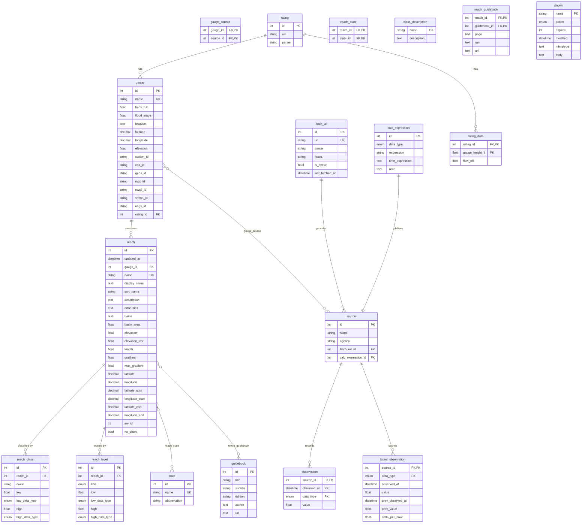

# Database Schema

Entity-relationship diagram for the `kayak` database (18 tables).

**Relationship legend:**
- `||--||` — one to one
- `||--o{` — one to many
- `}o--o{` — many to many (via junction table)

## Table Counts by Domain

| Domain | Tables |
|---|---|
| **Gauges & Sources** | `gauge`, `source`, `gauge_source`, `fetch_url`, `calc_expression` |
| **Observations** | `observation`, `latest_observation` |
| **Ratings** | `rating`, `rating_data` |
| **Reaches** | `reach`, `reach_class`, `reach_level`, `reach_state` |
| **Reference** | `state`, `class_description`, `guidebook`, `reach_guidebook` |
| **Cache** | `pages` |
