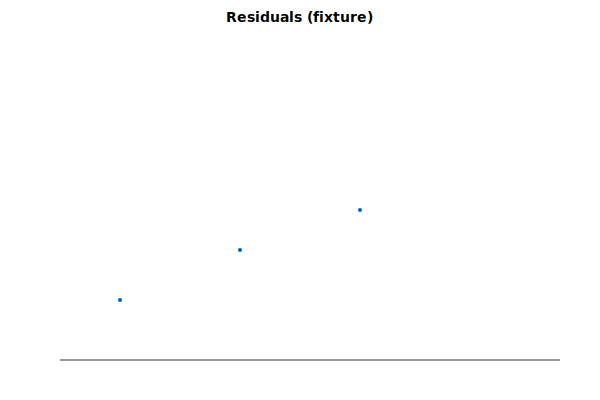

# Linear regression: fixture target from USGS 14150000

**Goal**: estimate the fixture calc target from USGS `14150000` (test fixture report).



Generated by:

```bash
python3 scripts/regression/gauge_pair_linear.py \
    --predictor 14150000 \
    --target fixture \
    --name fixture_calc_from_usgs
```

## Fit

| Term | Value |
|---|---|
| intercept | 0.0 |
| slope | 0.5 |

r² = 0.99 over n = 100 daily means.

See the [lead/lag analysis](./fixture_calc_from_usgs_leadlag.md) for sub-daily timing.

## `calc_expression` row

```
provenance_slug: fixture_calc_from_usgs
```
